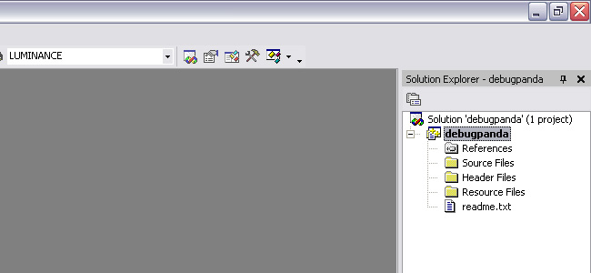
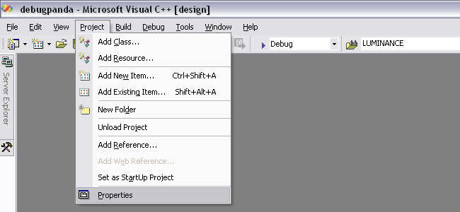
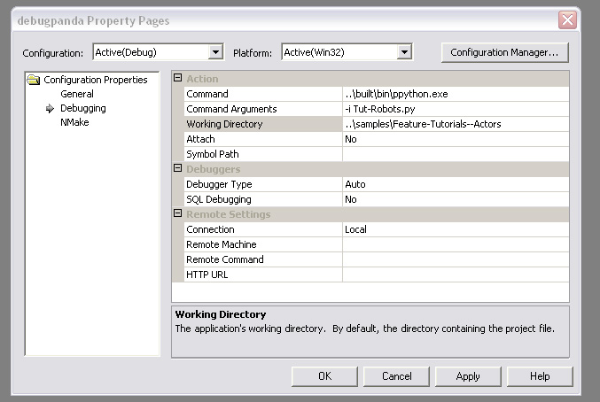
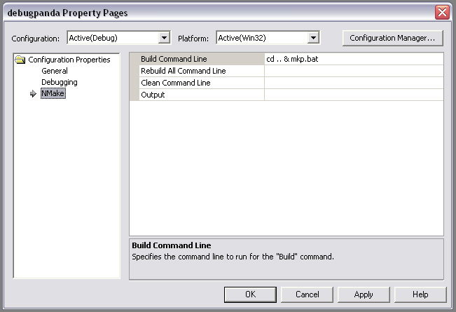
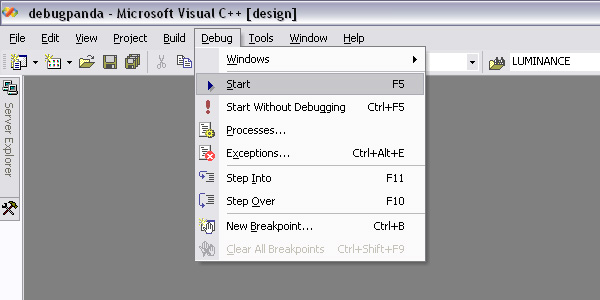
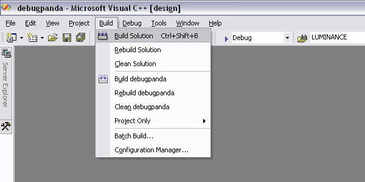

.. _running-panda3d-under-the-c++-debugger:

Running Panda3D under the C++ Debugger
======================================

These instructions show how to compile and run panda from inside the Microsoft
Visual Studio debugger.

Before you Begin
----------------

The first step is to download the Panda source code and compile it. The
instructions can be found in the section :ref:`building-from-source`. Be sure to
compile with the Optimize setting of 1, otherwise, Visual Studio will not be
able to debug properly. Once you have compiled Panda3D, start up Visual Studio,
and ask it to create a new project:

|debugpanda1.jpg|

There are four pieces of information you need to enter into the new project
dialog:

-  Tell it to make a "C++ project"
-  Tell it to use a "Makefile"
-  Tell it the name of the project, "debugpanda"
-  Tell it where the panda source tree is (ie, "c:\panda3d-b")

|debugpanda2.jpg|

Click ok, and confirm. You have now created the project, and the project is open
for editing. You now need to access the "solution explorer:"

|debugpanda3.jpg|

Normally, you can see the solution explorer in the upper-right corner of Visual
Studio. It should show your project name (debugpanda). The word "debugpanda"
needs to be highlighted - if it is not, click on it:

|debugpanda4.jpg|

Now that your project is selected, you can edit its project properties:

|debugpanda5.jpg|

The project property dialog initially looks like this. It contains three
subpanels, the "General" panel, the "Debugging" panel, and the "NMake" subpanel.
You can see these three subheadings in the left pane:

|debugpanda6.jpg|

There is nothing to fill in on the general panel, so switch to the debugging
panel. You need to fill in the command name, the command arguments, and the
working directory. For now, we will ask it to debug the Actors/Robots sample
program. Since visual studio puts the project file in a subdirectory, the paths
need to be preceded by ".." to get to the root of the panda source tree:

|debugpanda7.jpg|

Finally, switch to the "NMake" panel. Here, you can tell it what the command is
to recompile panda. I use a bat file "mkp.bat" to compile panda. Since the
project file is in a subdirectory, the command needs to be preceded by "cd .."
in order to get back to the root of the panda source tree:

|debugpanda8.jpg|

Visual studio now knows how to run panda, and how to compile it. You can run
your program (in this case, the "Actors/Robots" tutorial) by clicking on the
Debug menu:

|debugpanda9.jpg|

You can rebuild panda at any time by clicking on the "Build" menu:

|debugpanda10.jpg|

Now that you are running in the debugger, you can open any panda source file and
set a breakpoint, or examine data. Of course, it may be advantageous to learn
how to use the python debugger as well as the C++ debugger.

.. |debugpanda1.jpg| image:: debugpanda1.jpg
.. |debugpanda2.jpg| image:: debugpanda2.jpg
.. |debugpanda3.jpg| image:: debugpanda3.jpg

.. |debugpanda6.jpg| image:: debugpanda6.jpg

