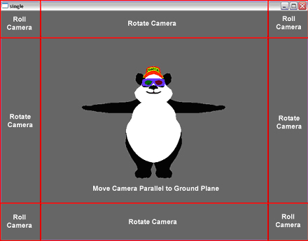

.. _enhanced-mouse-navigation:

Enhanced Mouse Navigation
=========================

Direct Tools gives more functionality to the middle mouse button. First,
clicking the middle mouse button changes the pivot point it uses to rotate
around the environment. The middle mouse button will also move the camera
depending on where the cursor is on the screen.

==================================== ==============================================
Middle Mouse Click                   Sets pivot point for rotating around the world
Middle Mouse + Middle Region         Move camera parallel to ground
Shift + Middle Mouse + Middle Region Move camera vertically
Middle Mouse + Edge Region           Rotate camera around pivot point
Middle Mouse + Corner Region         Roll camera around pivot point
Shift + Middle Mouse + Edge Region   Changes pitch of the camera
==================================== ==============================================

The left mouse button is now used to select and manipulate objects in the
environment. Once an object is selected, it may be moved and rotated.

================================== ====================================
Left Mouse Click                   Select an object
Left Mouse + Middle Region         Move object vertically
Shift + Left Mouse + Middle Region Move object parallel to ground
Left Mouse + Edge Region           Rotate object around its pivot point
Left Mouse + Corner Region         Roll object around its pivot point
Control + Left Mouse               Rescale the model
================================== ====================================

Direct Tools uses a large number of hot keys for camera control, rendering
styles, and object control. The full list is in the table below.

================== ============================================================= =================== ==================================================
**Camera Control**                                                               **Render Style**
\+                 Zoom in                                                       Shift + A           Show all
\-                 Zoom out                                                      Control + F         Flash selected
1                  Front view (relative to render)                               B                   Toggle backface
2                  Back view (relative to render)                                L                   Toggle lights
3                  Right view (relative to render)                               T                   Toggle texture
4                  Left view (relative to render)                                W                   Toggle wireframe
5                  Top view (relative to render)
6                  Bottom view (relative to render)                              **Direct Controls**
7                  ¾ view (relative to render)                                   Delete              Delete selected object
8                  Roll view about axis relative to camera’s axis                Escape              Delete all
9                  Rotate around hot point                                       Page Down           Move down selected object’s hierarchy
0                  Rotate around hot point                                       Page Up             Move up selected object’s hierarchy
C                  Center on hot point                                           Tab                 Toggle widget mode
F                  Fit on hot point                                              Shift + F           Grow widget to fit current window
H                  Move to (0,0,0)                                               I                   Plant selected object at cursor intersection point
Shift + L          Toggle camera pivot point lock                                M                   Move widget in front of camera
N                  Select next possible camera COA (along last intersection ray) P                   Set active parent to selected object
U                  Orbit upright camera about hot point                          R                   WRT reparent selected to active parent
Shift + U          Upright camera                                                Shift + R           Reparent selected to active parent
\`                 Kill camera move task                                         S                   Reselect last selected object
\                                                                                V                   Toggle widget visibility
**Undo/Redo**                                                                    Shift + V           Toggle COA marker visibility
[                  Undo                                                          <                   Shrink widget
]                  Redo                                                          >                   Expand widget
================== ============================================================= =================== ==================================================
