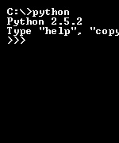
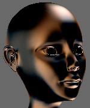
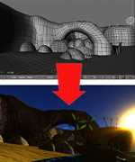
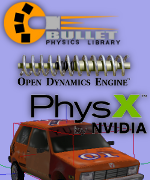
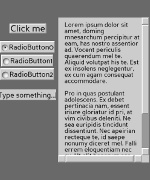
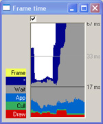
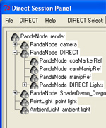

:orphan:

.. _features:

Features
========

Just Works, Right out of the Box
--------------------------------

No-hassle install:

-  Convenient installer packages for Windows, macOS and Linux
-  Supports Windows versions all the way from Windows XP to Windows 10
-  Supports Mac OS X 10.6 "Snow Leopard" through macOS 11 "Big Sur"
-  Only one external dependency: working graphics driver
-  Sample programs run right out of Start Menu
-  No compilation step needed

|clear|

Full Python Integration
-----------------------

Automatically-generated wrappers expose full functionality of the engine.

-  All Python versions from 2.7 to newest 3.10 supported
-  Highly optimized: all core functionality in C++
-  Thoroughly-tested: two commercial MMOs in Python
-  Panda3D structures garbage collected when using Python
-  Manual and sample programs use Python

|clear|

Exposes Full Power of Graphics API
----------------------------------

Modern OpenGL/DirectX features exposed directly to Panda3D user:

-  High-level shader languages: GLSL, Cg
-  Powerful interface between shaders and engine
-  Support for render-to-texture, multiple render targets
-  Use of depth/shadow/stencil textures
-  Support for tessellation and compute shaders

|clear|

Shader Generation
-----------------

Many advanced rendering techniques now fully automatic:

-  Special Maps: Normal Map, Gloss Map, Glow Map
-  HDR Rendering: Tone Mapping, Bloom Filter
-  Cel Shading: Threshold Lighting, Inking
-  Shadow Mapping
-  Fullscreen filters such as Bloom, Cartoon Inking, Volumetric Lightning,
   Blur/Sharpen and Ambient Occlusion, as well as the ability to use your own
-  More to come

|clear|

3D Pipeline
-----------

Get models from your 3d modeller to Panda3D easily:

-  Powerful EGG/BAM format
-  EGG exporters for Maya, Blender and 3ds Max
-  Support for other 3d formats (collada, x, lwo, obj, dxf, wrl, flt)
-  Converters between different 3d formats and EGG

|clear|

Audio
-----

Several options for adding sounds to your game:

-  Support for the OpenAL audio engine
-  Support for the FMOD audio engine
-  Support for the Miles audio engine

|clear|

Physics
-------

Several options for physics simulation:

-  Built-in simple physics engine
-  Support for the Bullet physics engine
-  Support for the ODE physics engine

|clear|

Particle Effects
----------------

Panda3D has its own Particle System:

-  Particle effects can be stored in text files
-  Particle editor included for creating and editing particle effects

|clear|

GUI
---

Panda3D comes with a set of tools for the creation of a graphical interface:

-  Native DirectGUI system
-  Efficient text rendering system
-  Various third-party library options

|clear|

Artificial Intelligence
-----------------------

Simple AI library "PandaAI" included:

-  Steering behaviors: Seek, Flee, Pursue, Evade, Wander, Flock, Obstacle
   Avoidance, Path Following
-  Path Finding
-  Navigation Mesh generator for EGG files

|clear|

Performance Monitoring
----------------------

Powerful performance monitoring and optimization tools:

-  Identifies bottlenecks, both CPU and GPU
-  CPU time use decomposed into more than 250 categories
-  Counts meshes, polygons, textures, transforms, state changes, etc
-  Allows user-defined CPU-usage categories
-  Tools for batching and state-change minimization
-  Tools to merge textures and minimize texture switches
-  Times draw calls using GPU timer queries

|clear|

Debugging Tools
---------------

Heavy emphasis on error tolerance and debuggable code:

-  Extreme resistance to crashing, even when errors are made
-  More than 5000 assertion-checks to catch errors early
-  Reference-counted data structures minimize memory leaks
-  Many tools to examine internal state (one shown here)

|clear|

Mature, Complete System
-----------------------

Mature system used to deliver several commercial games. Contains everything
you need, not just the "sexy" stuff:

-  Converters for a number of file formats
-  Font file importers
-  Tools to package games into redistributables
-  Means to pack art assets into encrypted bundles
-  Lots of other boring but essential stuff

.. |clear| raw:: html

   

