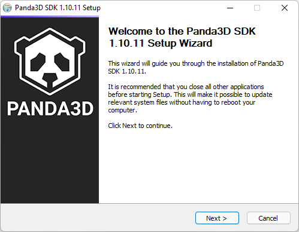
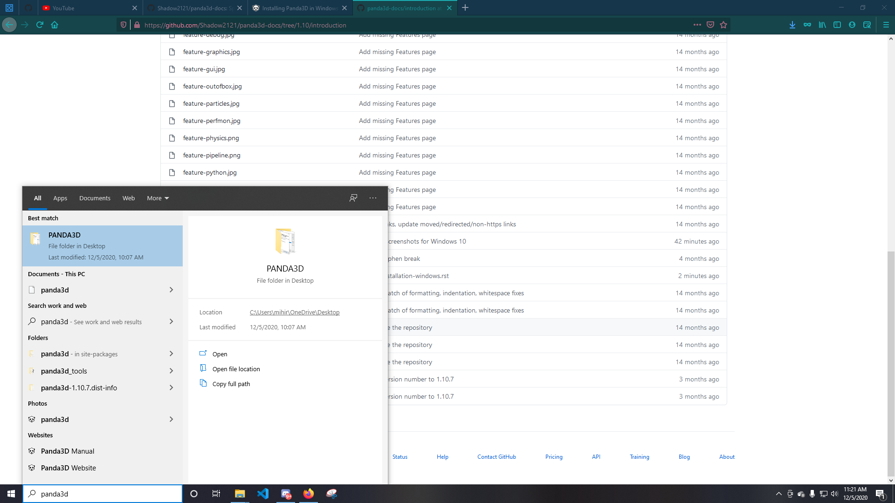
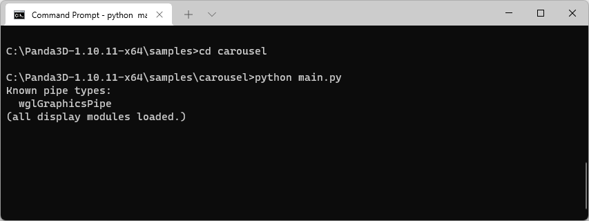
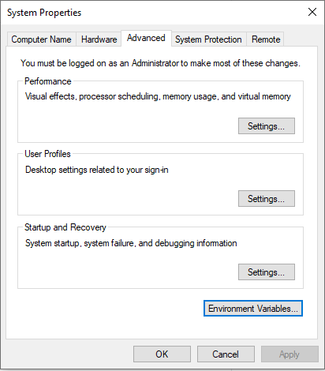
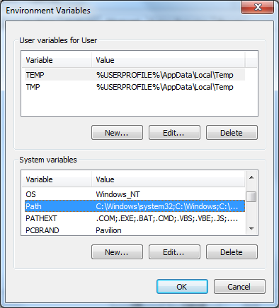
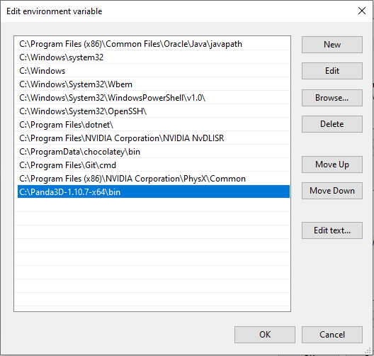

.. _installation-windows:

Installing Panda3D in Windows
=============================

If you have already installed Panda previously, you should uninstall it before
installing a new version. Once your machine is clean of all previous versions of
Panda3D, you should download the windows installer from the
`download page <https://www.panda3d.org/download/>`__. Run the installer, and
follow the prompts:

After installing Panda, you should run the sample programs to verify that the
installation is good. The best way to run a sample program is by using the
command prompt.

Open a command prompt, then change directory to the location where you installed
Panda. Then, change to the samples subdirectory. There, you will find a large
number of samples:

Change directory into one of the sample program directories, then use Python to
run the sample program in question:

If the test programs don't run, then usually, you need to update your video
drivers. If you want to know exactly why a program didn't run, you may need to
run it using the command prompt - this will enable you to see the error
messages.

**What to do if you see the Error Message:**

.. code-block:: text

   :display(error): The application requested hardware acceleration, but your OpenGL
   :display(error): driver, GDI Generic, only supports software rendering.
   :display(error): You need to install a hardware-accelerated OpenGL driver, or,
   :display(error): if you actually *want* to use a software renderer, then
   :display(error): alter the hardware/software configuration in your Config.prc file.
   :display(error): Window wouldn't open; abandoning window.

This error is fairly self-explanatory: it means your video drivers are
inadequate. Obtain better drivers.

**What to do if you see the Error Message:**

.. code-block:: text

   python is not a recognized internal command

This error message means that the command prompt was not able to locate python.
Normally, during the panda installation process, the PATH environment variable
is configured to indicate the location of python. However, some PCs have unusual
security configurations that prevent the installer from modifying the PATH. This
can result in the error message shown above.

To solve this problem, it may be necessary to modify the PATH manually.
Right-click the Start icon, click System, and then "Advanced sytem settings".
Then, click the button "Environment Variables":

If you have administrator access to the PC, select the PATH line in the list
under System Variables, otherwise, select the PATH line in the list of personal
environment Variables.

Now double-click the PATH (or Path) line. A small window opens containing a
series of directories separated by semicolons. Add Panda3D's bin and python
directories to the end of the PATH.

It may be necessary to log off and log back in to obtain the updated settings.
