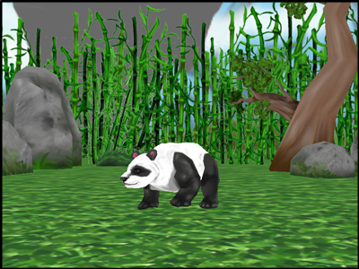

.. _loading-and-animating-the-panda-model:

Loading and Animating the Panda Model
=====================================

.. only:: python

   :ref:`Actors <loading-actors-and-animations>`
   ---------------------------------------------

   The :py:class:`~direct.actor.Actor.Actor` class is for animated models. Note
   that we use :py:meth:`~direct.showbase.Loader.Loader.loadModel()` for static
   models and :py:class:`~direct.actor.Actor.Actor` only when they are animated.
   The two constructor arguments for the :py:class:`~direct.actor.Actor.Actor`
   class are the name of the file containing the model and a Python dictionary
   containing the names of the files containing the animations.

Update the Code
---------------

.. only:: python

   .. literalinclude:: loading-and-animating-the-panda-model.py
      :language: python
      :linenos:

   The command :py:meth:`loop("walk") <direct.actor.Actor.Actor.loop>` causes
   the walk animation to begin looping.

.. only:: cpp

   The :py:class:`~direct.actor.Actor.Actor` class which is available to Python
   users is not available to C++ users. you should create your own Actor class
   which at least should do the following:

   -  load the Actor Model
   -  load the animations
   -  bind the model and the animations using AnimControl or
      AnimControlCollection

   The next sample will load the panda model and the walk animation. the call:
   ``window->loop_animations(0);`` does the magic of binding all the loaded
   models and their animations under the node path: render . it's very important
   to note that any animations loaded after the above call will not show until
   the same method is called again. also any animations loaded under a node path
   which doesn't belong to render (for example: render_2d) will not show even if
   the call: ``window->loop_animations(0);`` is made. For such animations to
   show, other steps must be applied (more on this later).

   .. literalinclude:: loading-and-animating-the-panda-model.cxx
      :language: cpp
      :linenos:

   We are first loading the model file and the animation file like ordinary
   models. Then, we are simply calling ``loop_animations(0)`` to loop all
   animations.

Run the Program
---------------

The result is a panda walking in place as if on a treadmill:

