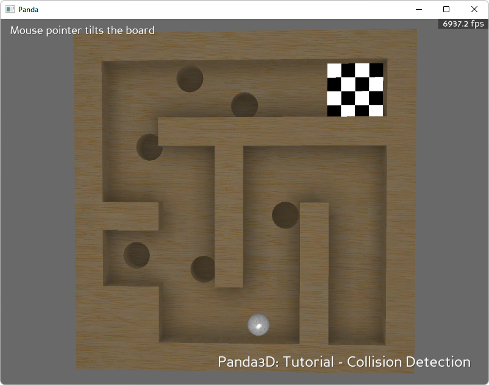

.. _ball-in-maze:

Sample Programs: Ball in Maze
=============================

To run a sample program, you need to install Panda3D.
If you're a Windows user, you'll find the sample programs in your start menu.
If you're a Linux user, you'll find the sample programs in /usr/share/panda3d.

.. rubric:: Screenshots

.. rubric:: Explanation

This tutorial will demonstrate how collision detection works in panda and
provide a simple implementation of its use. Collisions are used extensively in
modern games for a variety of purposes. At the most basic level, collision
detection allows for two objects to bump into each other and react. This can be
used to keep the objects from passing through each other but is not limited to
that purpose. In this tutorial, collision detection be used to simulate the game
of Labyrinth and will keep the ball within the bounds of the board. It will also
be used to detect if the ball is over a hole.

.. rubric:: Back to the List of Sample Programs:

:ref:`samples`
