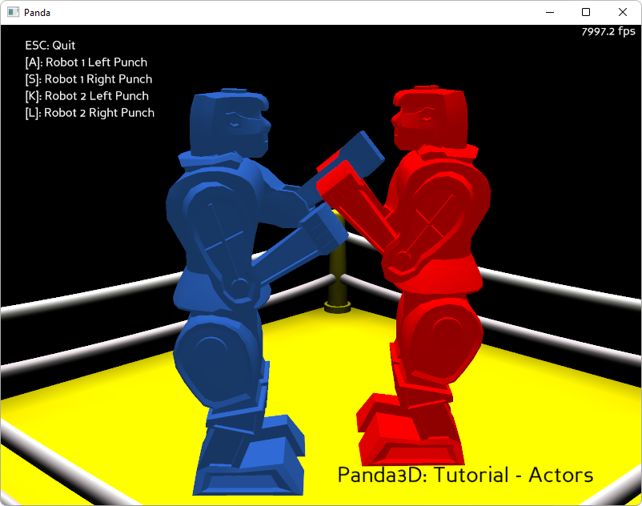

.. _boxing-robots:

Sample Programs: Boxing Robots
==============================

To run a sample program, you need to install Panda3D.
If you're a Windows user, you'll find the sample programs in your start menu.
If you're a Linux user, you'll find the sample programs in /usr/share/panda3d.

.. rubric:: Screenshots

.. rubric:: Explanation

This tutorial will show how to play animations on models aka "actors". We will
base this world on a the popular game of "Rock 'em Sock 'em Robots".

Actors are specific models that come with some pre-generated animations. These
animations are either available in the same egg file as the model or they are
available as their own egg files. Only actors may play these animations, and
actors also come with their own set of functions to use. Actors behave almost
identically to models but use a different load command called ``Actor.Actor()``.
For more information on actors, please consult the Panda3D online manual.

The image above shows the tutorial in action. Use the A,S,K,L keys to make the
robots punch and thus triggering their animations.

.. rubric:: Back to the List of Sample Programs:

:ref:`samples`
