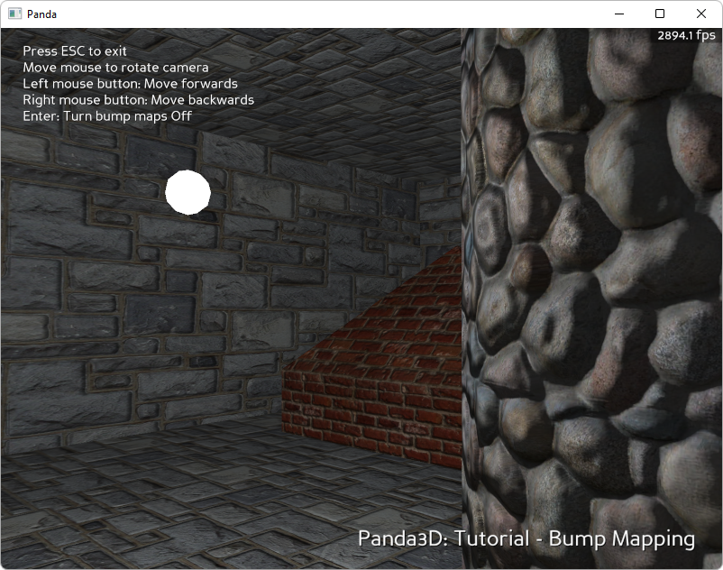

.. _bump-mapping:

Sample Programs: Bump Mapping
=============================

To run a sample program, you need to install Panda3D.
If you're a Windows user, you'll find the sample programs in your start menu.
If you're a Linux user, you'll find the sample programs in /usr/share/panda3d.

.. rubric:: Screenshots

.. rubric:: Explanation

Normal Mapping is a technique to make textured surfaces appear more "lifelike"
by having them respond to changing lights and viewing angles. As the light moves
around, it reflects off of simulated "bumps" on the surface (the bumps are not
real, the polygons are flat, but they look real because of how they reflect the
light).

.. rubric:: Panda's built-in Normal Mapping Capabilities

Normally, to use fancy rendering techniques like normal mapping, you would have
to write special GPU code called "shaders." However, in Panda3D version 1.5.0,
panda gained the ability to synthesize many shaders for you. What that means is
that you can use many modern rendering techniques (including normal mapping)
without having to know shader programming at all.

Look in the ``models`` subdirectory for a model called "abstractroom". It was
created in Maya, and a normal map was applied in Maya. The maya exporter was
used to convert this into panda's model file format, ``abstractroom.egg.``
During the conversion process, the maya exporter noticed the normal map and
included information about it in the egg file: if you examine the egg file with
a text editor, you will see the references in there. You can view the model
using panda's model viewer::

   pview abstractroom.egg

After pview loads, press 'c' to center the model, 'l' to turn on lighting, and
'p' to turn on per-pixel lighting. Presto, you will see the effects of normal
mapping.

If you are doing this in a program, the steps are basically the same: load a
model which already has normal maps, set up some lights, and turn on per-pixel
lighting. The sample program ``Tut-Normal-Mapping-Basic`` shows this process.

.. rubric:: Doing it the Hard Way

The problem with panda's shader synthesis capabilities is that they can only
synthesize the shaders that people usually need. If what you need is esoteric,
you'll have to write your own shader.

There are two difficulties associated with writing your own shader. The first is
that you need to know shader programming. Teaching shader programming is beyond
the scope of this tutorial. Panda uses the Cg shader language, which you can
learn elsewhere. Furthermore, normal mapping shaders are more complex than most.
The mathematics involved in normal mapping are quite complex, which puts writing
a normal mapping shader even further outside the scope of this tutorial.

The second problem with writing your own shader is that shaders must be
hardwired to a very limited set of circumstances. The shader included with this
sample program is hardwired for models with a single diffuse texture and a
single normal map. It is hardwired for absence of vertex colors. It implements
one white point light and one white ambient light. Changing any of these
parameters would require a different shader.

This is not because the shader was written lazily. It is because shaders are by
nature specialized to a specific combination of model attributes. This makes it
rather awkward to write a substantial program that uses manually-written
shaders. This is a big part of the reason that panda now supports shader
synthesis - the shader generator can handle almost any kind of model.

.. rubric:: Back to the List of Sample Programs:

:ref:`samples`
