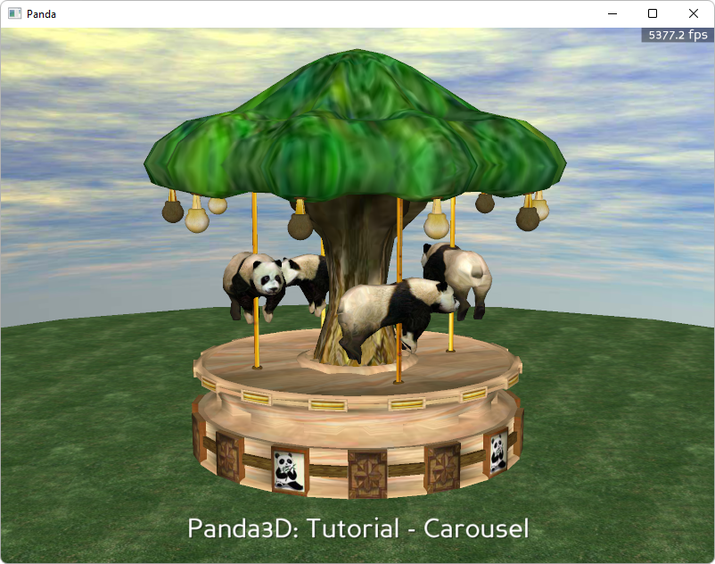

.. _carousel:

Sample Programs: Carousel
=========================

To run a sample program, you need to install Panda3D.
If you're a Windows user, you'll find the sample programs in your start menu.
If you're a Linux user, you'll find the sample programs in /usr/share/panda3d.

.. rubric:: Screenshots

.. rubric:: Explanation

This sample progam demonstrates some uses for intervals in panda to move objects
in your panda world.

Intervals are built in Panda3D functions that will let you change an attribute
over time. In this tutorial, the position and texture attributes of various
objects will be altered over time to give life to a carousel. The most common
intervals for doing simple movement of objects are the posInterval and
hprInterval. These intervals will change the position/orientation of an object
(or node) over a given time and given displacement/rotation, respectively.
Another interval we will look at is the LerpFunc interval. LerpFunc will call a
function and give it a linearly interpolated value range over a specified time
range. This is how we will oscilate pandas via a sin wave and alternate textures
over time. For more information on intervals, please refer to the intervals
section of the online manual.

.. rubric:: Back to the List of Sample Programs:

:ref:`samples`
