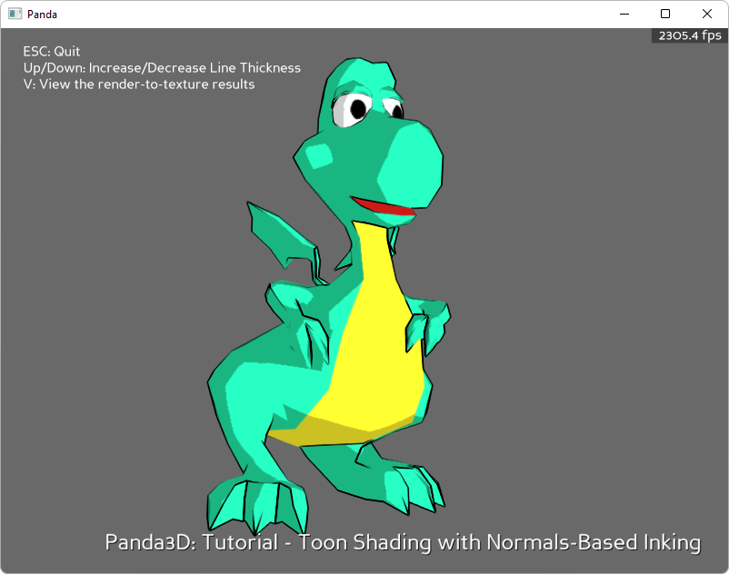

.. _cartoon-shader:

Sample Programs: Cartoon Shader
===============================

To run a sample program, you need to install Panda3D.
If you're a Windows user, you'll find the sample programs in your start menu.
If you're a Linux user, you'll find the sample programs in /usr/share/panda3d.

.. rubric:: Screenshots

.. rubric:: Explanation

This tutorial will show how to make a cartoon shader. It requires three separate
shaders. On video cards that do not support shaders, the results will not be
interesting.

Every frame, the scene is rendered into the main window using a "lighting
shader." The lighting shader calculates lighting pretty much the same way OpenGL
always does, but it adds a threshold function, so that the line between light
and dark is a clear, discrete line.

Every frame, the scene is also rendered into an offscreen buffer using a shader
that stores the surface normals into the buffer. Every frame, the contents of
this buffer are copied to a texture. The result is a "surface normals texture."
The lower-right corner of the screen contains a small quad showing the contents
of the "surface normals texture."

The surface normals texture is applied to the main window using a fullscreen
quad. A shader that detects edges is run on this quad. Wherever there is a
discontinuity in the normals, the shader outputs black. Otherwise, it outputs a
transparent pixel. This creates the lines around the model.

The model itself isn't even textured - it's vertex colored. Untextured models
often look great in cartoon-shaded worlds.

The image above shows the tutorial in action.

.. rubric:: Back to the List of Sample Programs:

:ref:`samples`
