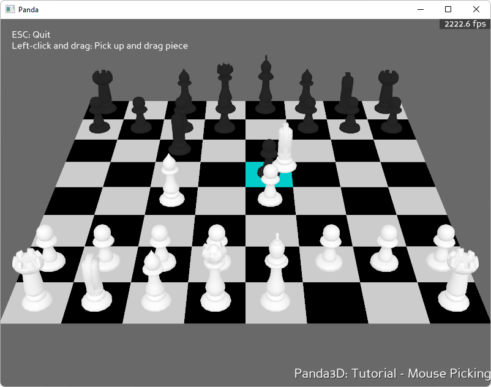

.. _chessboard:

Sample Programs: Chessboard
===========================

To run a sample program, you need to install Panda3D.
If you're a Windows user, you'll find the sample programs in your start menu.
If you're a Linux user, you'll find the sample programs in /usr/share/panda3d.

.. rubric:: Screenshots

.. rubric:: Explanation

This sample program demonstrates how to use the mouse cursor interactively in
your panda world. It is sometimes desirable to be able to interact with objects
in a 3D scene via a mouse cursor. There are many solutions to this problem and
this tutorial will cover a popular method. The method used in this tutorial will
use collision detection to determine which objects the mouse cursor is hovering
over. By using collision rays and shooting them from the lens (camera) with
respect to the current position of the mouse cursor, we can hit objects that are
being covered by the cursor.

Note that there's a much faster way to achieve this, using the Plane class.
However, this sample demonstrates how it can be done using the Collision system.

.. rubric:: Back to the List of Sample Programs:

:ref:`samples`
