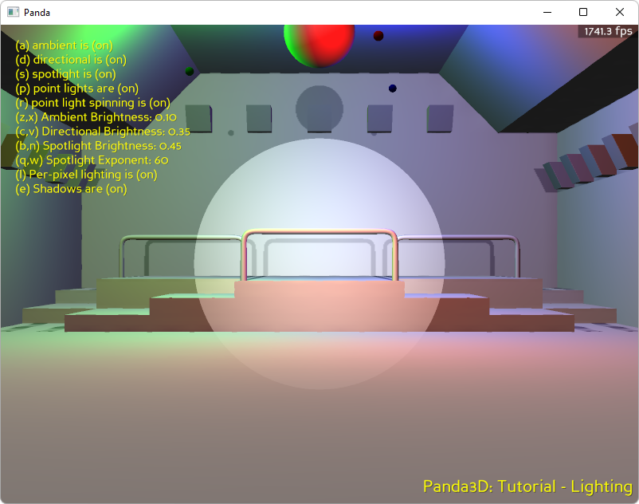

.. _disco-lights:

Sample Programs: Disco Lights
=============================

To run a sample program, you need to install Panda3D.
If you're a Windows user, you'll find the sample programs in your start menu.
If you're a Linux user, you'll find the sample programs in /usr/share/panda3d.

.. rubric:: Screenshots

.. rubric:: Explanation

This sample program demonstrates lighting in panda. Lighting in panda can add a
lot of depth into a scene. In panda, you can create point, directional, ambient
and spot lights (for a detailed description of these lights, see the manual link
below). Lights in Panda can also optionally cast shadows.
For more information on lighting, please consult the Panda3D online manual.

.. rubric:: Back to the List of Sample Programs:

:ref:`samples`
