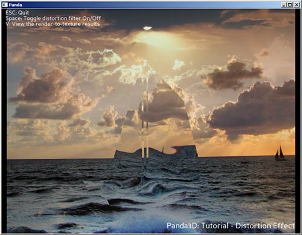

.. _distortion:

Sample Programs: Distortion
===========================

The Distortion Sample Program

To run a sample program, you need to install Panda3D. If you're a Windows
user, you'll find the sample programs in your start menu. If you're a Linux
user, you'll find the sample programs in /usr/share/panda3d.

Screenshots

|Screenshot-Sample-Programs-Distortion.jpg|

Explanation

Creates an interesting shader effect where the entire screen is rendered into
a texture.

Back to the List of Sample Programs:

:ref:`samples`

