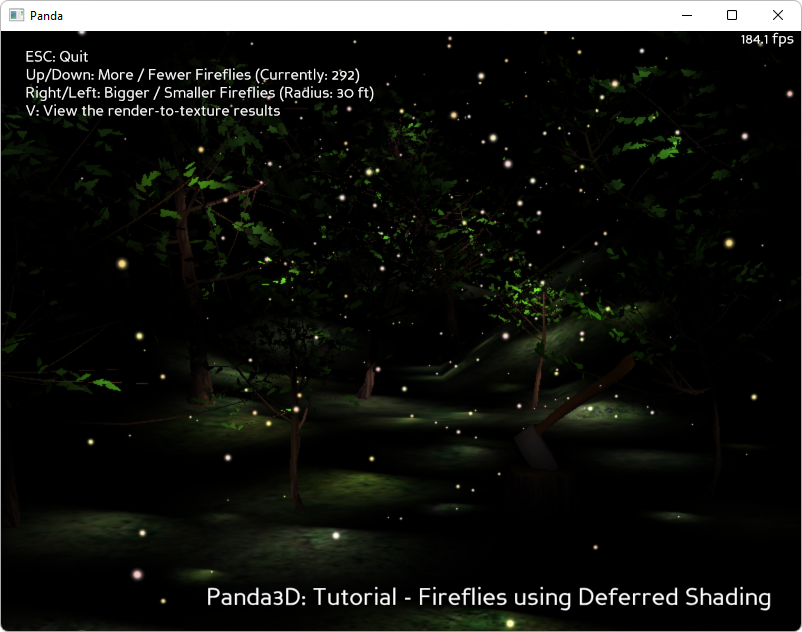

.. _fireflies:

Sample Programs: Fireflies
==========================

To run a sample program, you need to install Panda3D.
If you're a Windows user, you'll find the sample programs in your start menu.
If you're a Linux user, you'll find the sample programs in /usr/share/panda3d.

.. rubric:: Screenshots

.. rubric:: Explanation

A nature scene with 500 fireflies: how do you do a high-polygon scene with 500
lights, without a total performance collapse?

This sample program shows how to do Deferred Shading in Panda. You can have
hundreds of lights, and all the lights affect all the models automatically.
This is not expensive: the cost is only proportional to the number of actual lit
pixels times the number of times each pixel is lit. That's why fireflies make a
perfect demonstration --- you could never have 500 lights in a high-polygon
scene without deferred shading. But perhaps even more important is the elegance
of a rendering algorithm that automatically connects lights to the appropriate
objects without the need for LightAttribs.

To understand how deferred shading works, first consider how ordinary shading
works in plain OpenGL. In most fairly simple cases, the lighting equation boils
down to::

   final = diffuse color * dot(light vector, surface normal) * attenuation(surface position, light position and orientation)

Where the attenuation function depends on the type of light. So anyhow, this
equation has four inputs:

1. The diffuse color.
2. The surface normal.
3. The surface position.
4. The light parameters.

The idea behind deferred shading is that during the rendering process, you don't
compute the final color. Instead, you store the values listed above in the
framebuffer itself. Of course, you need a "fat framebuffer" to store all that
data. In an image postprocessing step you scan the framebuffer and compute the
final color.

Of course, that's a lot of data to store in the framebuffer. The first
optimization is not to store the light parameters. It is not necessary to store
light parameters because the light parameters don't vary from pixel to pixel ---
they're constants.

Our second optimization involves surface position. Surface position can be
inferred by calculating backward from the depth buffer. Each pixel on the screen
represents a ray from the camera into the scene, and the depth value in the
pixel indicates a distance along the ray. Because of this, it is not actually
necessary to store surface position explicitly - it is only necessary to store
depth values. Of course, OpenGL does that for free.

So the framebuffer now needs to store surface normal, diffuse color, and depth
value (to infer surface position). In practice, most ordinary framebuffers can
only store color and depth - they don't have any place to store a third value.
So we need to use a special offscreen buffer with an "auxiliary" bitplane. The
auxiliary bitplane stores the surface normal.

So then, there's the final postprocessing pass. This involves combining the
diffuse color texture, the surface normal texture, the depth texture, and the
light parameters into a final rendered output. The light parameters are passed
into the postprocessing shader as constants, not as textures.

If there are a lot of lights, things get interesting. You use one postprocessing
pass per light. Each pass only needs to scan those framebuffer pixels that are
actually in range of the light in question. To traverse only the pixels that are
affected by the light, just render the illuminated area's convex bounding
volume.

The shader to store the diffuse color and surface normal is trivial. But the
final postprocessing shader is a little complicated. What makes it tricky is
that it needs to regenerate the original surface position from the screen
position and depth value. The math for that deserves some explanation.

We need to take a clip-space coordinate and depth-buffer value
:math:`\begin{pmatrix}x_{clip}&y_{clip}&z_{clip}&w_{clip}\end{pmatrix}` and
unproject it back to a view-space
:math:`\begin{pmatrix}x_{view}&y_{view}&z_{view}\end{pmatrix}` coordinate.
Lighting is then done in view-space.

Okay, so here's the math. Panda uses the projection matrix to transform view-
space into clip-space. But in practice, the projection matrix for a perspective
camera always contains four nonzero constants, and they're always in the same
place:

.. math::

   \begin{bmatrix}
   A & 0 & 0 & 0 \\
   0 & 0 & B & 1 \\
   0 & C & 0 & 0 \\
   0 & 0 & D & 0
   \end{bmatrix}

The result is that the panda projection matrix boils down to these simple
equations:

.. math::

   \begin{aligned}
   x_{clip} &= x_{view} \cdot A \\
   y_{clip} &= z_{view} \cdot C \\
   z_{clip} &= y_{view} \cdot B + D \\
   w_{clip} &= y_{view}
   \end{aligned}

Look out, there has been a coordinate system change! In the scene graph, Z
corresponds to "up", but in clip-space, Z is the depth value (and X,Y address a
pixel).

After panda calculates clip-space coordinates, it divides by W. Finally, it
rescales the depth-value:

.. math::

   \begin{aligned}
   x_{screen} &= \frac{x_{clip}}{w_{clip}} \\
   y_{screen} &= \frac{y_{clip}}{w_{clip}} \\
   z_{screen} &= \frac{z_{clip}}{w_{clip}} \\
   depth &= 0.5 \cdot z_{screen} + 0.5
   \end{aligned}

So now we have some equations defining
:math:`\begin{pmatrix}x_{clip}&y_{clip}&z_{clip}&w_{clip}\end{pmatrix}` in terms
of :math:`\begin{pmatrix}x_{view}&y_{view}&z_{view}\end{pmatrix}`, and
:math:`\begin{pmatrix}x_{screen}&y_{screen}&z_{screen}\end{pmatrix}` in terms of
:math:`\begin{pmatrix}x_{clip}&y_{clip}&z_{clip}&w_{clip}\end{pmatrix}`.  It's
basic algebra to solve these equations for
:math:`\begin{pmatrix}x_{view}&y_{view}&z_{view}\end{pmatrix}` in terms of
:math:`\begin{pmatrix}x_{screen}&y_{screen}&z_{screen}\end{pmatrix}`.  Here, I
have shown all my algebraic steps:

.. math::

   \begin{aligned}
   depth &= 0.5 \cdot z_{screen} + 0.5 \\
   depth &= \frac{z_{clip}}{w_{clip}} \cdot 0.5 + 0.5 \\
   depth &= \frac{y_{view} \cdot B + D}{y_{view}} \cdot 0.5 + 0.5 \\
   depth - 0.5 &= \frac{y_{view} \cdot B + D}{y_{view}} \cdot 0.5 \\
   (2 \cdot depth - 1.0) &= \frac{y_{view} \cdot B + D}{y_{view}} \\
   (2 \cdot depth - 1.0) \cdot y_{view} &= y_{view} \cdot B + D \\
   (2 \cdot depth - 1.0) \cdot y_{view} + y_{view} \cdot -B &= D \\
   (2 \cdot depth - 1.0 - B) \cdot y_{view} &= D \\
   y_{view} &= \frac{0.5D}{depth - 0.5 - 0.5B}
   \end{aligned}

|

.. math::

   \begin{aligned}
   x_{screen} &= \frac{x_{clip}}{w_{clip}} \\
   x_{screen} &= \frac{x_{view} \cdot A}{y_{view}} \\
   x_{screen} \cdot y_{view} &= x_{view} \cdot A \\
   x_{screen} \cdot \frac{0.5D}{depth - 0.5 - 0.5B} &= x_{view} \cdot A \\
   \frac{x_{screen} \cdot 0.5D}{depth - 0.5 - 0.5B} &= x_{view} \cdot A \\
   \frac{x_{screen} \cdot \frac{0.5D}{A}}{depth - 0.5 - 0.5B} &= x_{view} \\
   x_{view} &= \frac{x_{screen} \cdot \frac{0.5D}{A}}{depth - 0.5 - 0.5B}
   \end{aligned}

|

.. math::

   \begin{aligned}
   y_{screen} &= \frac{y_{clip}}{w_{clip}} \\
   y_{screen} &= \frac{z_{view} \cdot C}{y_{view}} \\
   y_{screen} \cdot y_{view} &= z_{view} \cdot C \\
   y_{screen} \cdot \frac{0.5D}{depth - 0.5 - 0.5B} &= z_{view} \cdot C \\
   \frac{y_{screen} \cdot 0.5D}{depth - 0.5 - 0.5B} &= z_{view} \cdot C \\
   \frac{y_{screen} \cdot \frac{0.5D}{C}}{depth - 0.5 - 0.5B} &= z_{view} \\
   z_{view} &= \frac{y_{screen} \cdot \frac{0.5D}{C}}{depth - 0.5 - 0.5B}
   \end{aligned}

To save our vertex and pixel shaders a little work, we can precompute these
constants:

.. math::

   \begin{aligned}
   x_{proj} &= \frac{0.5D}{A} \\
   y_{proj} &= 0.5D \\
   z_{proj} &= \frac{0.5D}{C} \\
   w_{proj} &= -0.5-0.5B
   \end{aligned}

So, here are the equations in their final form:

.. math::

   \begin{aligned}
   x_{view} &= \frac{x_{screen} \cdot x_{proj}}{depth + w} \\
   y_{view} &= \frac{y_{proj}}{depth + w} \\
   z_{view} &= \frac{y_{screen} \cdot z_{proj}}{depth + w}
   \end{aligned}

.. rubric:: Back to the List of Sample Programs:

:ref:`samples`
