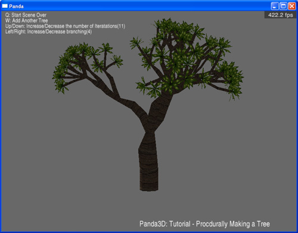

.. _fractal-plants:

Sample Programs: Fractal Plants
===============================

The Fractal Plants Sample Program

To run a sample program, you need to install Panda3D. If you're a Windows
user, you'll find the sample programs in your start menu. If you're a linux
user, you'll find the sample programs in /usr/share/panda3d.

Screenshots

|Screenshot-Sample-Programs-Fractal-Plants.jpg|

Explanation

This sample program isn't so much about fractals as it is about synthesizing a
3D model. Ie, this program does not include any 3D models on disk - it
generates the trees procedurally.

Back to the List of Sample Programs:

:ref:`samples`

