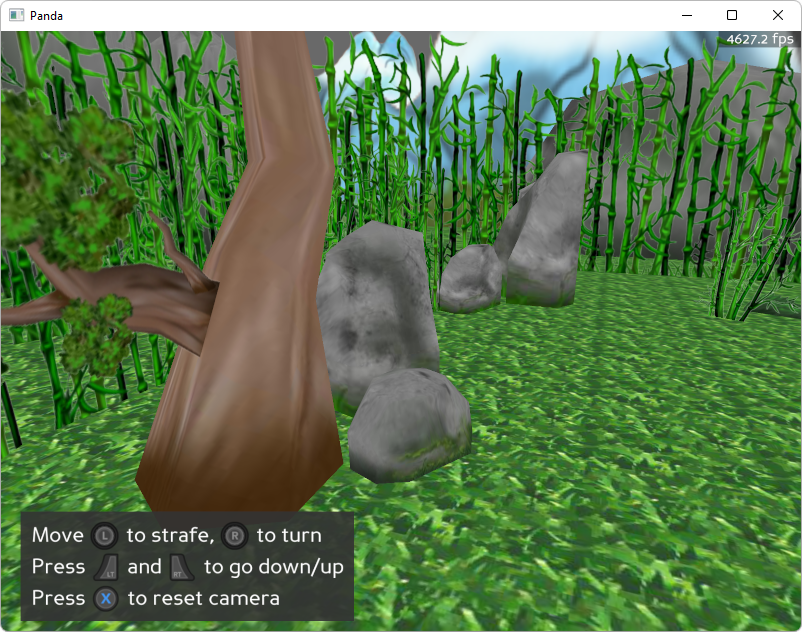
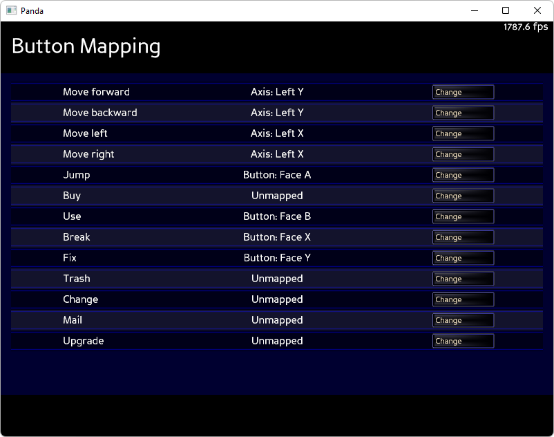

.. _sample-programs-gamepad:

Sample Programs: Gamepad
========================

To run a sample program, you need to install Panda3D.
If you're a Windows user, you'll find the sample programs in your start menu.
If you're a Linux user, you'll find the sample programs in /usr/share/panda3d.

.. rubric:: Screenshots

.. rubric:: Explanation

This sample program shows how to use game controller devices such as gamepads,
steering wheels and joysticks in Panda3D. Gamepad devices are mostly used to
control characters in games using input from specialized devices. In this
example we will control the camera to steer around the environment with either a
gamepad device, steering wheel or flightstick device.

The controls are as follows:

*gamepad:*

This sample is for gamepads like for example the xbox, Switch Pro or Steam
controller but will also work with all other gamepads that have any of those
controls:

===================== =============================================
Move Left thumbstick  Move camera forward and strafe
Move Right thumbstick Move camera heading and pitch
Press Left thumbstick speed up strafe
A/B/Y                 Show an onscreen text which button is pressed
X                     Reset to start position
Back/Start/Select     Exit the sample program
===================== =============================================

*steering wheel:*

================== =================================
Acceleration pedal Accelerate camera forward
Break pedal        Slow down camera
Wheel              Control cameras heading
A                  Show an onscreen message
Hat Up             Re-Set the wheels center position
================== =================================

*flight stick:*

========== =========================
Throttle   Accelerate camera forward
Move Stick Control camera rotations
Trigger    Show an onscreen message
========== =========================

For more information on devices, please consult the :ref:`joystick-support`
section of the manual.

.. rubric:: Back to the List of Sample Programs:

:ref:`samples`
