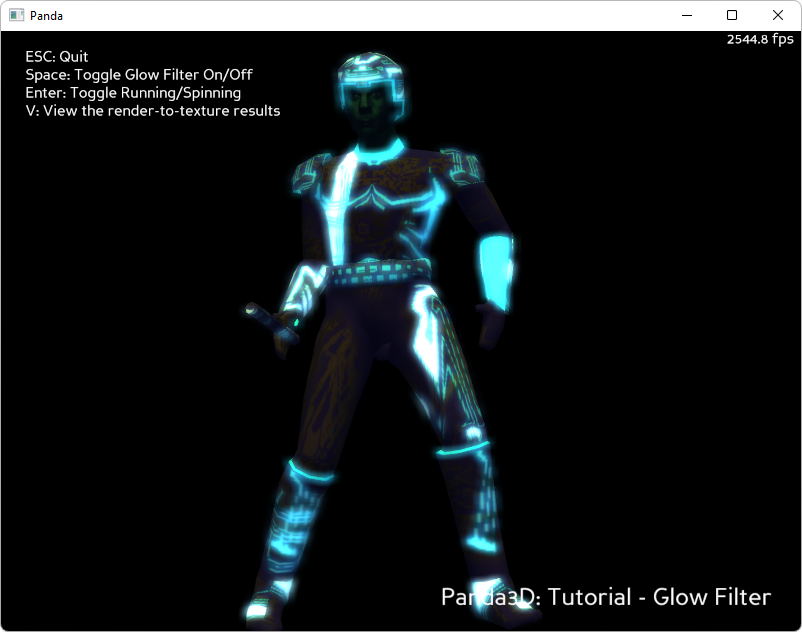

.. _glow-filter:

Sample Programs: Glow Filter
============================

To run a sample program, you need to install Panda3D.
If you're a Windows user, you'll find the sample programs in your start menu.
If you're a Linux user, you'll find the sample programs in /usr/share/panda3d.

.. rubric:: Screenshots

.. rubric:: Explanation of the 'Basic' Version

There are two versions of this program: Basic and Advanced. The Basic version
relies on Panda3D's automatic shader generation mechanisms and Panda3D's built
in catalog of image-postprocessing filters. In other words, in the Basic
version, Panda3D is doing all the hard work for us. In the Advanced version, we
have written our own shaders and are doing our own image postprocessing.

So what the basic version demonstrates is really just how to turn on the shader
generation, how to turn on a 'light ramp' (the essence of cartoon shading), and
how to turn on a built-in image postprocessing filter.

.. rubric:: Explanation of the 'Advanced' Version

The advanced version shows how to use Cg shaders to implement a "glow"
postprocessing filter. The demo will only work on video cards that support
shaders.

If you examine the texture for this model in photoshop, you'll see that it has
an alpha channel. I'm not using the alpha channel to represent transparency.
Instead, the alpha channel is a "glow map." Where the alpha is 1, the model
glows, in places where the alpha is zero, it does not glow.

The scene is rendered to the main window in the normal way. It is also rendered
to an offscreen buffer using a special shader that pays attention to the glow
map (in the alpha channel). Wherever the glow map is 1, it renders the model's
normal color. Wherever the glow map is 0, it renders black. This offscreen
buffer is called the "glow buffer".

The contents of the glow buffer are then rendered into another offscreen buffer,
the "blur x" buffer, using a shader that does a one-dimensional horizontal blur.
The contents of the "blur x" buffer are then rendered into a third offscreen
buffer, the "blur y" buffer, using a shader that does a one-dimensional vertical
blur. Taken together, the two one-dimensional blurs add up to a two-dimensional
blur. The result is that the glowing lines that were rendered into the glow
buffer are smeared outward, forming little halos.

In a final step, the blurred texture is applied to the main window using
additive blending - ie, the halos are added to the scene.

.. rubric:: Back to the List of Sample Programs:

:ref:`samples`
