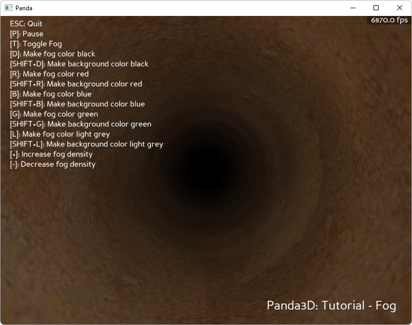

.. _infinite-tunnel:

Sample Programs: Infinite Tunnel
================================

To run a sample program, you need to install Panda3D.
If you're a Windows user, you'll find the sample programs in your start menu.
If you're a Linux user, you'll find the sample programs in /usr/share/panda3d.

.. rubric:: Screenshots

.. rubric:: Explanation

This tutorial will cover fog and how it can be used to make a finite length
tunnel seem endless by hiding its endpoint in darkness. Fog in panda works be
coloring objects based on their distance from the camera. Fog is not a 3D volume
object like real world fog. With the right settings, Fog in panda can mimic the
appearance of real world fog.

The way fog in Panda works is by coloring the models in the world. Fog cannot
exist without any objects in the scene. The parts of the object which are
furthest from the camera will get gradually colored by the color specified for
the fog. If this color blends in with the background, it will appear as it the
object is being occluded by a 'cloud' of fog.

.. rubric:: Back to the List of Sample Programs:

:ref:`samples`
