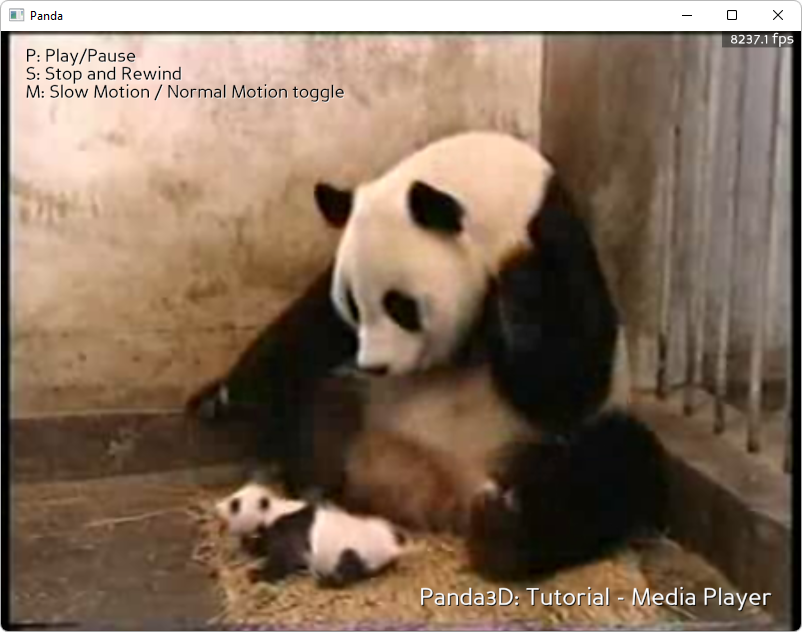

.. _media-player:

Sample Programs: Media Player
=============================

To run a sample program, you need to install Panda3D.
If you're a Windows user, you'll find the sample programs in your start menu.
If you're a Linux user, you'll find the sample programs in /usr/share/panda3d.

.. rubric:: Screenshots

.. rubric:: Explanation

This sample program shows how to play a movie in panda. This is particularly
useful for cut-scenes, but movies can also be used as animated textures on the
surfaces of objects. This sample shows both video and audio, and how to
synchronize them properly.

.. rubric:: Back to the List of Sample Programs:

:ref:`samples`
