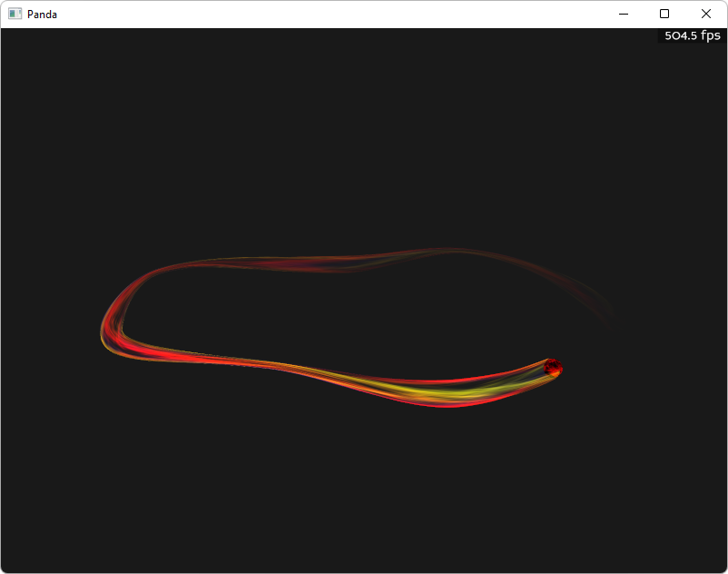
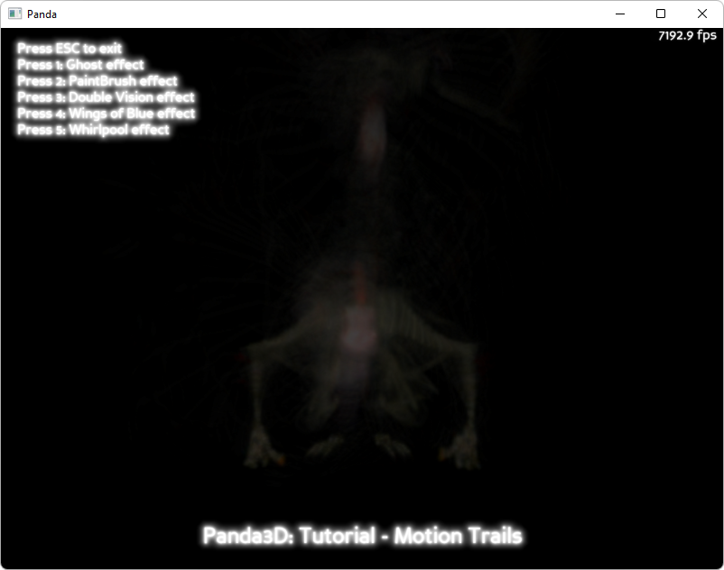

.. _motion-trails:

Sample Programs: Motion Trails
==============================

To run a sample program, you need to install Panda3D.
If you're a Windows user, you'll find the sample programs in your start menu.
If you're a Linux user, you'll find the sample programs in /usr/share/panda3d.

.. rubric:: Screenshots

.. rubric:: Explanation

These sample programs shows two different ways to create motion trails in panda.
The first one is a geometry-based method, which uses the
:py:class:`~direct.motiontrail.MotionTrail.MotionTrail` class (which is a
wrapper around the C++ class :class:`.CMotionTrail`) in order to extrude a
cross-section of geometry along the path that an object takes. This method can
be used to achieve a wide range of effects, and is usually applied applied to
individual objects.

The second one is entirely different, and based around reusing the contents of
the framebuffer in the following frame. The basic process is this: after
rendering the scene, you copy the scene into a texture. You apply that texture
to a full-screen quad. You integrate that quad into the rendering of the next
frame. That creates a feedback loop.

The basic steps are: create a texture that will hold the contents of the main
window. Tell the main window to copy is output into this texture using
setupRenderTexture. Obtain a full-screen quad containing this texture using
getTextureCard. Position this quad in the scene.

You can get a lot of different effects by simply moving the quad a little bit.
By putting it behind the actor, the actor is fully visible, and surrounded by
trails. By putting it in front of the actor, the trails overlap the actor. By
rotating the quad slightly, you get a whirlpool. By offsetting it or scaling it,
you can cause the trails to move away from the actor. You can colorize it,
adjust its transparency, and otherwise tweak it in a number of ways.

.. rubric:: Back to the List of Sample Programs:

:ref:`samples`
