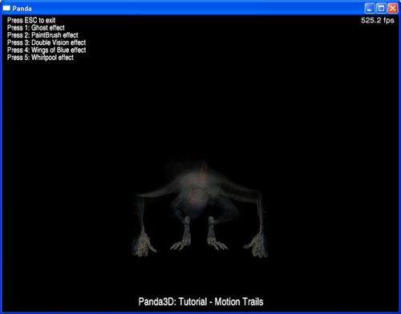

.. _motion-trails:

Sample Programs: Motion Trails
==============================

The Motion Trails Sample Program

To run a sample program, you need to install Panda3D. If you're a Windows
user, you'll find the sample programs in your start menu. If you're a Linux
user, you'll find the sample programs in /usr/share/panda3d.

Screenshots

|Screenshot-Sample-Programs-Motion-Trails.jpg|

Explanation

This tutorial shows how to create motion trails in panda. The basic process is
this: after rendering the scene, you copy the scene into a texture. You apply
that texture to a full-screen quad. You integrate that quad into the rendering
of the next frame. That creates a feedback loop.

The basic steps are: create a texture that will hold the contents of the main
window. Tell the main window to copy is output into this texture using
setupRenderTexture. Obtain a full-screen quad containing this texture using
getTextureCard. Position this quad in the scene.

You can get a lot of different effects by simply moving the quad a little bit.
By putting it behind the actor, the actor is fully visible, and surrounded by
trails. By putting it in front of the actor, the trails overlap the actor. By
rotating the quad slightly, you get a whirlpool. By offsetting it or scaling
it, you can cause the trails to move away from the actor. You can colorize it,
adjust its transparency, and otherwise tweak it in a number of ways.

Back to the List of Sample Programs:

:ref:`samples`

