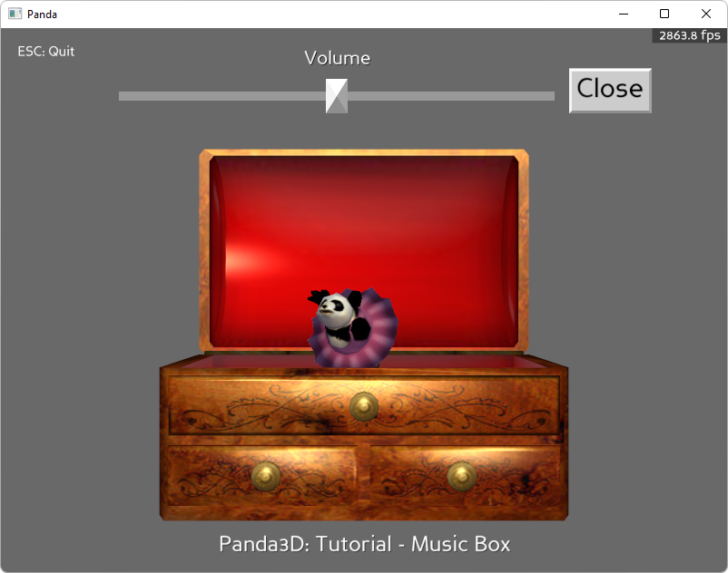

.. _music-box:

Sample Programs: Music Box
==========================

To run a sample program, you need to install Panda3D.
If you're a Windows user, you'll find the sample programs in your start menu.
If you're a Linux user, you'll find the sample programs in /usr/share/panda3d.

.. rubric:: Screenshots

.. rubric:: Explanation

Music Box is a simple program that allows you to play sounds. It demonstrates
playing sounds, and creating GUI buttons and sliders.

.. rubric:: Back to the List of Sample Programs:

:ref:`samples`
