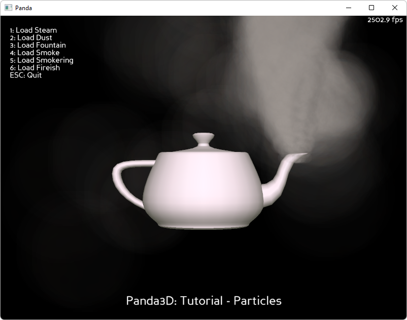

.. _particles:

Sample Programs: Particles
==========================

To run a sample program, you need to install Panda3D.
If you're a Windows user, you'll find the sample programs in your start menu.
If you're a Linux user, you'll find the sample programs in /usr/share/panda3d.

.. rubric:: Screenshots

.. rubric:: Explanation

In this tutorial, you will learn how to create particle effects in Panda3D.
Particle effects are systems simulated by the movement of many small objects, or
particles. They are commonly used to simulate phenomenon like explosions,
sparks, fire, smoke, and steam to name a few. Particle effect systems are very
complicated. It's not likely that you would be able to create any good systems
just by reading a list of available parameters. You need to be able to see and
manipulate the systems to really get results. Fortunately, there is a tool built
into Panda for visualizing particle effects. particlePanelLoader.py contains the
code needed to run the Particle Panel. Run it, and you should see a black screen
with a default particle effect, and a second window listing the parameters for
that effect.

There are too many parameters in the Particle Panel to go over them all,
however, the main sections are:

-  System: Details on how many particles are allowed and how often they are
   created.
-  Factory: Sets the properties of particles when they are created.
-  Emitter: Sets an area that particles can be created in and their initial
   velocities.
-  Renderer: How the particles will be drawn on screen (Hint: Most good particle
   effects are sprites with a small texture at very low alpha (around .1)
   heavily blending between each other.).
-  Forces: Sets forces that can be used to move existing particles.

Play around with the panel for a while, and create something you like. You can
then save the settings to a file with the extension ptf. You can also load that
ptf later and continue to modify it. Some sample ptfs are included for
inspiration. The Panel does need some improvements because it is somewhat buggy.
It can crash, especially when dragged around, and forgets some settings when
they are saved out to a ptf. It forgets to include the extension of the texture
for a SpriteRenderer, so you need to open the file by hand and correct the
loader.loadTexture command or it will not load. It also forgets to record the
axis masks on forces.

.. rubric:: Back to the List of Sample Programs:

:ref:`samples`
