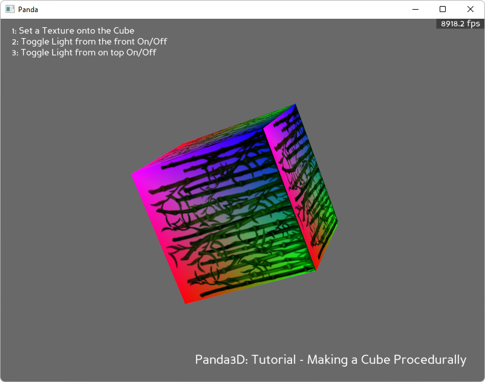

.. _procedural-cube:

Sample Programs: Procedural Cube
================================

To run a sample program, you need to install Panda3D.
If you're a Windows user, you'll find the sample programs in your start menu.
If you're a Linux user, you'll find the sample programs in /usr/share/panda3d.

.. rubric:: Screenshots

.. rubric:: Explanation

This program synthesizes a 3D model of a cube. If you need to see in the minimum
number of lines of code how to synthesize a model, this is the sample you want.

.. rubric:: Back to the List of Sample Programs:

:ref:`samples`
