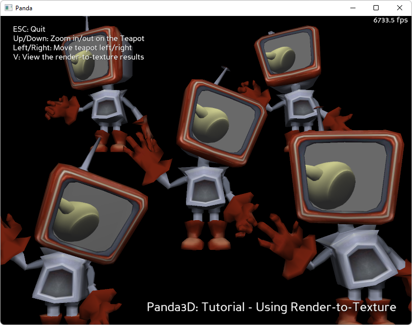

.. _render-to-texture:

Sample Programs: Teapot on TV
=============================

To run a sample program, you need to install Panda3D.
If you're a Windows user, you'll find the sample programs in your start menu.
If you're a Linux user, you'll find the sample programs in /usr/share/panda3d.

.. rubric:: Screenshots

.. rubric:: Explanation

In this tutorial, a spinning teapot is rendered into a texture. Then, the
texture (which contains a picture of a teapot) is applied to the face of an
animated TV-headed character, who dances.

.. rubric:: Back to the List of Sample Programs:

:ref:`samples`
