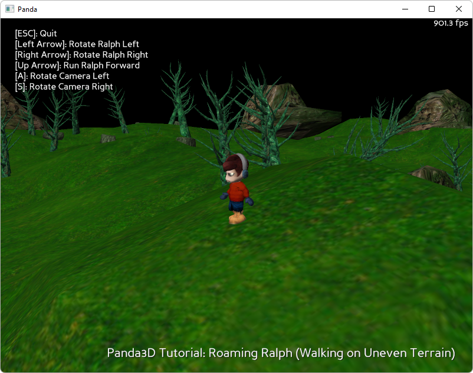

.. _roaming-ralph:

Sample Programs: Roaming Ralph
==============================

To run a sample program, you need to install Panda3D.
If you're a Windows user, you'll find the sample programs in your start menu.
If you're a Linux user, you'll find the sample programs in /usr/share/panda3d.

.. rubric:: Screenshots

.. rubric:: Explanation

This tutorial shows a character walking on uneven terrain. He rises and falls
with the contours of the terrain, stops when he runs into a tree or a rock, and
won't walk off the edge. The camera follows him, also moving intelligently over
the terrain, and you have some control over the camera angle. The character's
body animates sensibly according to his motion.

Much of this is implemented using collision rays to detect the height of the
terrain and the presence of obstacles.

.. caution::

   This program uses an extremely inefficient method for detecting the height of
   the terrain. There is a much better way to do it, but we have not had time to
   correct the sample program.

.. rubric:: Back to the List of Sample Programs:

:ref:`samples`
