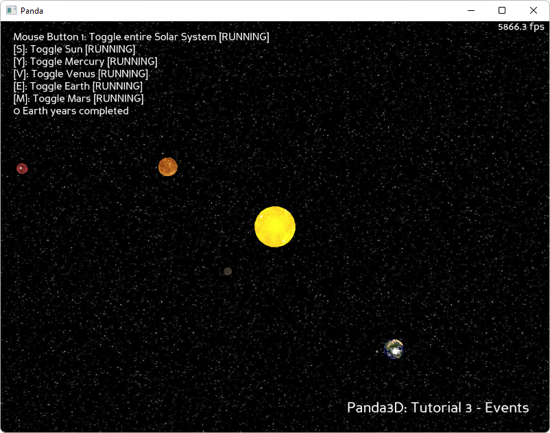
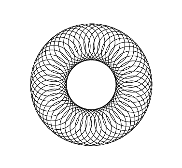

.. _solar-system:

Sample Programs: Solar System
=============================

To run a sample program, you need to install Panda3D.
If you're a Windows user, you'll find the sample programs in your start menu.
If you're a Linux user, you'll find the sample programs in /usr/share/panda3d.

.. rubric:: Screenshots

.. rubric:: Explanation

This sample program shows planets orbiting around the sun, and a moon orbiting
one of the planets. If you just stare at the moon, you'll realize that its
motion is a spiral:

The motion of the moon is only simple if you think about it in relative terms:
the moon is moving in a circle relative to the planet, and the planet is
moving in a circle relative to the sun.

This panda program shows how to implement relative movement and relative
positioning.

.. rubric:: Back to the List of Sample Programs:

:ref:`samples`
