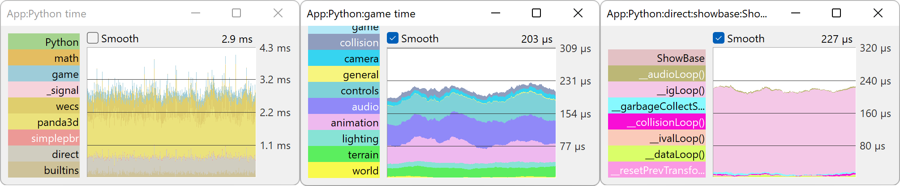

.. _python-calculation:

Python Calculation
==================

The Panda3D engine is mostly written in C++, not Python. It would be false to
assume that Panda3D is always slower than other game engines when used with
Python. When you call a function in Python, Python calls the C++ equivalent,
same for classes. For example, when you load a model, Panda3D's C++ side does
all the job of reading from the 3d file, creating the vertices, faces,
applying the materials, textures and so on. The Python overhead is usually
very small. Many other games and game engines use scripting languages for
writing the game logic code, because usually the difference in performance
time is negligible and scripting languages clearly win when it comes to
development time.

However there are certain situations when you need to do some heavy
calculations yourself and Python can be up to 100x slower than C++. This does
not mean you need to abandon Python and rewrite all your code in C++ for that
single bottleneck. Only that single function or class can be ported to C++ and
called from your Python code.

To determine whether it is the Python code that is slowing down an application,
you should :ref:`use PStats <measuring-performance-with-pstats>`. As of Panda3D
version 1.10.13, you can set the ``pstats-python-profiler`` Config.prc variable
to get a detailed view of how much time each Python module, class and function
is taking up. To access this view, in the Frame strip chart, double-click the
App collector on the left side, then double-click the Python collector. Then,
you can drill down further into the packages, modules, classes and functions.

Before considering writing any C++ code, consider other options:

-  See if you can optimize your code. The Python website has a
   `page <https://wiki.python.org/moin/PythonSpeed/PerformanceTips>`__ for
   various performance tips. Very often performance can be improved by simply
   writing better Python code.
-  There are many Python libraries which can improve performance for certain
   tasks, like `Numpy <https://numpy.org/>`__.
-  The `Cython <https://cython.org/>`__ language is also an option. Read
   `this <https://www.panda3d.org/blog/panda3d-and-cython/>`__ blog entry to
   find out more about Cython and how it can be used with Panda3D.

If none of these options help you, you will have to write a C++ version of the
bottleneck function or class and make it accessible from your Python code.
`This <https://wiki.python.org/moin/IntegratingPythonWithOtherLanguages#C.2BAC8-C.2B-.2B->`__
page from the Python website shows you the many options you have.

Note that unlike Python modules, C++ modules are not cross-platform and might
not run on another OS or platform. This is why it's a good idea to save this
option for last. You will have to have one compiled module for every platform
your game is meant to run on. You can do something like this if you want to be
really sure that your game will run on any platform out-of-the-box:

.. code-block:: python

   try:
       import cVersionOfModule
   except ImportError:
       import pythonVersionOfModule

Then the game will use the Python version of the module if the C++ version
will fail to load. Your game will use the slow Python version in that case,
but at least it won't crash.

Note: unlike modifying Panda3D's source, compiling a C++ module doesn't
require you to recompile the whole engine.
