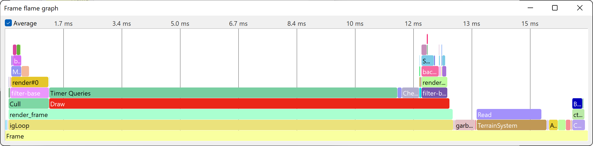

.. _pstats-graph-types:

Graph Types
===========

The PStats server offers a range of different graphs, giving different views of
the data being sent from the client. The graph windows can be opened from the
Graphs pull-down menu.

.. _pstats-strip-chart:

Time-based Strip Charts
-----------------------

.. image:: strip-chart-time.png
   :width: 546

This is the graph type you will use most frequently to examine performance data.
The horizontal axis represents the passage of time; each frame is represented as
a vertical slice on the graph. The overall height of the colored bands
represents the total amount of time spent on each frame; within the frame, the
time is further divided into the primary subdivisions represented by different
color bands (and labeled on the left). These subdivisions are called
"collectors" in the PStats terminology, since they represent time collected by
different tasks.

Normally, the three primary collectors are App, Cull, and Draw, the three stages
of the graphics pipeline. Atop these three colored collectors is the label
"Frame", which represents any remaining time spent in the frame that was not
specifically allocated to one of the three child collectors (normally, there
should not be significant time reported here).

The frame time in milliseconds, averaged over the past three seconds, is drawn
above the upper right corner of the graph. The labels on the guide bars on the
right are also shown in milliseconds; if you prefer to think about a target
frame rate rather than an elapsed time in milliseconds, you may find it useful
to select "Hz" from the Units pulldown menu, which changes the time units
accordingly.

The running Panda client suggests its target frame rate, as well as the initial
vertical scale of the graph (that is, the height of the colored bars). You can
change the scale freely by clicking within the graph itself and dragging the
mouse up or down as necessary. One of the horizontal guide bars is drawn in a
lighter shade of gray; this one represents the actual target frame rate
suggested by the client. The other, darker, guide bars are drawn automatically
at harmonic subdivisions of the target frame rate. You can change the target
frame rate with the Config.prc variable pstats-target-frame-rate on the client.

You can also create any number of user-defined guide bars by dragging them into
the graph from the gray space immediately above or below the graph. These are
drawn in a dashed blue line. It is sometimes useful to place one of these to
mark a performance level so it may be compared to future values (or to alternate
configurations).

The primary collectors labeled on the left might themselves be further
subdivided, if the data is provided by the client. For instance, App is often
divided into Show Code, Animation, and Collisions, where Show Code is the time
spent executing any Python code, Animation is the time used to compute any
animated characters, and Collisions is the time spent in the collision
traverser(s).

To see any of these further breakdowns, double-click on the corresponding
colored label (or on the colored band within the graph itself). This narrows the
focus of the strip chart from the overall frame to just the selected collector,
which has two advantages. Firstly, it may be easier to observe the behavior of
one particular collector when it is drawn alone (as opposed to being stacked on
top of some other color bars), and the time in the upper-right corner will now
reflect just the total time spent within just this collector. Secondly, if there
are further breakdowns to this collector, they will now be shown as further
colored bars. As in the Frame chart, the topmost label is the name of the parent
collector, and any time shown in this color represents time allocated to the
parent collector that is not accounted for by any of the child collectors.

You can further drill down by double-clicking on any of the new labels; or
double-click on the top label, or the white part of the graph, to return back up
to the previous level. Right-clicking a label will provide further options.

Value-based Strip Charts
------------------------

.. image:: strip-chart-level.png
   :width: 546

There are other strip charts you may create, which show arbitrary kinds of data
per frame other than elapsed time. These can only be accessed from the Graphs
pulldown menu, and include things such as texture memory in use and vertices
drawn. They behave similarly to the time-based strip charts described above.

Flame Graphs
------------

This is probably the most useful graph, giving an immediate insight into how the
time is broken down in a frame or in a particular category, but it can be a bit
difficult to wrap your head around at first. It collects a running average of
the time spent in each collector, with the currently-focused collector (the
bottom-most bar, by default the entire frame) being stretched to fit the entire
width of the chart.

The way the bars are stacked indicates how the collectors are nested. Let's say
that Panda3D performs a Cull pass for display region A and B separately. The
Strip Chart view would just tell you the total Cull time in the frame, which
doesn't tell you which scene you need to optimize. The Flame Graph view on the
other hand, will show two separate Cull bars, one stacked above the bar for
display region A, and the other stacked above the bar for display region B.

You can double-click on any bar to focus in to that particular collector and
see how its time is broken up. Double-click the white background to go back to
the previous level. Right-clicking a bar will show further options, such as to
open additional charts.

Timeline
--------

.. image:: timeline.png
   :width: 1018

This graph is used less frequently, but when it is needed it is a valuable tool
to reveal exactly how the time is spent within a frame. Sometimes you really
need to know the exact sequence and timing of events in the frame, not just
an accumulated time spent in each collector. For example, it is very useful for
finding lag spikes that occurred only during a single frame, like during a
loading process. In the Timeline chart, a bar is drawn between each start and
stop event of each particular collector, with the vertical axis showing the
nesting of collectors.

When using multiple threads, the timelines for the different threads are listed
vertically, underneath each other. This makes it the only chart that can show
multiple threads at once, making it possible to find synchronization issues.
When :ref:`GPU timing <pstats-gpu-timing>` is enabled, the video card is
considered a separate thread, but due to the fact that the GPU has a separate
clock, the GPU and CPU threads may not be perfectly aligned.

There are several ways to navigate through the timeline. By double-clicking a
particular bar, the view will zoom to fit that bar. You can also use the WASD
keys to navigate, or the scroll wheel of the mouse while holding the control key
on the keyboard.

Please note that PStats discards data older than 60 seconds by default. To be
able to see the entire timeline, you need to change the ``pstats-history``
configuration variable.

The Piano Roll
--------------

This graph is no longer considered very useful. It predates the Timeline chart,
which is easier to read while giving a more powerful view of how the time is
broken up in each frame. Nevertheless, it is still available for those who find
it useful.

The piano roll chart shows the sequence of events in the last frame, not just
the total time spent in each collector. It is so named because it is similar to
the paper music roll for an old-style player piano, with holes punched down the
roll for each note that is to be played. The longer the hole, the longer the
piano key is held down. (Think of the chart as rotated 90 degrees from an actual
piano roll. A player piano roll plays from bottom to top; the piano roll chart
reads from left to right.)

Unlike a strip chart, a piano roll chart does not show trends; the chart shows
only the current frame's data. The horizontal axis shows time within the frame,
and the individual collectors are stacked up in an arbitrary ordering along the
vertical axis.

The time spent within the frame is drawn from left to right; at any given time,
the collector(s) that are active will be drawn with a horizontal bar. You can
observe the CPU behavior within a frame by reading the graph from left to right.
You may find it useful to select "pause" from the Speed pulldown menu to freeze
the graph on just one frame while you read it.

Note that the piano roll chart shows time spent within the frame on the
horizontal axis, instead of the vertical axis, as it is on the strip charts.
Thus, the guide bars on the piano roll chart are vertical lines instead of
horizontal lines, and they may be dragged in from the left or the right sides
(instead of from the top or bottom, as on the strip charts). Apart from this
detail, these are the same guide bars that appear on the strip charts.
