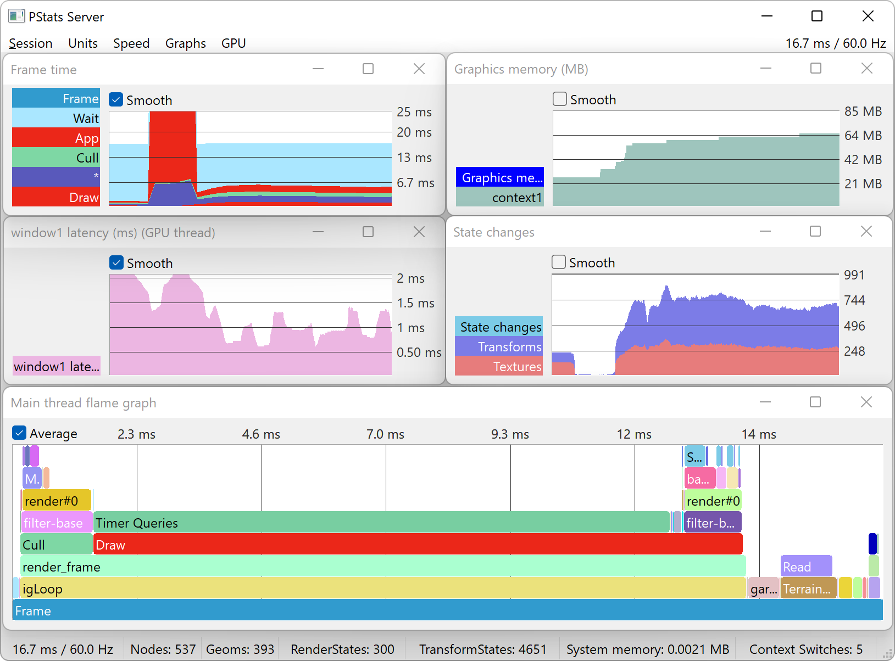

.. _measuring-performance-with-pstats:

Measuring Performance with PStats
=================================

PStats is Panda's built-in performance analysis tool. It can graph frame rate
over time, and can further graph the work spent within each frame into
user-defined subdivisions of the frame (for instance, App, Cull and Draw), and
thus can be an invaluable tool in identifying performance bottlenecks. It can
also show frame-based data that reflects any arbitrary quantity other than time
intervals, for instance, texture memory in use or number of vertices drawn.

PStats consists of two parts: the server program, which is a separate utility
shipped with the Panda3D installation and is responsible for drawing the graphs,
and the client, which is part of the Panda3D library. The server utility may be
run on the same computer that is running the Panda client, or it may be run on
another computer on the same LAN, which is useful for analyzing fullscreen
applications. The remote computer need not be running the same operating system
or even the same Panda3D version as the client computer.

It is furthermore possible to save the recorded performance data to a file and
open it for analysis at a later date, or to export the data in JSON format for
inspection in external tools, such as Chrome Tracing or Perfetto.

.. only:: python

   The easiest way to use PStats is to add ``want-pstats 1`` to the Config.prc
   file, running the pstats.exe server utility, and then launching the Panda3D
   application, as described :ref:`here <pstats-basic-profiling>`.

.. only:: cpp

   To use PStats, simply run the pstats.exe server utility and connect a Panda3D
   application to it, as described :ref:`here <pstats-basic-profiling>`.

.. note::

   On macOS, the PStats server utility is not included with the installation,
   but it can be built from source if the GTK+ 3 library is available on the
   system. Alternatively, it is possible to connect over the network to a
   different computer that does have the PStats server utility available.

Table of Contents
-----------------

.. toctree::
   :maxdepth: 2

   basic-profiling
   graph-types
   thread-profiling
   gpu-timing
   user-collectors
   customization
   internals
