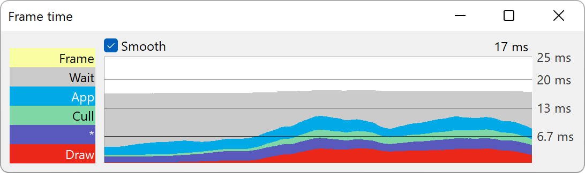
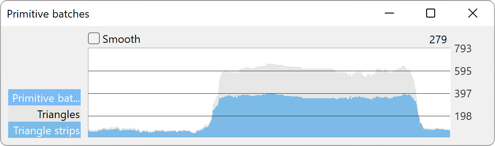

.. _measuring-performance-with-pstats:

Measuring Performance with PStats
=================================

QUICK INTRODUCTION
------------------

PStats is Panda's built-in performance analysis tool. It can graph frame rate
over time, and can further graph the work spent within each frame into
user-defined subdivisions of the frame (for instance, app, cull and draw), and
thus can be an invaluable tool in identifying performance bottlenecks. It can
also show frame-based data that reflects any arbitrary quantity other than time
intervals, for instance, texture memory in use or number of vertices drawn.

The performance graphs may be drawn on the same computer that is running the
Panda client, or they may be drawn on another computer on the same LAN, which is
useful for analyzing fullscreen applications. The remote computer need not be
running the same operating system as the client computer.

To use PStats, you first need to run the PStats server program, which is part of
the Panda3D installation on Windows and Linux. On macOS, it is not included, but
it can be built from source if the GTK+ 2 library is available on the system.

.. only:: python

   Once it is running, launch your application with the following set in your
   Config.prc file:

   .. code-block:: text

      want-pstats 1

   Or, at runtime, issue the Python command:

   .. code-block:: python

      PStatClient.connect()

.. only:: cpp

   Once it is running, launch your application with the following added to your
   start-up code:

   .. code-block:: cpp

      // Includes: pStatClient.h

      if (PStatClient::is_connected()) {
        PStatClient::disconnect();
      }

      string host = ""; // Empty = default config var value
      int port = -1; // -1 = default config var value
      if (!PStatClient::connect(host, port)) {
        std::cout << "Could not connect to PStat server." << std::endl;
      }

Or if you're running pview, press shift-S.

Any of the above will contact your running PStats server program, which will
proceed to open a window and start a running graph of your client's performance.

If you have multiple computers available for development, it can be advantageous
to run the pstats server on a separate computer so that the processing time
needed to maintain and update the pstats user interface isn't taken from the
program you are profiling. If you wish to run the server on a different machine
than the client, start the server on the profiling machine and add the following
variable to your client's Config.prc file, naming the hostname or IP address of
the profiling machine:

.. code-block:: text

   pstats-host profiling-machine-ip-or-hostname

.. only:: python

   Profiling Python Code
   ~~~~~~~~~~~~~~~~~~~~~

   If you are developing Python code, you may be interested in reporting the
   relative time spent within each Python task (by subdividing the total time
   spent in Python, as reported under "Show Code"). To do this, add the
   following line to your Config.prc file before you start ShowBase:

   .. code-block:: text

      pstats-tasks 1

   As of Panda3D 1.10.13 and Python 3.6 or higher, it is also possible to get a
   more detailed view of which specific Python modules, classes and functions
   are taking up time in the application. Note that this may slow down your
   application somewhat due to the fact that information is collected each time
   a function is called. To enable this, add the following line:

   .. code-block:: text

      pstats-python-profiler 1

   To access this view, in the Frame strip chart, double-click the App collector
   on the left side, then double-click the Python collector. Then, you can drill
   down further into the packages, modules, classes and functions.

Profiling GPU Time
~~~~~~~~~~~~~~~~~~

OpenGL is asynchronous, which means that function calls aren't guaranteed to
execute right away. This can make performance analysis of OpenGL operations
difficult, as the graphs may not accurately reflect the actual time that the GPU
spends doing a certain operation. However, if you wish to more accurately track
down rendering bottlenecks, you may set the following configuration variable:

.. code-block:: text

   pstats-gpu-timing 1

This will enable a new set of graphs that use timer queries to measure how much
time each task is actually taking on the GPU.

.. note::

   Please make sure you are at least using Panda3D 1.10.12 when trying to use
   this feature. Older versions had a bug that made GPU timing not work
   correctly with some graphics cards.

If your card does not support it or does not give reliable timer query
information, a crude way of working around this and getting more accurate timing
breakdown, you can set this:

.. code-block:: text

   gl-finish 1

Setting this option forces Panda to call glFinish() after every major graphics
operation, which blocks until all graphics commands sent to the graphics
processor have finished executing. This is likely to slow down rendering
performance substantially, but it will make PStats graphs more accurately
reflect where the graphics bottlenecks are.

THE PSTATS SERVER (The user interface)
--------------------------------------

The GUI for managing the graphs and drilling down to view more detail is
entirely controlled by the PStats server program. At the time of this writing,
there are two different versions of the PStats server, one for Unix and one for
Windows, both called simply pstats. The interfaces are similar but not
identical; the following paragraphs describe the Windows version.

When you run pstats.exe, it adds a program to the taskbar but does not
immediately open a window. The program name is typically "PStats 5185", showing
the default PStats TCP port number of 5185; see "HOW IT WORKS" below for more
details about the TCP communication system. For the most part you don't need to
worry about the port number, as long as server and client agree (and the port is
not already being used by another application).

Each time a client connects to the PStats server, a new monitor window is
created. This monitor window owns all of the graphs that you create to view the
performance data from that particular connection. Initially, a strip chart
showing the frame time of the main thread is created by default; you can create
additional graphs by selecting from the Graphs pulldown menu.

Time-based Strip Charts
~~~~~~~~~~~~~~~~~~~~~~~

This is the graph type you will use most frequently to examine performance data.
The horizontal axis represents the passage of time; each frame is represented as
a vertical slice on the graph. The overall height of the colored bands
represents the total amount of time spent on each frame; within the frame, the
time is further divided into the primary subdivisions represented by different
color bands (and labeled on the left). These subdivisions are called
"collectors" in the PStats terminology, since they represent time collected by
different tasks.

Normally, the three primary collectors are App, Cull, and Draw, the three stages
of the graphics pipeline. Atop these three colored collectors is the label
"Frame", which represents any remaining time spent in the frame that was not
specifically allocated to one of the three child collectors (normally, there
should not be significant time reported here).

The frame time in milliseconds, averaged over the past three seconds, is drawn
above the upper right corner of the graph. The labels on the guide bars on the
right are also shown in milliseconds; if you prefer to think about a target
frame rate rather than an elapsed time in milliseconds, you may find it useful
to select "Hz" from the Units pulldown menu, which changes the time units
accordingly. As of Panda3D 1.10.13, a counter may also be shown in the top-right
corner keeping track of how many times during a frame the collector is started.

The running Panda client suggests its target frame rate, as well as the initial
vertical scale of the graph (that is, the height of the colored bars). You can
change the scale freely by clicking within the graph itself and dragging the
mouse up or down as necessary. One of the horizontal guide bars is drawn in a
lighter shade of gray; this one represents the actual target frame rate
suggested by the client. The other, darker, guide bars are drawn automatically
at harmonic subdivisions of the target frame rate. You can change the target
frame rate with the Config.prc variable pstats-target-frame-rate on the client.

You can also create any number of user-defined guide bars by dragging them into
the graph from the gray space immediately above or below the graph. These are
drawn in a dashed blue line. It is sometimes useful to place one of these to
mark a performance level so it may be compared to future values (or to alternate
configurations).

The primary collectors labeled on the left might themselves be further
subdivided, if the data is provided by the client. For instance, App is often
divided into Show Code, Animation, and Collisions, where Show Code is the time
spent executing any Python code, Animation is the time used to compute any
animated characters, and Collisions is the time spent in the collision
traverser(s).

To see any of these further breakdowns, double-click on the corresponding
colored label (or on the colored band within the graph itself). This narrows the
focus of the strip chart from the overall frame to just the selected collector,
which has two advantages. Firstly, it may be easier to observe the behavior of
one particular collector when it is drawn alone (as opposed to being stacked on
top of some other color bars), and the time in the upper-right corner will now
reflect just the total time spent within just this collector. Secondly, if there
are further breakdowns to this collector, they will now be shown as further
colored bars. As in the Frame chart, the topmost label is the name of the parent
collector, and any time shown in this color represents time allocated to the
parent collector that is not accounted for by any of the child collectors.

You can further drill down by double-clicking on any of the new labels; or
double-click on the top label, or the white part of the graph, to return back up
to the previous level.

Value-based Strip Charts
~~~~~~~~~~~~~~~~~~~~~~~~

There are other strip charts you may create, which show arbitrary kinds of data
per frame other than elapsed time. These can only be accessed from the Graphs
pulldown menu, and include things such as texture memory in use and vertices
drawn. They behave similarly to the time-based strip charts described above.

Piano Roll Charts
~~~~~~~~~~~~~~~~~

This graph is used less frequently, but when it is needed it is a valuable tool
to reveal exactly how the time is spent within a frame. The PStats server
automatically collects together all the time spent within each collector and
shows it as a single total, but in reality it may not all have been spent in one
continuous block of time.

For instance, when Panda draws each display region in single-threaded mode, it
performs a cull traversal followed by a draw traversal for each display region.
Thus, if your Panda client includes multiple display regions, it will alternate
its time spent culling and drawing as it processes each of them. The strip
chart, however, reports only the total cull time and draw time spent.

Sometimes you really need to know the sequence of events in the frame, not just
the total time spent in each collector. The piano roll chart shows this kind of
data. It is so named because it is similar to the paper music roll for an old-
style player piano, with holes punched down the roll for each note that is to be
played. The longer the hole, the longer the piano key is held down. (Think of
the chart as rotated 90 degrees from an actual piano roll. A player piano roll
plays from bottom to top; the piano roll chart reads from left to right.)

Unlike a strip chart, a piano roll chart does not show trends; the chart shows
only the current frame's data. The horizontal axis shows time within the frame,
and the individual collectors are stacked up in an arbitrary ordering along the
vertical axis.

The time spent within the frame is drawn from left to right; at any given time,
the collector(s) that are active will be drawn with a horizontal bar. You can
observe the CPU behavior within a frame by reading the graph from left to right.
You may find it useful to select "pause" from the Speed pulldown menu to freeze
the graph on just one frame while you read it.

Note that the piano roll chart shows time spent within the frame on the
horizontal axis, instead of the vertical axis, as it is on the strip charts.
Thus, the guide bars on the piano roll chart are vertical lines instead of
horizontal lines, and they may be dragged in from the left or the right sides
(instead of from the top or bottom, as on the strip charts). Apart from this
detail, these are the same guide bars that appear on the strip charts.

The piano roll chart may be created from the Graphs pulldown menu.

Additional threads
~~~~~~~~~~~~~~~~~~

If the panda client has multiple threads that generate PStats data, the PStats
server can open up graphs for these threads as well. Each separate thread is
considered unrelated to the main thread, and may have the same or an independent
frame rate. Each separate thread will be given its own pulldown menu to create
graphs associated with that thread; these auxiliary thread menus will appear on
the menu bar following the Graphs menu.

Color and Other Optional Collector Properties
~~~~~~~~~~~~~~~~~~~~~~~~~~~~~~~~~~~~~~~~~~~~~

If you do not specify a color for a particular collector, it will be assigned a
random color at runtime. At present, the only way to specify a color is to
modify panda/src/pstatclient/pStatProperties.cxx, and add a line to the table
for your new collector(s). You can also define additional properties here such
as a suggested initial scale for the graph and, for non-time-based collectors, a
unit name and/or scale factor. The order in which these collectors are listed in
this table is also relevant; they will appear in the same order on the graphs.
The first column should be set to 1 for your new collectors unless you wish them
to be disabled by default. You must recompile the client (but not the server) to
reflect changes to this table.

HOW TO DEFINE YOUR OWN COLLECTORS
---------------------------------

The PStats client code is designed to be generic enough to allow users to define
their own collectors to time any arbitrary blocks of code (or record additional
non-time-based data), from either the C++ or the Python level.

The general idea is to create a PStatCollector for each separate block of code
you wish to time. The name which is passed to the PStatCollector constructor is
a unique identifier: all collectors that share the same name are deemed to be
the same collector.

Furthermore, the collector's name can be used to define the hierarchical
relationship of each collector with other existing collectors. To do this,
prefix the collector's name with the name of its parent(s), followed by a colon
separator. For instance, ``PStatCollector("Draw:Flip")`` defines a collector
named "Flip", which is a child of the "Draw" collector, defined elsewhere.

You can also define a collector as a child of another collector by giving the
parent collector explicitly followed by the name of the child collector alone,
which is handy for dynamically-defined collectors. For instance,
``PStatCollector(draw, "Flip")`` defines the same collector named above,
assuming that draw is the result of the ``PStatCollector("Draw")`` constructor.

Once you have a collector, simply bracket the region of code you wish to time
with :meth:`collector.start() <.PStatCollector.start>` and
:meth:`collector.stop() <.PStatCollector.stop>`. It is important to ensure that
each call to start() is matched by exactly one call to stop(). If you are
programming in C++, it is highly recommended that you use the
:class:`.PStatTimer` class to make these calls automatically, which guarantees
the correct pairing; the PStatTimer's constructor calls start() and its
destructor calls stop(), so you may simply define a PStatTimer object at the
beginning of the block of code you wish to time. If you are programming in
Python, you must call start() and stop() explicitly.

When you call start() and there was another collector already started, that
previous collector is paused until you call the matching stop() (at which time
the previous collector is resumed). That is, time is accumulated only towards
the collector indicated by the innermost start() .. stop() pair.

Time accumulated towards any collector is also counted towards that collector's
parent, as defined in the collector's constructor (described above).

It is important to understand the difference between collectors nested
implicitly by runtime start/stop invocations, and the static hierarchy implicit
in the collector definition. Time is accumulated in parent collectors according
to the statically-defined parents of the innermost active collector only,
without regard to the runtime stack of paused collectors.

For example, suppose you are in the middle of processing the "Draw" task and
have therefore called start() on the "Draw" collector. While in the middle of
processing this block of code, you call a function that has its own collector
called "Cull:Sort". As soon as you start the new collector, you have paused the
"Draw" collector and are now accumulating time in the "Cull:Sort" collector.
Once this new collector stops, you will automatically return to accumulating
time in the "Draw" collector. The time spent within the nested "Cull:Sort"
collector will be counted towards the "Cull" total time, not the "Draw" total
time.

If you wish to collect the time data for functions, a simple decorator pattern
can be used below, as below:

.. code-block:: python

   from panda3d.core import PStatCollector
   def pstat(func):
       collectorName = "Debug:%s" % func.__name__
       if hasattr(base, 'custom_collectors'):
           if collectorName in base.custom_collectors.keys():
               pstat = base.custom_collectors[collectorName]
           else:
               base.custom_collectors[collectorName] = PStatCollector(collectorName)
               pstat = base.custom_collectors[collectorName]
       else:
           base.custom_collectors = {}
           base.custom_collectors[collectorName] = PStatCollector(collectorName)
           pstat = base.custom_collectors[collectorName]
       def doPstat(*args, **kargs):
           pstat.start()
           returned = func(*args, **kargs)
           pstat.stop()
           return returned
       doPstat.__name__ = func.__name__
       doPstat.__dict__ = func.__dict__
       doPstat.__doc__ = func.__doc__
       return doPstat

To use it, either save the function to a file and import it into the script you
wish to debug. Then use it as a decorator on the function you wish to time. A
collection named Debug will appear in the Pstats server with the function as its
child.

.. code-block:: python

   from pstat_debug import pstat

   @pstat
   def myLongRunFunction():
       """ This function does something long """

HOW IT WORKS (What's actually happening)
----------------------------------------

The PStats code is divided into two main parts: the client code and the server
code.

The PStats Client
~~~~~~~~~~~~~~~~~

The client code is in panda/src/pstatclient, and is available to run in every
Panda client unless it is compiled out. (It will be compiled out if OPTIMIZE is
set to level 4, unless DO_PSTATS is also explicitly set to non-empty.)

The client code is designed for minimal runtime overhead when it is compiled in
but not enabled (that is, when the client is not in contact with a PStats
server), as well as when it is enabled (when the client is in contact with a
PStats server). It is also designed for zero runtime overhead when it is
compiled out.

There is one global :class:`.PStatClient` class object, which manages all of the
communications on the client side. Each PStatCollector is simply an index into
an array stored within the PStatClient object, although the interface is
intended to hide this detail from the programmer.

Initially, before the PStatClient has established a connection, calls to start()
and stop() simply return immediately.

When you call :meth:`.PStatClient.connect()`, the client attempts to contact the
PStatServer via a TCP connection to the hostname and port named in the pstats-
host and pstats-port Config.prc variables, respectively. (The default hostname
and port are localhost and 5185.) You can also pass in a specific hostname
and/or port to the connect() call. Upon successful connection and handshake with
the server, the PStatClient sends a list of the available collectors, along with
their names, colors, and hierarchical relationships, on the TCP channel.

Once connected, each call to start() and stop() adds a collector number and
timestamp to an array maintained by the PStatClient. At the end of each frame,
the PStatClient boils this array into a datagram for shipping to the server.
Each start() and stop() event requires 6 bytes; if the resulting datagram will
fit within a UDP packet (1K bytes, or about 84 start/stop pairs), it is sent
via UDP; otherwise, it is sent on the TCP channel. (Some fraction of the
packets that are eligible for UDP, from 0% to 100%, may be sent via TCP
instead; you can specify this with the pstats-tcp-ratio Config.prc variable.)

Also, to prevent flooding the network and/or overwhelming the PStats server,
only so many frames of data will be sent per second. This parameter is
controlled by the pstats-max-rate Config.prc variable and is set to 30 by
default. (If the packets are larger than 1K, the max transmission rate is also
automatically reduced further in proportion.) If the frame rate is higher than
this limit, some frames will simply not be transmitted. The server is designed
to cope with missing frames and will assume missing frames are similar to their
neighbors.

The server does all the work of analyzing the data after that. The client's next
job is simply to clear its array and prepare itself for the next frame.

The PStats Server
~~~~~~~~~~~~~~~~~

The generic server code is in pandatool/src/pstatserver, and the GUI-specific
server code is in pandatool/src/gtk-stats and pandatool/src/win-stats, for Unix
and Windows, respectively. (There is also an OS-independent text-stats
subdirectory, which builds a trivial PStats server that presents a scrolling-
text interface. This is mainly useful as a proof of technology rather than as a
usable tool.)

The GUI-specific code is the part that manages the interaction with the user via
the creation of windows and the handling of mouse input, etc.; most of the real
work of interpreting the data is done in the generic code in the pstatserver
directory.

The PStatServer owns all of the connections, and uses network sockets to
communicate with the clients. It listens on the specified port for new
connections, using the pstats-port Config.prc variable to determine the port
number (this is the same variable that specifies the port to the client).
Usually you can leave this at its default value of 5185, but there may be some
cases in which that port is already in use on a particular machine (for
instance, maybe someone else is running another PStats server on another display
of the same machine).

Once a connection is received, it creates a PStatMonitor class (this class is
specialized for each of the different GUI variants) that handles all the data
for this particular connection. In the case of the windows pstats.exe program,
each new monitor instance is represented by a new toplevel window. Multiple
monitors can be active at once.

The work of digesting the data from the client is performed by the PStatView
class, which analyzes the pattern of start and stop timestamps, along with the
relationship data of the various collectors, and boils it down into a list of
the amount of time spent in each collector per frame.

Finally, a PStatStripChart or PStatPianoRoll class object defines the actual
graph output of colored lines and bars; the generic versions of these include
virtual functions to do the actual drawing (the GUI specializations of these
redefine these methods to make the appropriate calls).
