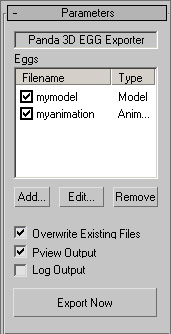
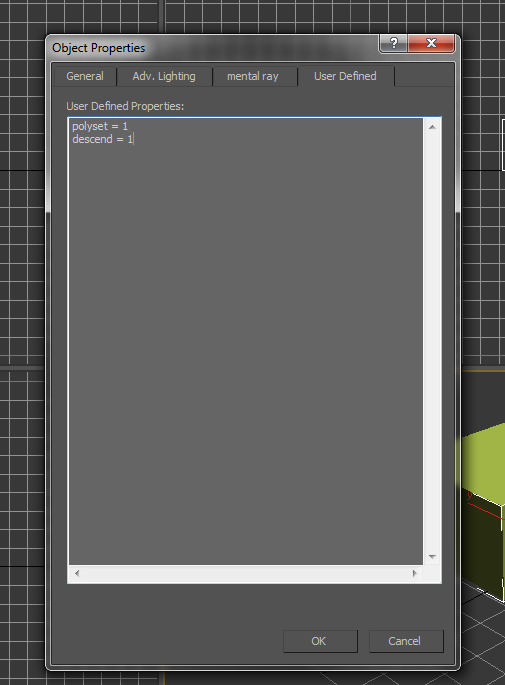

.. _converting-from-3ds-max:

Converting from 3ds Max
=======================

.. contents::
   :local:

Skinning
--------

The Max exporter understands only bone-based animation. In other words, all
animation must be done by moving bones around. If you move anything else, the
Max exporter may not notice! Character studio bipeds work too --- they are
indeed collections of bones.

Meshes must be connected to the bones using either the ``skin`` or ``physique``
modifiers. Any other way of attaching the mesh to the bones will not work. In
particular, simply linking the mesh to the bone using the link tool will not
work correctly. Do not use the link tool to connect your meshes to your bones.
Use the physique or skin modifiers.

If all you want to do is drag a mesh around, then use the following method.
Create a single bone - it will look like a small diamond. Put it in the middle
of the mesh. Skin the mesh, and connect it to the one bone. Now you can drag the
one bone around and the mesh will follow.

In Max, it is a little difficult to create a single bone, because the bone
creation tool usually creates two. After clicking to create a bone, look in the
object list, and you'll see "Bone01", "Bone02", which proves that there are
indeed two. The easiest thing to do is to create the pair of bones, and then
delete the second one by pressing the "delete" button.

Using the Exporter
------------------

Before installing any plugins, you must install the visual studio runtime
system. To do so, execute vcredist_x86-sp1.exe as administrator. Then, to
install the plugin, look in the panda3d "plugins" directory. There, you will
find the plugins, such as ``maxegg5.dlo``, ``maxegg6.dlo``, and ``maxegg7.dlo``.
These are for 3D Studio Max versions 5, 6, and 7 respectively. Copy the correct
file from the Panda3D plugins directory into the 3D Studio Max plugins
directory, then, restart 3D Studio Max.

The exporter is somewhat unconventional in its design. Max has a menu item
"File/Export". Panda's egg format does not show up in this menu. Instead,
Panda's exporter is a helper object. This enables the exporter to save your
export settings from one session to the next.

To export a scene, your first step is to create the necessary helper object.
Go to the creation panel, select "helper objects," choose "exporters," and
then click on the button to create a Panda3D export helper:

|maxexp1.jpg|

Drop an egg exporter into the scene:

|maxexp2.jpg|

Switch to the modify panel. You will now be able to see the configuration
settings that are stored in the export helper.

|maxexp3.jpg|

The exporter can generate several egg files from a single scene. The exporter
therefore contains a list of egg files to generate. To export this particular
scene (the one with the blocky humanoid and the biped skeleton), we will create
an egg containing the model and one containing the animation. Click the "add..."
button on the exporter's modify panel. You will be prompted:

|maxexp4.jpg|

I have filled in the file name, and I have selected the mesh I want to export.
When I click "OK," an egg file will be added to the list of eggs to generate.
I then click the "add..." button again, and add another egg to the list:

|maxexp5.jpg|

This time, I'm generating an animation egg. I have listed the bones to export,
and the range of animation frames. Once I click OK, the modify panel for the egg
exporter looks like this:

|maxexp6.jpg|

When I click the "export now" button, the two egg files are generated, and I am
asked whether or not I would like to pview them.

When you save your MAX file, the export helper will also be saved. The next time
you load it up, it will still remember which meshes go in which egg files.

Materials
---------

The different map types in the 3dsmax Standard material equal Panda ones
followingly:

-  Diffuse Slot = Color
-  Bump Slot = Normal
-  Self-Illumination Slot = Glow
-  Specular Color Slot = Gloss
-  Opacity Slot = Modulate

Max egger changes and additions
-------------------------------

In Panda3D 1.7.0, there have been some minor but very noticeable changes to the
way the Max egger handles collisions. Although collision tagging was possible on
a global level with the egger prior to now, it had some drawbacks, such as only
one object would get tagged if the whole scene was exported. To remedy this
problem, the Panda SE team has implemented a method similar to the way Maya tags
collision objects. Every object in max has a User Defined properties box inside
the per- object properties options. (to get it simply right click on any object
and select Object Properties, User Defined is the far right tab).

|OBJ_PROPS.JPG| |OBJECT_PROPERTIES.JPG|

Every collision object in Panda has a Collision Solid Type and a Collision Flag.
To tag an object you have to type the "<solid type> = 1". Where <solid type> is
polyset, plane, etc. Next you must specify a collision flag in the same manner
(ex. descend = 1). Be sure to note the all lowercase and spaces between the
equals sign and the 1. To remove any tag simply set the value of one to zero on
both properties. in order to speed up this process we've included a simple
Maxscript utility called TagSelectedObjects.ms. Simply run this either from the
main program menu bar, or anywhere else in the program where you can run a
Maxscript. It will allow you to select any number of objects and tag them or
remove any tags on the objects.

|MAX_SCRIPT.JPG|

Also included in this update is the ability to use Point Objects as locators
(similar to Maya's locators). Prior to now, an artist had to egg out a max scene
using the model option and using joints as locators. Now with the addition of
point objects, an artist can use the static option and place locators for
wherever a position needs to be stored. NOTE: point objects do not get included
in animated models, only in static ones.

Known Issues
------------

Currently, you have to use the option 'Export Entire Scene' when having animated
models, otherwise the character hierarchy might not be exported correctly.

User interpretation regarding "Pose" versus the other export types ("Model",
"Animation", "Both") was not always correct. Newer versions of the exporter will
have "Static" rather than "Pose" in the interface, as the "Static" (formerly
listed as "Pose") type should be chosen for exporting an environment or static
geometry, with the "Model" type chosen for exporting an animatable model with
joints and vertex membership. Using "Static" will generate an egg file without a
"Dart" tag. The "Model" export will produce a "Dart" tag in the egg file. See
:ref:`egg-syntax` for more details.

.. |maxexp1.jpg| image:: maxexp1.jpg
.. |maxexp2.jpg| image:: maxexp2.jpg
.. |maxexp3.jpg| image:: maxexp3.jpg
.. |maxexp4.jpg| image:: maxexp4.jpg
.. |maxexp5.jpg| image:: maxexp5.jpg

.. |OBJ_PROPS.JPG| image:: obj-props.jpg

.. |MAX_SCRIPT.JPG| image:: max-script.jpg
