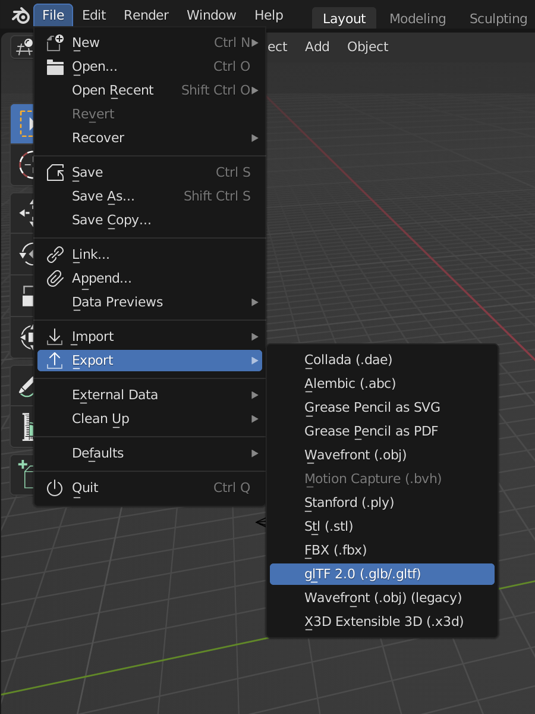
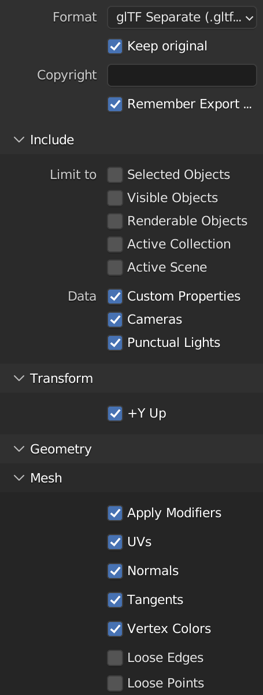

.. _converting-from-blender:

Converting from Blender
=======================

Currently, there are several ways to get models from Blender into Panda3D. The
most popular has always been the YABEE exporter, but it is no longer recommended
as it is not compatible with the latest version of Blender, 2.80.  Instead, we
recommend the use of blend2bam, or to export to the
:ref:`glTF format <gltf-files>`.

Please note that some of these tools rely on features that were introduced in
Panda3D 1.10.8, so please make sure you are using the latest stable version of
Panda3D.

.. contents::
   :local:

Option 1: blend2bam
-------------------

Blend2bam is a command-line utility that converts .blend files into .bam files,
which can be directly loaded into Panda3D. It does not do the conversion on its
own, but interfaces with other exporters and converters (which may differ
depending on your version of Blender) and sets them up with the right settings
to get the correct result in Panda3D. It also adds a few extensions on top of
the glTF conversion to add support for collision shapes. As such, it is
considered the most fool-proof option for getting Blender models into Panda3D.

You can simply add this to your Panda3D installation using pip::

   python -m pip install -U panda3d-blend2bam

To convert a model, enter the blend2bam command on the command-line::

   blend2bam myfile.blend myfile.bam

For more information, and issue reports, visit the GitHub page for blend2bam:

https://github.com/Moguri/blend2bam

Option 2: Exporting to glTF
---------------------------

When using Blender 2.80 or higher, blend2bam uses the built-in glTF 2.0 exporter
provided with Blender to produce a :ref:`glTF file <gltf-files>`, and then uses
a Python module called `panda3d-gltf <https://github.com/Moguri/panda3d-gltf>`__
to convert the model to Panda3D.

The advantage of using blend2bam is that it will automatically set up the glTF
exporter and supervise this process to produce the best results for Panda3D.
However, if you prefer, it is still possible to manually export the glTF file
from Blender and load it into Panda3D.

The glTF exporter interface can be opened by going to File > Export > glTF 2.0:

The exporter interface provides many settings that can be customized, but the
settings indicated in the image above provide a good starting point. After
dialing in the settings and selecting the file path, click "Export glTF 2.0" to
produce the glTF file.

Once you have the .gltf (or .glb) file, follow the instructions on
:ref:`this page <gltf-files>` to load the model into Panda3D.

Option 3: Exporting to Egg
--------------------------

There is a community-provided Blender add-on called YABEE, which adds an option
to the Blender GUI for exporting :ref:`egg-files`. This is considered the most
mature and stable add-on for Blender, however, it only works with Blender 2.5x,
2.6x and 2.7x. It does not work with newer versions, and as such is no longer
recommended.

If you are using one of these older versions of Blender, however, this plug-in
may still be useful to you:

https://github.com/09th/YABEE

.. caution::

   There are some community-made ports of YABEE for newer versions of Blender
   floating around the internet. These ports are not officially supported as
   they are often tailored to the author's own purposes and may not produce the
   expected output in the general case.

Material Set-Up
---------------

Blender 2.80 (and higher) uses a node graph to define materials. This is a very
flexible way to define materials, but export formats are very rigid in how they
like their materials to be structured. Therefore, the exporter contains code to
recognize particular combinations of material nodes and map them to the
more rigidly-defined material slots of the export format.

This does mean that your materials need to be structured in a certain way in
order for them to be converted correctly. For example, you must use the
Principled BSDF shader node in your materials, and connect its output directly
to the Surface input of the Material Output node. More information on the
limitations of the Blender exporter can be found in the Blender manual (though
note that not all features mentioned here are supported by Panda3D):

https://docs.blender.org/manual/en/latest/addons/import_export/scene_gltf2.html

PBR Rendering
-------------

Blender 2.80 and above use a physically-based rendering model to render
materials. As of this time of writing, Panda3D's shader generator does not
implement such a rendering model. If you wish to get a rendering result that
approaches the way the model appears in Blender, you need to use a shader that
applies lighting in a similar way to Blender.

For best reproduction of the Blender materials, you can use the simplepbr
package, which provides a set of shaders that are designed to approximate the
Principled BSDF shading model used in Blender:

https://github.com/Moguri/panda3d-simplepbr

Why do my colors look different in Panda3D?
-------------------------------------------

It is important to note that Blender uses a linear workflow, meaning all colors
are converted from the sRGB color encoding to the "linearized sRGB" color space
before being used for lighting and blending.  After the render process, the
colors in the framebuffer are converted back to sRGB for display on the screen.

Panda3D by default does not perform any color conversion, meaning that all the
input colors are rendered as-is into the window.  However, this can mean that
colors defined in Blender will not appear the same way in Panda3D, as they have
not undergone the same color conversion as Blender performs.

If you use blend2bam in conjunction with the panda3d-simplepbr package, this
will be handled for you automatically.  Otherwise, you will need to configure
Panda3D to also use the linear workflow.  This requires two steps:

#. Set your textures to use the ``Texture.F_srgb`` or ``Texture.F_srgb_alpha``
   texture format, which automatically linearizes the colors before they are
   used in the rendering process. This should only be done on color textures,
   not on other types of texture maps.
#. Tell Panda3D to ask the graphics driver for an "sRGB framebuffer", which
   causes the GPU to automatically convert colors back to sRGB before they are
   displayed on the monitor.  This is achieved by enabling ``framebuffer-srgb``
   in Config.prc, or by adding a post-processing filter as described in
   :ref:`common-image-filters`.
