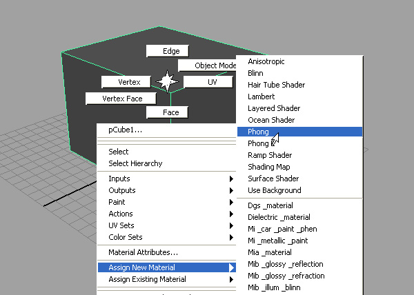
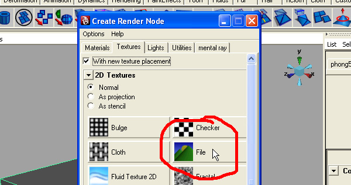
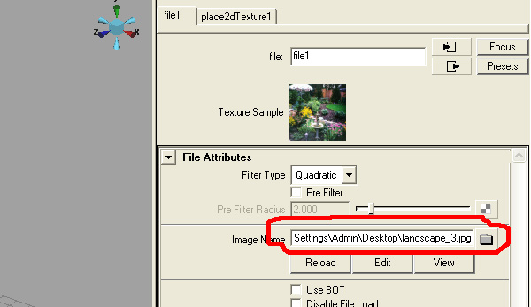
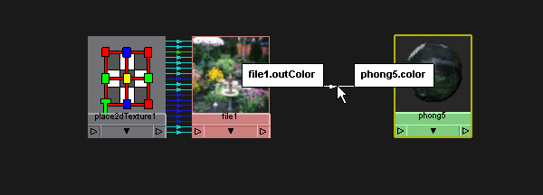
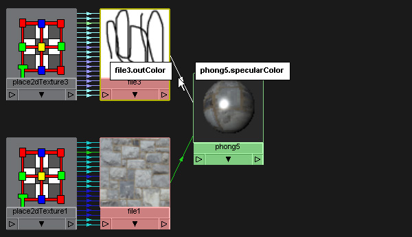
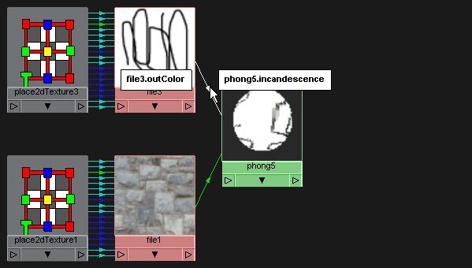
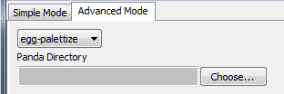

.. _converting-from-maya:

Converting from Autodesk Maya
=============================

This section talks about how to prepare a Maya model for export, and then export
it. Since exporting is the very last step, the actual instructions for the
export process are last.

.. contents::
   :local:

Material Preparation
--------------------

Basic Texturing
~~~~~~~~~~~~~~~

In order for the Panda3D to correctly export your textures, you must texture
your model in a manner that Panda3D understands. In fact, you have to follow a
fairly strict formula in order for Panda3D to be able to make sense of your
scene.

Teaching how to use Maya is beyond the scope of this manual. We assume that you
already know how to use maya, and especially the hypershade. The only purpose of
this section is to show you what configurations are understood by Panda3D.

The first step in texturing your model is to apply a "Phong" shader. This is the
only kind of shader that Panda3D understands. You can apply a phong shader using
the Maya menus:

Next, tell maya that you want to control the color of the surface by clicking
the color button:

.. image:: maya-tex-2.jpg

Now create a file texture - this will control the color of the surface:

Set the filename. Once you do this, you will be able to see your texture in
Maya:

You now have a straightforward textured model that Panda3D can export.

Advanced Texturing
~~~~~~~~~~~~~~~~~~

You may wish to use Panda's advanced texturing abilities: multitexturing, normal
maps, gloss maps, transparency, or glow maps. To use these features, you will
need to access Maya's hypershade editor:

.. image:: maya-hypershade.jpg

A straightforwardly textured model will look like this in the hypershade:

To apply a normal map, create another file texture and connect the "out color"
of the normal map to the "normal camera" input of the phong shader. The normal
map must be a true normal map (you can recognize them by their light blue
color), not a bump map (which are black-and-white.)

.. image:: maya-hyper-2.jpg

Unfortunately, there is a maya button to help you set up a bump map, but what it
creates is not correct for Panda3D. If you use the button, you end up with the
following incorrect configuration. So far as I know, the only way to get the
correct configuration (shown above) is to set it up manually in the hypershade.
The incorrect configuration is:

.. image:: maya-hyper-3.jpg

You may wish for parts of your model to be transparent. This is a little tricky,
because Panda3D understands "opacity maps," and maya understands "transparency
maps," which are opposites of each other. (In an opacity map, white is opaque,
in a transparency map, black is opaque.) To set it up, you will need to create a
reverser-object:

.. image:: maya-hyper-4.jpg

You may also wish to control which areas of the model are glossy, and which are
not. Panda3D calls this a "gloss map." To do this, create a black-and-white
image and connect it to the "specularColor" input of the phong shader. Note that
it must be black-and-white, or Panda3D won't understand it.

You may also want to create glowing areas on your model. Panda3D calls this a
"glow map." I have also heard it called a "self-illumination map" or an
"incandescence map." Create a black-and-white image and connect it to the
"incandescence" input of the phong shader:

Creating a glow map will cause those parts of the model which are glowing to be
bright even when the light is dark. However, it will not by itself create a
full-featured bloom effect. To get that, you need to use a bloom filter in your
Panda3D program in conjunction with the glow map. There is a
:ref:`sample program <glow-filter>` that demonstrates this process.

Finally, there is plain old multitexturing. Create this structure in the
hypershade, using a "Layered Texture" (NOT a "Layered Shader!"):

.. image:: maya-hyper-7.jpg

This will cause the two textures to be multiplied, which is the simplest form of
multitexturing. You can also obtain certain other effects by changing the
settings of the Layered Texture, however, this functionality is very incomplete
at this time. For the most part, you can only multiply.

Merging Textures
~~~~~~~~~~~~~~~~

The Maya exporter may try to merge textures. For example, if your model has an
RGB color map, and a black-and-white opacity map, then the exporter will
consider loading them together as a single RGBA texture.

In order to merge two textures, the following rules must be satisfied:

1. Their UV mappings must be identical.
2. Their filenames must have a common prefix.

By "common prefix," I mean that the files "house-color.jpg" and
"house-opacity.jpg" can be merged, because they both start with the common
prefix "house-". A common prefix consists of a series of alphanumeric characters
followed by a dash. If you do not want two files merged, use a different file
naming convention.

Flagging Objects from Maya
--------------------------

The Maya exporter is able to automatically flag objects for collisions if the
objects are flagged properly in Maya. There is a
`MELscript <https://raw.githubusercontent.com/panda3d/panda3d/master/pandatool/src/mayaprogs/eggImportOptions.mel>`__
in the available in the source code that helps flag objects in Maya.

Installation

#. Open up maya's script editor (Window>General Editors>Script Editor)
#. Open the script in the editor and execute it (Ctrl+Enter or Script>Execute)
#. Type "eggObjectFlags()" at the script editor and select the text.
#. Middle mouse drag the selection into your custom shelf.
#. Optional: go to the shelf editor and give it a custom icon/name

Usage

#. Select the objects that you want to tag and press the shelf script.
#. Set the object type by going to the channel box of the object, there should
   be a new attribute called Egg Object TypesN.
#. Set the object type to the desired value.

=========== =================================================================================================================================================================================================
Object Type Meaning
barrier     The geometry defined at this root and below defines an invisible collision solid.
trigger     The geometry defined at this root and below defines an invisible trigger surface.
sphere      The geometry is replaced with the smallest collision sphere that will enclose it. Typically you model a sphere in polygons and put this flag on it to create a collision sphere of the same size.
tube        As in sphere, above, but the geometry is replaced with a collision tube (a capsule). Typically you will model a capsule or a cylinder in polygons.
bubble      A collision bubble is placed around the geometry, which is otherwise unchanged.
ghost       It means that the geometry beginning at this node and below should never be collided with--characters will pass through it.
backstage   It means that the geometry at this node and below should not be translated. This will normally be used on scale references and other modeling tools.
=========== =================================================================================================================================================================================================

Running the Exporter
--------------------

Maya's exporter can be run from the command prompt or via a graphical panel.
The command line utility is called maya2egg. There are multiple versions of it
corresponding to different versions of maya. For instance, the version to use
for Maya 5.0 is maya2egg5, for 6.0 its maya2egg6 and for 6.5 its maya2egg65.

The following is an example of how to convert a file(maya binary .mb) if using
Maya 6.0 through the command line.

.. image:: mayacommandlineexport.png

The egg file will contain the filenames of the textures. These texture
pathnames will be stored as relative paths, relative to the location of the
egg file. For example, let's say that the files are laid out like this::

   c:\My Models\Maya Files\Character.mb
   c:\My Models\Egg Files\Character.egg
   c:\My Models\Textures\Character.png

In that case, the command to export the model is::

   c:\
   cd c:\My Models\
   maya2egg -o "Egg Files/Character.egg" "Maya Files/Character.mb"

Note that :ref:`filename-syntax` uses forward slashes, even under Windows, and
this applies to the exporter as well. After doing this export, the character egg
will contain the following texture reference:

``"../Textures/Character.png"``

Again, notice that this pathname is relative to the egg file itself. Many
artists find it convenient to keep everything in the same directory, to avoid
having to think about this. This approach works fine.

The above conversion process will turn the character into a static model.
Models which are rigged (they have bones to help them animate), skinned
(polygons attached to the bones/skeleton), and are animated need to use one of
the following options::

   maya2egg -a model -o eggFileName.egg mayaFileName.mb
   maya2egg -a chan -o eggFileName.egg mayaFileName.mb
   maya2egg -a pose -o eggFileName.egg mayaFileName.mb
   maya2egg -a both -o eggFileName.egg mayaFileName.mb

The meanings of these options are:

======== ===================================================================================================================================================================================================================================================
-a model Save only the skinned and boned model, ready for animation but with no animation attached. This is ideal for models with several event- or interaction-based animations.
-a chan  Save only the animation data on the current model, but not the model itself. This is ideal applying animations to an already-existing model egg file that is ready to receive animation. A model may have several animation channels applied to it.
-a pose  Save the model in the current key position of the animation applied to it. This position must be selected before choosing to export the file. This format does not save the animation.
-a both  This will export the model and animation out as one file.
======== ===================================================================================================================================================================================================================================================

There are many options to maya2egg. For a complete list, run maya2egg with the
-h argument::

   maya2egg -h

Using the New Maya2EGG GUI
--------------------------

Although the command line version of maya2egg (and the additional optimization
utilities such as egg2bam, egg-optchar, work well when used correctly, typically
problems arise from a poor understanding of the command line options and
requirements. This standalone tools application attempts to demystify some of
those options and present them in a way an artist (rather than a programmer) can
better understand. However, the application still requires the command line
programs to be present in order to actually export or process any eggs or Maya
files. Simply put, the application builds the command line arguments for you and
can process multiple files in a sequence (better known as batch processing).
After all, in most game pipelines models and animations have to be exported
multiple times with no changes to their settings after minor tweaks within the
3D package. It should also be noted this tool currently only supports the
maya2egg exporter, but since the other optimization tools operate on egg files
they can be used with any egg file that has been correctly exported from any 3D
package.

.. note::
   The application was developed to work on Windows, Linux, and macOS. There are
   certain differences between how each operating system installs Panda, and how
   directory paths are represented. For the rest of this document Windows
   conventions are going to be used, because it is the operating system that the
   is most familiar. However, if there are significant differences between how
   you need to use the app in Linux of macOS the necessary steps can be provided
   to ensure the application working correctly.

Simple Mode
~~~~~~~~~~~

.. image:: maya-egg-gui-simple.jpg

For viewing the video tutorial click `here <https://vimeo.com/11445320>`__

This application presents two modes for exporting a model or animation from
Maya. Upon opening the application the simple mode is presented show above.
The simple mode tab is intended to do “one-off” or single file exports. It
would be the same thing as typing the exporter command and options each time
you wanted to export a model. To use simple mode follow these few steps:

-  Click the Save button next to the first text box labeled “Egg file to be
   written” and navigate to your intended export directory and name your file.
   When you’ve finished this, click OK.

-  Click the Choose button next to the text box labeled “Maya file to be
   exported” and select the .mb file that you would like to export.

-  Select the version of Maya you currently have on your system from the Maya
   Version drop-down box.

Now, before you click Run Export, you must decide if you want to export any
animation from the file and if so what type. If you simply want a static model
(usually used for props and game levels) select “none” in the Animation box.
This will export only the geometry from your scene, excluding any joints or key
frames. It should be noted that this type of model will not export any skinning
data from Maya. However, it will still have a transform included which will
allow it to be placed in a Panda3D world.

If you want to export a scene with joints and skinning data so that it can later
accept any exported animation select “model “ from Animation box. This term can
be slightly confusing initially, but once you realize we’re talking about what
type of animation (if any) to export the distinction between “none” and “model”
is slightly more clear. Remember, model doesn’t just mean polygon geometry, it
implies that the model has joints and possibly a skin cluster in the scene file.
It is meant to accept animation data from a separate file or to be animated by
the programmer through code.

If you only want to export the animation data from a scene select “chan”. This
will simply write out the key frames of your scene and what joints those key
frames apply to into the egg file. This file is almost always used with a
separate egg file that was egged out with the “model” option.

Lastly, if you want all the geometry, joints, and skinning data exported to your
egg in one file select “both” from the Animation box. This file type is rarely
used, but special cases exist. Most of the time you would want to keep the
animation and geometry data in separate files. This allows you to load
animations on the fly inside the engine without having to load the geometry data
twice. Thus making your game load (and possibly run) faster.

Once you’ve figured out which type of animation you need to export in your egg
file. Click Run Export. A pop-up window will show up and it will start writing
the output from the command line tool that the application launched in the
background. If your scene file does not export correctly, this text will let you
know in most cases. It can be helpful in tracking down problems and be sure to
copy and paste it to text file if things don’t work out so you can show your
programmer or a member of the Panda community where things are going haywire.
Also, since computers in general have not learned to interpret the intentions of
a human without explicit instructions the egg file may not show up in the game
correctly. In short the exporter may write a perfectly good egg file, but since
something wasn’t quite right in your scene file in Maya, things may not turn out
correctly when you Pview or import the egg into your game. This almost always
has to do with the Maya file itself, NOT the exporter, so be sure to try and
diagnose problems inside Maya first. A good place to start is the Common
Problems section of this document. If there’s no answer there, post on the
Panda3D forums. There are a number of experts and seasoned artists who have
probably come across the same problems you have and can quickly get you back on
track.

Advanced Mode
~~~~~~~~~~~~~

.. image:: maya-egg-gui-advanced.jpg

For viewing the video tutorial click `here <https://vimeo.com/11445391>`__

In the beginning Simple Mode should cover the basics of single file exporting.
However, once you’ve had to load the application a few times and enter the same
settings over and over again, it’s probably time to move on to using the
Advanced Mode Tab.

Aside from allowing you to have greater control over what specifically gets
exported out of a particular Maya scene, this tab allows you to save these
options and settings for later use. Also, since everyone has a different set of
default exporter options and locations the application allows you to save and
load a preferences XML file to load each time the application is launched.

The process for exporting from the Advanced Mode tab is largely the same as
Simple Mode, but with a few wrinkles. First you should choose your Panda
installation directory and Maya version from the Environment Options section.
This location is the directory where you told Panda3D to install when running
the installer. It is NOT the \\bin directory where the maya2egg executable
resides. This little wrinkle was necessary to allow multiple operating systems
to use the application.

The last difference between Simple and Advanced mode for exporting a single
file, is that it must be put into the batch list before it can be exported. The
Batch List represents the order of the files that are about to be exported. To
Add a Maya scene file with its export options to this list simply click Add To
Batch (The other utilities in the Extra Utilities section have this same button
for simplicity’s sake, but the main Add To Batch button deals solely with the
maya2egg tool). After you’ve added any number of scene files with any of the
available options to the Batch List you can then click Run Batch and the
application will launch the exporter or utility command one by one until it has
finished the entire list of items.

Another useful feature of the application is that it checks the modified date of
every file used as an input for the given utility (ie the .mb file for an
exporter batch command, and an egg file for egg2bam). This is handy if you have
saved out an entire batch list of 20 files but only need to export the three
files you actually changed. The exporter skips any unchanged files by default,
but this behavior can be overridden by checking the “Override export changed
files” checkbox next to the Run Batch button.

Using the Egg-Palettize Tool
~~~~~~~~~~~~~~~~~~~~~~~~~~~~

For viewing the video tutorial click `here <https://vimeo.com/11445357>`__

Egg-palettize is an optimization tool in Panda for you to group your textures.
You can have your textures placed in a single palette. In the advanced mode of
the GUI, choose the egg-palettize panel. This is the egg-palettize Tool.

For using egg-palettize on a single egg file select that option in the drop
down list:

.. image:: maya-egg-palettize-2.jpg

First, specify the input egg file, the output texture file and the output egg
file. The output texture file is where the palette will be put in. And the
output egg file is the new egg with the new palette as the texture. Before
generating the egg palette, a .txa file should be generated with some attributes
listed in the attribute panel. Set palette size: Specify the size of the
palette. Imagetype: Image type of the palette. Powertwo flag: Specifies whether
textures should be forced to a power of two size when they are not placed within
a palette. The default is false.

Set background color: Specifies the background color of the generated palette
images. The background color is the color of the palette images where nothing is
used. The number r, g, b, a channels are range from 0 to 255. The default color
is black.

Margin: This specifies the amount of default margin to apply to all textures
that are placed within a palette image. The margin is a number of additional
pixels that are written around the texture image to help prevent color bleeding
between neighboring images within the same palette. The default is 2.

Coverage: The 'coverage' of a texture refers to the fraction of the area in the
texture image that is actually used, according to the UV's that appear in the
various egg files. If a texture's coverage is less than 1, only some of the
texture image is used (and only this part will be written to the palette). If
the coverage is greater than 1, the texture repeats that number of times. A
repeating texture may still be palettized by writing the required number of
copies into the palette image, according to the coverage area. This attribute
specifies the maximum coverage to allow for any texture before rejecting it from
the palette. It may be any floating-point number greater than zero. Set this to
1 to avoid palettizing repeating textures altogether.

After setting all the attribute, click on Save Attributes button to save all the
attributes to a .txa file. Last, add this to batch list, after clicking run
batch, the palette will be generated.

Egg-palettize for multiple eggs

.. image:: maya-egg-palettize-3.jpg

Egg-palettize can also generate a palette image for multiple egg files to share.
This palette image has all the textures of multiple egg files to be placed on
it. This panel is almost the same as the single egg one. Only for the input egg
file can have multiple egg files put into it. Select a added egg file and click
Remove button can remove that egg file. Click Remove All button can remove all
the added egg files The output is a folder to put all the new eggs. Attributes
Panel is the same as the single egg one.

Using the Graphical Front-End (old)
-----------------------------------

There is also a graphical front-end to maya2egg. To run the graphical Maya
exporter, drag MayaPandaTool.mel from the panda plugins directory into the Maya
workspace.

.. image:: mayapandatoolload.png

The UI window(below) will appear.

.. image:: maya-exporter.png

You can alternatively load the .mel file from the script editor. To save space,
the graphical tool does not have access to all of the features of the exporter.
It is designed for rapid verification of assets. The features you can execute
with the graphical tool are identical to the respective ones of the command line
exporter listed below.

Or, you can integrate the UI interface to Maya. There is a very convenient way
to launch the MayaPandaTool, using Maya shelf to store the MEL script:

1. Open the Script Editor (Window > General Editors > Script Editor)

2. In Script Editor, load the MayaPandaTool MEL script (File > Open Script)

3. select the MEL text (press Ctrl+A)

4. using middle mouse button, drag the selected text onto the shelf

5. (optional) Using Shelf Editor, you can change the image of Panda exporter
   icon to distinguish it from the others:

   .. image:: launchmpt.jpg

Anytime you need to open the Panda Exporter, just click the icon on the shelf.

For Windows users:

If you want a faster launch, you can put the MEL file on the QuickLaunch. Press
Ctrl while dragging the MEL file onto QuickLaunch bar. If you don't press Ctrl,
the actual file dropped to QuickLaunch is only the shortcut to the MEL file.

Anytime you need to open the Panda exporter, just drag it from QuickLaunch bar
to the 3D window of Maya.
