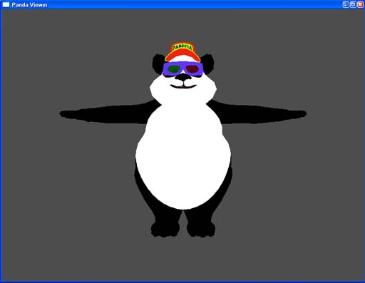

.. _pview:

Previewing Models in pview
==========================

PView or Panda Viewer is a model and animation viewer for supported model files.
This allows users to see if their files have converted correctly without having
to create a Panda3D program. Pview is accessed through a command prompt.

To view a model that has been converted to an egg or bam file, type the
following::

   pview modelFile.egg

To view a character model with animations, simply add the name of the file with
the animation.

::

   pview modelFile.egg animationFile.egg

Here's an example based on the panda model distributed with panda source.

::

   pview panda.egg

A new window should pop-up and here's what you should see:

There are some controls and hotkeys available while using pview. To see the
whole list press shift-question mark in the pview window. To turn this list off
press shift-question mark again. For convenience here is the full list of as the
time of writing:

=========================== ====================================================
Left-click and drag Mouse   Moves the camera laterally.
Middle-click and drag Mouse Rotates the model around its pivot
Right-click and drag Mouse  Moves the model away and towards the camera
f                           Report current framerate to the console window.
w                           Toggle wireframe mode
t                           Toggle texturing
b                           Toggle back face (double-sided) rendering
i                           Invert (reverse) single-sided faces
l                           Toggle lighting
p                           Toggle per-pixel lighting
c                           Recenter view on object
shift-c                     Toggle collision surfaces
shift-b                     Report bounding volume
shift-l                     List hierarchy
shift-a                     Analyze hierarchy
h                           Highlight node
arrow-up                    Move highlight to parent
arrow-down                  Move highlight to child
arrow-left                  Move highlight to sibling
arrow-right                 Move highlight to sibling
shift-s                     Activate PStats
f9                          Take screenshot
,                           Cycle through background colors
shift-w                     Open new window
alt-enter                   Toggle between full-screen and windowed mode
2                           Split the window
W                           Toggle wireframe
escape                      Close window
q                           Close window
=========================== ====================================================
