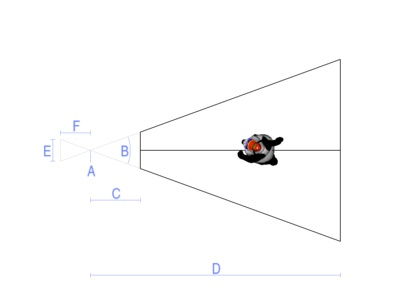

.. _lenses-and-field-of-view:

Lenses and Field of View
========================

Every Camera has a Lens object that defines the properties of its view. For
simple applications, you do not need to think about the lens; you will
probably be happy with the default lens properties. However, you will
occasionally want to adjust some properties of the lens, such as its field of
view, and there are several interfaces to do this, depending on how you want
to think about the lens.

.. only:: python

   When you start ShowBase, a default camera and lens are created for you
   automatically. The default camera object is stored in
   :py:obj:`base.cam <direct.showbase.ShowBase.ShowBase.cam>` (although by
   convention, if you want to move the default camera you should manipulate
   :py:obj:`base.camera <direct.showbase.ShowBase.ShowBase.camera>` instead),
   and the default lens is
   :py:obj:`base.camLens <direct.showbase.ShowBase.ShowBase.camLens>`.

This default lens will almost always be a perspective lens--that is, an
instance of the class :class:`.PerspectiveLens`--unless you have done
something to change it to another kind of lens. A perspective lens is by far
the most common kind of lens used, and it behaves the same way the physical
lens in a camera works, or for that matter the same way the lenses in our eyes
work:

|Lens tutorial, perspective view|

The illustration above shows a camera with an ordinary perspective lens
observing a model in the world. The camera can only see the part of the world
that falls within the black lines; this area is called the lens frustum.

In the picture, you can also see the image that the lens is capturing (and
that image is shown upside-down, just as it would be in a real, physical
camera). This image is just for the purposes of illustration; it isn't really
part of a Panda3D camera. It is included to help show the relationship between
a Panda3D lens and a real, physical lens.

There are several different properties that can be set on a PerspectiveLens.
Not all of them are independent; setting some properties will change the
values of other properties. Here is an illustration:

|Lens tutorial, top view|

A. This point is the nodal point or eyepoint of the lens. It is also (usually)
the origin, that is, the (0, 0, 0) point of the camera that holds the lens.
Normally (in a default Z-up coordinate system), the lens will be looking down
the +Y axis, so in the above illustration the +Y axis extends to the right
from point A. The plane containing the nodal point, perpendicular the viewing
direction (that is, the plane corresponding to the vertical line through point
A), is called the camera plane.

Although it is possible to change the nodal point or view direction of a lens
to some point other than (0, 0, 0) or some direction other than down the +Y
axis, it is usually simplest and best just to move the entire camera using the
basic NodePath operations like :meth:`~.NodePath.set_pos()` and
:meth:`~.NodePath.set_hpr()`.

B. This angle is the field of view, or fov, of the lens. You can easily change
this by setting a new value in degrees with
:meth:`lens.set_fov(angle) <.Lens.set_fov>`. Making the field of
view smaller will bring things in closer, like a telephoto lens; it will also
diminish the visible effects of perspective. Making the field of view larger
will open up the view to more objects, like a wide-angle lens; it will also
increase the visible distortion of perspective. The field of view must be
greater than 0 degrees and less than 180, but values greater than 90 will seem
extremely distorted. (In the real world, perspective lenses rarely go wider
than 80 degrees, and that's pretty wide.) The default field of view is 40
degrees, which is usually a pretty comfortable viewing angle.

There is actually a separate horizontal field of view and vertical field of
view, both of which may be independently controlled with the two-parameter form
of :meth:`~.Lens.set_fov`: :meth:`lens.set_fov(horizontalAngle, verticalAngle)
<.Lens.set_fov>`. Using the two-parameter form will change the aspect ratio of
the lens (see below). Normally, you would set the field of view using only the
one-parameter form, which sets the horizontal field of view directly, and
automatically recomputes the vertical field of view to preserve the same aspect
ratio.

C. This distance is called the near distance or near plane of the lens.
Objects that are closer than this to the camera plane will not be rendered.
You may set the near distance as small as you like, but it must be greater
than 0; and the smaller you set it, the greater the likelihood that you will
observe an artifact called Z-fighting, a shimmering of objects that are off in
the distance. The default near distance is 1.0, which for many scenes is a
reasonable compromise. Of course, the most appropriate value for your scene
depends on the nature of the scene (as well as the measurement units in which
your scene is modeled).

You may change the near distance at any time with the call
:meth:`lens.set_near(distance) <.Lens.set_near>`.

D. This is the far distance or far plane of the lens. Similar to the near
distance, objects that are farther than this from the camera plane will not be
rendered. You may set this as large as you like, but like the near distance,
setting it too large may result in Z-fighting. (However, the near distance
value has a much greater impact on Z-fighting than the far distance value,
because of the nature of the math involved.) The default far distance is
1000.0, which is appropriate for small scenes; you may need to set it larger
if you have a large scene.

You may change the far distance with the call
:meth:`lens.set_far(distance) <.Lens.set_far>`. Since the near
distance and far distance are often changed at the same time, there is a
convenience function to set then both:
:meth:`lens.set_near_far(near_dist, far_dist) <.Lens.set_near_far>`

E. This size is the film size of the lens. This is only an abstract concept in
Panda3D; it is designed to simulate the actual film size of a physical lens.
In a real, physical camera, the lens casts light onto a piece of film behind
the lens, and the size of the film impacts the effective field of view of the
lens via a mathematical formula that every photographer knows (and which I
won't repeat here). In Panda3D, you will probably ignore the film size, unless
you are a photographer, or you want to set up a virtual lens that exactly
matches the properties of some real, physical lens.

You can specify the film size with :meth:`lens.set_film_size(width)
<.Lens.set_film_size>` or :meth:`lens.set_film_size(width, height)
<.Lens.set_film_size>`. Like field of view, the film size has two components, a
horizontal film size and a vertical film size. Also like field of view, if you
specify both components at once it will change the aspect ratio of the lens, but
if you set only the width, Panda will automatically compute the height to keep
the aspect ratio the same.

Setting the film size defines the units to be used for some of the other
advanced lens properties, such as the focal length (below) and the lens offset.
For instance, a 35mm camera exposes a rectangle on the film about 24mm x 36mm,
so if you wanted to simulate a 35mm camera, you would use
:meth:`lens.set_film_size(24, 36) <.Lens.set_film_size>`. This establishes that
your film units are in millimeters, so you could then specify a lens with a
focal length of 50mm using :meth:`lens.set_focal_length(50)
<.Lens.set_focal_length>`. (Setting both the film size and the focal length like
this would automatically calculate the field of view; see below.)

F. This distance is the focal length of the lens. Like film size, this is only
an abstract concept in Panda3D, but it is a very important concept in a real,
physical camera. Technically, it is the distance between a lens's nodal point
or camera plane and its focal plane or film plane, and it affects the field of
view of the lens. In real photography, lenses are typically described by their
focal length, rather than by their field of view. You can set the focal length
via :meth:`lens.set_focal_length(distance) <.Lens.set_focal_length>`.

G (not pictured). The final important property of a lens is its aspect ratio.
This is the ratio of the width to the height of the image produced by the
lens. It is almost, but not quite, the same as the ratio of the horizontal
field of view to the vertical field of view. (It is not quite this, because a
perspective lens is not linear in proportion to the angle.) Normally, you will
want the aspect ratio of the lens to match the aspect ratio of your window; if
it is something different, the image may seem stretched or squashed.

You can set the aspect ratio explicitly via :meth:`lens.set_aspect_ratio(ratio)
<.Lens.set_aspect_ratio>`. For instance, if you open a window that is 800 pixels
wide and 300 pixels tall, you might want to call
:meth:`lens.set_aspect_ratio(800.0 / 300.0) <.Lens.set_aspect_ratio>`.

Interplay of lens properties
----------------------------

Note that, as mentioned above, several of these properties are interrelated.
In particular, the field of view, focal length, and film size are closely tied
together. Setting any two of these three properties will implicitly define the
third one.

Panda will let you set all three of these properties as often as you like, but
only the last two properties you set will be important. That is, if you set
field of view and film size, Panda will calculate the focal length. If you set
film size and focal length, Panda will calculate the field of view. If you set
focal length and field of view, Panda will calculate the film size.

Also, the aspect ratio can be set either implicitly, by using the two-parameter
:meth:`~.Lens.set_fov()` or :meth:`~.Lens.set_film_size()` methods, or
explicitly, by directly specifying it with :meth:`~.Lens.set_aspect_ratio()`.
If you set the aspect ratio explicitly, Panda will recompute your vertical field
of view and vertical film size to match.

.. |Lens tutorial, perspective view| image:: lens-tutorial-perspective.jpg

