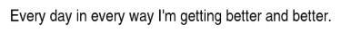
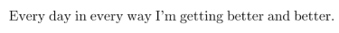
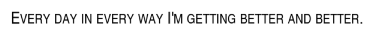
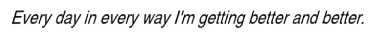
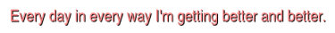
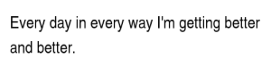
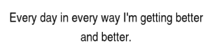
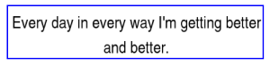
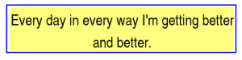

.. _rendering-text:

Rendering Text
==============

.. only:: python

   .. _onscreentext:

   OnscreenText
   ------------

   :py:class:`~.direct.gui.OnscreenText.OnscreenText` is a convenience class
   that is used a quick way to put text onscreen without having to go through
   the trouble of creating a TextNode and setting properties on it. However, it
   doesn't have the full range of rendering options that you can get with
   TextNode directly; and it doesn't support the DirectGUI features of a
   :ref:`directlabel`. Use an OnscreenText whenever you want a quick way to
   display some ordinary text without a lot of fancy requirements.

   .. code-block:: python

      from direct.gui.OnscreenText import OnscreenText
      textObject = OnscreenText(text='my text string', pos=(-0.5, 0.02), scale=0.07)

   The OnscreenText object inherits from NodePath, so all of the standard NodePath
   operations can be used on the text object. When you are ready to take the text
   away, use:

   .. code-block:: python

      textObject.destroy()

   A full list of arguments that can be passed to the constructor is available
   on the :py:class:`~.direct.gui.OnscreenText.OnscreenText` page of the API
   reference.

.. _text-node:

Text Nodes
----------

.. only:: python

   The most fundamental way to render text in Panda3D is via the
   :class:`.TextNode` interface. This may be a little more work than the
   :ref:`onscreentext` or :ref:`directlabel` objects, but it gives you a lot
   more control over the appearance of the text.

.. only:: cpp

   Rendering text in Panda3D is done using the :class:`.TextNode` interface.

To use a TextNode, simply create one and call :meth:`~.TextNode.set_text()` to
set the actual text to display, and then parent the TextNode wherever you like
(you can put it under :obj:`~builtins.aspect2d` to make a 2-d onscreen text, or
you can put it in the 3-d world for in-the-world text). Note that if you parent
the text to render2d or aspect2d, you will probably need to give it a fairly
small scale, since the coordinate space of the whole screen in render2d is in
the range (-1, 1).

.. only:: python

   .. code-block:: python

      text = TextNode('node name')
      text.setText("Every day in every way I'm getting better and better.")
      textNodePath = aspect2d.attachNewNode(text)
      textNodePath.setScale(0.07)

.. only:: cpp

   .. code-block:: cpp

      PT(TextNode) text;
      text = new TextNode("node name");
      text->set_text("Every day in every way I'm getting better and better.");
      NodePath textNodePath = window->get_aspect_2d().attach_new_node(text);
      textNodePath.set_scale(0.07);

|A simple TextNode example|

Note that the TextNode constructor takes a string name, which is not related
to the text that is to be displayed. Also note that the default text color is
white; we show it as black in these examples to make it easier to see on the
white background.

There are a large number of properties that you can specify on the TextNode to
control the appearance of your text.

Font
~~~~

.. only:: python

   .. code-block:: python

      cmr12 = loader.loadFont('cmr12.egg')
      text.setFont(cmr12)

.. only:: cpp

   .. code-block:: cpp

      PT(TextFont) cmr12=FontPool::load_font("cmss12.egg");
      text->set_font(cmr12);

|TextNode.setFont() example|

You may use any font you like, including a TTF file; see :ref:`text-fonts`.

Small Caps
~~~~~~~~~~

.. code-block:: python

   text.setSmallCaps(True)

.. only:: python

   .. code-block:: python

      cmr12 = loader.loadFont('cmr12.egg')
      text.setFont(cmr12)

.. only:: cpp

   .. code-block:: cpp

      PT(TextFont) cmr12=FontPool::load_font("cmss12.egg");
      text->set_font(cmr12);

|TextNode.setSmallCaps() example|

``setSmallCaps()`` accepts a boolean true or false value; set it true to enable
small caps mode. In this mode, instead of rendering lowercase letters, the
TextNode renders capital letters that are a bit smaller than the true capital
letters. This is an especially useful feature if your font of choice doesn't
happen to include lowercase letters.

You can also specify the relative scale of the "lowercase" letters:

.. only:: python

   .. code-block:: python

      text.setSmallCapsScale(0.4)

.. only:: cpp

   .. code-block:: cpp

      text->set_small_caps_scale(0.4);

|TextNode.setSmallCapsScale() example|

Where 1.0 is exactly the same size as the capital letters, and 0.5 is half the
size. The default is 0.8.

Slant
~~~~~

.. only:: python

   .. code-block:: python

      text.setSlant(0.3)

.. only:: cpp

   .. code-block:: cpp

      text->set_slant(0.3);

|TextNode.setSlant() example|

Slant can be used to give an effect similar to italicizing. The parameter value
is 0.0 for no slant, or 1.0 for a 45-degree rightward slant. Usually values in
the range 0.2 to 0.3 give a pleasing effect. You can also use a negative number
to give a reverse slant.

.. only:: python

   .. code-block:: python

      text.setTextColor(1, 0.5, 0.5, 1)

.. only:: cpp

   .. code-block:: cpp

      text->set_text_color(1, 0.5, 0.5, 1);

|TextNode.setColor() example|

The color is specified with its r, g, b, a components. Note that if a is not 1,
the text will be slightly transparent.

Shadow
~~~~~~

.. only:: python

   .. code-block:: python

      text.setShadow(0.05, 0.05)
      text.setShadowColor(0, 0, 0, 1)

.. only:: cpp

   .. code-block:: cpp

      text->set_shadow(0.05, 0.05);
      text->set_shadow_color(0, 0, 0, 1);

|TextNode.setShadow() example|

A shadow is another copy of the text, drawn behind the original text and offset
slightly to the right and down. It can help make the text stand out from its
background, especially when there is not a high contrast between the text color
and the background color. (The text color in this example is exactly the same
pink color used in the example above, but note how much clearer it is with the
shadow.) The downside of a shadow is that it doubles the number of polygons
required to render the text.

Setting a shadow requires two calls: ``setShadow()`` accepts a pair of numbers
indicating the distance to shift the shadow right and down, respectively, in
screen units; these are usually very small numbers like 0.05.
``setShadowColor()`` accepts the r, g, b, a color of the shadow; the default is
black.

Wordwrap
~~~~~~~~

By default, text will be formatted on one line, unless it includes newline
characters. Enabling wordwrap will automatically break the text into multiple
lines if it doesn't fit within the specified width.

.. only:: python

   .. code-block:: python

      text.setWordwrap(15.0)

.. only:: cpp

   .. code-block:: cpp

      text->set_wordwrap(15.0);

|TextNode.setWordwrap() example|

The parameter to ``setWordwrap()`` should be the maximum width of each line, in
screen units.

Alignment
~~~~~~~~~

Text is left-aligned by default; that is, it starts at the position you specify
with textNodePath.setPos() and goes out to the right from there. If you have
multiple lines of text, you may prefer to center the text or right-align it
instead:

.. only:: python

   .. code-block:: python

      text.setAlign(TextNode.ACenter)

.. only:: cpp

   .. code-block:: cpp

      text->set_align(TextNode::A_center);

|TextNode.setAlign() example|

The parameter to ``setAlign()`` should be one of ``TextNode.ALeft``,
``TextNode.ACenter``, or ``TextNode.ARight``. Note that changing the alignment
of the text will shift its position relative to the starting point; that is, the
text is aligned relative to the starting point.

You can also set the alignment to one of ``TextNode.ABoxedLeft``,
``TextNode.ABoxedCenter``, or ``TextNode.ABoxedRight``. These are similar to the
above, but they do not shift the text's position relative to the starting point;
the text is aligned within the specified margin, which extends for wordwrap
units to the right of the starting point.

Frame
~~~~~

You can specify that a thin frame should be drawn around the entire text
rectangle:

.. only:: python

   .. code-block:: python

      text.setFrameColor(0, 0, 1, 1)
      text.setFrameAsMargin(0.2, 0.2, 0.1, 0.1)

.. only:: cpp

   .. code-block:: cpp

      text->set_frame_color(0, 0, 1, 1);
      text->set_frame_as_margin(0.2, 0.2, 0.1, 0.1);

|TextNode.setFrameAsMargin() example|

As with the shadow, specifying a frame requires two calls; one to specify the
color, and another to specify the dimensions of the frame. The call
``setFrameAsMargin()`` specifies four parameters, which represent the amount of
space to insert between the edge of the text and the frame on the left, right,
bottom, and top edges, respectively. All four parameters can be 0.0 to tightly
enclose the text (although some fonts render a little bit outside their reported
boundaries).

Card
~~~~

Finally, you can draw a solid card behind the text rectangle:

.. only:: python

   .. code-block:: python

      text.setCardColor(1, 1, 0.5, 1)
      text.setCardAsMargin(0, 0, 0, 0)
      text.setCardDecal(True)

.. only:: cpp

   .. code-block:: cpp

      text->set_card_color(1, 1, 0.5, 1);
      text->set_card_as_margin(0, 0, 0, 0);
      text->set_card_decal(true);

|TextNode.setCardAsMargin() example|

This can also help to make the text easier to read when it is against a similar-
colored background. Often, you will want the card to be semitransparent, which
you can achieve by specifying an alpha value of 0.2 or 0.3 to the
``setCardColor()`` method.

The parameters to ``setCardAsMargin()`` are the same as those for
``setFrameAsMargin()``, above: the distance to extend the card beyond the left,
right, bottom, and top edges, respectively. (In this example, we have both the
card and the frame on at the same time, and you can see that the card exactly
fits the text, while the frame extends a little bit beyond--showing the effects
of the slightly different parameters passed to ``setFrameAsMargin()`` and
``setCardAsMargin()`` in this example.)

If the text is to be visible in the 3-d world (that is, parented to render
instead of to render2d), then you may observe z-fighting, or flashing, between
the text and the card. To avoid this, call ``text.setCardDecal(True)``. This is
not necessary when the text will be parented under render2d or aspect2d, or when
you will be controlling the binning of the text explicitly.

Picking a Text Node
-------------------

Strictly speaking, a TextNode has no geometry, so you can't pick it.

There are two possible workarounds.

1. Create your own card to go behind the TextNode, using e.g. CardMaker. You
   should be able to say ``cardMaker.setFrame(textNode.getFrameActual())`` to
   set the card to be the same dimensions as the text's frame. Then you will
   need to either offset the text a few inches in front of the card to prevent
   Z-fighting, or explicitly decal the text onto the card, with something like
   this:

   .. code-block:: python

      card = NodePath(cardMaker.generate())
      tnp = card.attachNewNode(textNode)
      card.setEffect(DecalEffect.make())

2. Instead of parenting the TextNode directly to the scene, parent the node
   returned by ``textNode.generate()`` instead. This will be a static node that
   contains the polygons that render the text. If the text changes in the
   future, it won't automatically update the geometry in this node; you will
   have to replace this node with the new result of ``textNode.generate()``.
   But this node will be 100% pickable. In particular, if you have specified
   ``textNode.setCardDecal(True)``, then the first child of the node should be
   the card geometry.

.. |TextNode.setSmallCapsScale() example| image:: text-smallcaps-scale.png

.. |TextNode.setColor() example| image:: text-color.png

