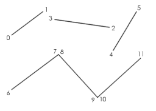
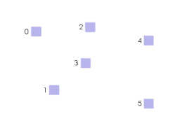

.. _geomprimitive:

GeomPrimitive
=============

In order to use the vertices in a :ref:`geomvertexdata` to render anything,
Panda needs to have a :class:`.GeomPrimitive` of some kind, which indexes into
the vertex table and tells Panda how to tie together the vertices to make lines,
triangles, or individual points.

There are several different kinds of :class:`.GeomPrimitive` objects, one for
each different kind of primitive. Each GeomPrimitive object actually stores
several different individual primitives, each of which is represented simply as
a list of vertex numbers, indexing into the vertices stored in the associated
GeomVertexData. For some GeomPrimitive types, like GeomTriangles, all the
primitives must have a fixed number of vertex numbers (3, in the case of
GeomTriangles); for others, like GeomTristrips, each primitive can have a
different number of vertex numbers.

For instance, a :class:`.GeomTriangles` object containing three triangles, and a
:class:`.GeomTristrips` containing two triangle strips, might look like this:

.. raw:: html

   
<table style="border-collapse: collapse">
   <tr>
   <td style="text-align: center; padding-left: 5pt; padding-right: 5pt">GeomTriangles</td>
   <td style="padding-right: 64pt"></td>
   <td style="text-align: center; padding-left: 5pt; padding-right: 5pt">GeomTristrips</td>
   </tr>
   <tr>
   <td style="border: 1px solid black; background: #c1beea; text-align: center">0</td>
   <td></td>
   <td style="border: 1px solid black; background: #c1beea; text-align: center">0</td>
   </tr>
   <tr>
   <td style="border: 1px solid black; background: #c1beea; text-align: center">1</td>
   <td></td>
   <td style="border: 1px solid black; background: #c1beea; text-align: center">2</td>
   </tr>
   <tr>
   <td style="border: 1px solid black; background: #c1beea; text-align: center">2</td>
   <td></td>
   <td style="border: 1px solid black; background: #c1beea; text-align: center">3</td>
   </tr>
   <tr>
   <td></td>
   <td></td>
   <td style="border: 1px solid black; background: #c1beea; text-align: center">5</td>
   </tr>
   <tr>
   <td style="border: 1px solid black; background: #c1beea; text-align: center">2</td>
   <td></td>
   <td style="border: 1px solid black; background: #c1beea; text-align: center">6</td>
   </tr>
   <tr>
   <td style="border: 1px solid black; background: #c1beea; text-align: center">1</td>
   <td></td>
   <td style="border: 1px solid black; background: #c1beea; text-align: center">1</td>
   </tr>
   <tr>
   <td style="border: 1px solid black; background: #c1beea; text-align: center">3</td>
   <td></td>
   <td></td>
   </tr>
   <tr>
   <td></td>
   <td></td>
   <td style="border: 1px solid black; background: #c1beea; text-align: center">5</td>
   </tr>
   <tr>
   <td style="border: 1px solid black; background: #c1beea; text-align: center">0</td>
   <td></td>
   <td style="border: 1px solid black; background: #c1beea; text-align: center">1</td>
   </tr>
   <tr>
   <td style="border: 1px solid black; background: #c1beea; text-align: center">5</td>
   <td></td>
   <td style="border: 1px solid black; background: #c1beea; text-align: center">3</td>
   </tr>
   <tr>
   <td style="border: 1px solid black; background: #c1beea; text-align: center">6</td>
   <td></td>
   <td style="border: 1px solid black; background: #c1beea; text-align: center">2</td>
   </tr>
   </table>

Note that the GeomPrimitive objects don't themselves contain any vertex data;
they only contain a list of vertex index numbers, which is used to look up the
actual vertex data in a GeomVertexData object, stored elsewhere.

GeomTriangles
~~~~~~~~~~~~~

This is the most common kind of GeomPrimitive. This kind of primitive stores
any number of connected or unconnected triangles. Each triangle must have
exactly three vertices, of course. In each triangle, the vertices should be
listed in counterclockwise order, as seen from the front of the triangle.

.. image:: geomtriangles.png

GeomTristrips
~~~~~~~~~~~~~

This kind of primitive stores lists of connected triangles, in a specific
arrangement called a triangle strip. You can store any number of individual
triangle strips in a single GeomTristrips object, and each triangle strip can
have an arbitrary number of vertices (at least three).

The first three vertices of a triangle strip define one triangle, with the
vertices listed in counterclockwise order. Thereafter, each additional vertex
defines an additional triangle, based on the new vertex and the preceding two
vertices. The vertices go back and forth, defining triangles in a zigzag
fashion.

.. image:: geomtristrips.png

Note that the second triangle in a triangle strip is defined in clockwise
order, the third triangle is in counterclockwise order, the fourth triangle is
in clockwise order again, and so on.

On certain hardware, particularly older SGI hardware and some console games,
using triangle strips is an important optimization to reduce the number of
vertices that are sent to the graphics pipe, since most triangles (except for
the first one) can be defined with only a single vertex, rather than three
vertices for each triangle.

Modern PC graphics cards prefer to receive a group of triangle strips
connected together into one very long triangle strip, by the introduction of
repeated vertices and degenerate triangles. Panda will do this automatically,
but in order for this to work you should ensure that every triangle strip has
an even number of vertices in it.

Furthermore, since modern PC graphics cards incorporate a short vertex cache,
they can generally render individual, indexed triangles as fast as triangle
strips; so triangle strips are less important on PC hardware than they have
been in the past. Unless you have a good reason to use a GeomTristrips, it may
be easier just to use GeomTriangles.

When loading a model from an egg file, Panda will assemble the polygons into
triangle strips if it can do so without making other compromises; otherwise,
it will leave the polygons as individual triangles.

GeomTrifans
~~~~~~~~~~~

This is similar to a GeomTristrips, in that the primitive can contain any
number of triangle fans, each of which has an arbitrary number of vertices.
Within each triangle fan, the first three vertices (in counterclockwise order)
define a triangle, and each additional vertex defines a new triangle. However,
instead of using the preceding two vertices to define each new triangle, a
triangle fan uses the previous vertex and the first vertex, which means that
all of the resulting triangles fan out from a single point, like this:

.. image:: geomtrifans.png

Like the triangle strip, a triangle fan can be an important optimization on
certain hardware. However, its use can actually incur a performance penalty on
modern PC hardware, because it is impossible to send more than one triangle
fan in one batch, so you probably shouldn't use triangle fans on a PC. Use
GeomTriangles or GeomTristrips instead.

GeomLines
~~~~~~~~~

This kind of GeomPrimitive stores any number of connected or unconnected line
segments. It is similar to a GeomTriangles, but it draws lines instead of
triangles. Each line has exactly two vertices.

By default, line segments are one pixel wide, no matter how far away they are
from the camera. You can use nodePath.setRenderModeThickness() to change this;
if you specify a thickness greater than 1, this will make the lines render as
thick lines, the specified number of pixels wide. However, the lines will
always be the same width in pixels, regardless of how far away from the camera
they are.

Thick lines are not supported by the DirectX renderer; in DirectX, the
thickness parameter is ignored.

GeomLinestrips
~~~~~~~~~~~~~~

This is the analogue of a GeomTristrips object: the GeomLinestrips object can
store any number of line strips, each of which can have any number of
vertices, at least two. Within a particular line strip, the first two vertices
define a line segment; and thereafter, each new vertex defines an additional
line segment, connected end-to-end with the previous line segment. This
primitive type can be used to draw a curve approximation with many bends
fairly easily.

.. image:: geomlinestrips.png

GeomPoints
~~~~~~~~~~

This is the simplest kind of GeomPrimitive; it stores a number of individual
points. Each point has exactly one vertex.

.. image:: geompoints.png

By default, each point is rendered as one pixel. You can use
:meth:`nodePath.set_render_mode_thickness() <.NodePath.set_render_mode_thickness>`
to change this; if you specify a thickness greater than 1, this will make the
points render as squares (which always face the camera), where the vertex
coordinate is the center point of the square, and the square has the specified
number of pixels along each side. Each point will always be the same width in
pixels, no matter how far it is from the camera. Unlike line segments, thick
points are supported by DirectX.

In addition to ordinary thick points, which are always the same size no matter
how far they are from the camera, you can also use
:meth:`nodePath.set_render_mode_perspective() <.NodePath.set_render_mode_perspective>`
to enable a mode in which the points scale according to their distance from the
camera. This makes the points appear more like real objects in the 3-D scene,
and is particularly useful for rendering sprite polygons, for instance for
particle effects.
In fact, Panda's :ref:`SpriteParticleRenderer <particle-renderers>` takes
advantage of this render mode. (This perspective mode works only for points; it
does not affect line segments.)

Even though the sprite polygons are rendered as squares, remember they are
really defined with one vertex, and each vertex can only supply one UV
coordinate. This means each sprite normally has only one UV coordinate pair
across the whole polygon. If you want to apply a texture to the face of each
sprite, apply :ref:`automatic-texture-coordinates` using
:meth:`nodePath.set_tex_gen(stage, TexGenAttrib.M_point_sprite)`; this will
generate texture coordinates on each polygon in the range (0, 0) to (1, 1). You
can then transform the texture coordinates, if you wish, using one of the
methods like :meth:`nodePath.set_tex_offset() <.NodePath.set_tex_offset>`,
:meth:`set_tex_scale() <.NodePath.set_tex_scale>`, etc.
