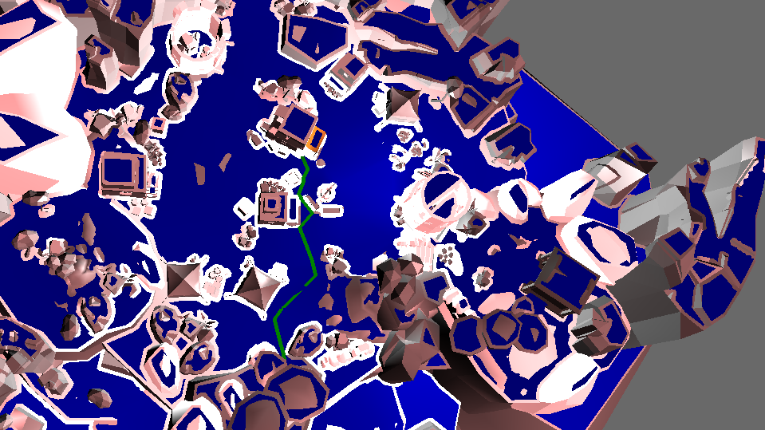
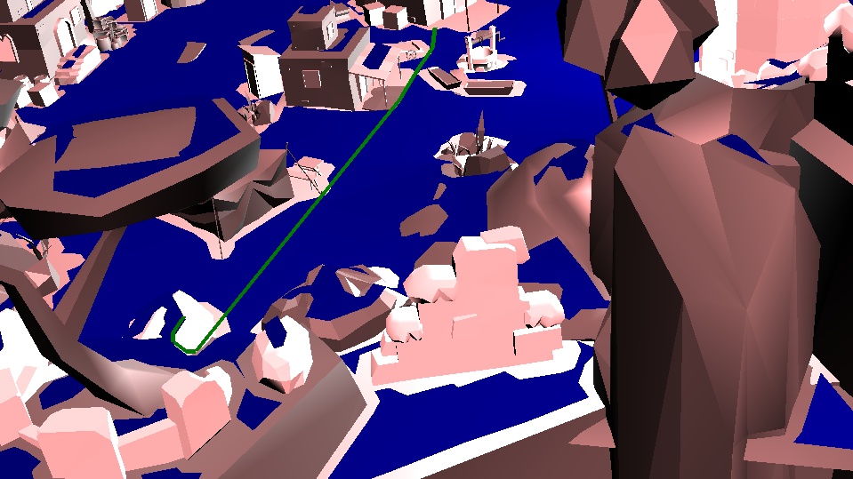

.. _path-query:

Pathfinding on NavMesh
======================

The most important feature of navigation library is pathfinding.
The library uses A* pathfinding algorithm over polygons of navigation 
mesh, though you do not need to worry about those stuffs.

Update the Code
~~~~~~~~~~~~~~~

Make a object of NavMeshQuery Class which will then do query operations 
for pathfinding.

.. code-block:: python

   query = navigation.NavMeshQuery(navmesh)

Now, you should define the two points between which path has to be found.

.. code-block:: python

   from panda3d.core import LPoint3
   pos1 = LPoint3(0, 0, 0);
   pos2 = LPoint3(50, 60, 3);

To find the path between the two positions, you can simple use the following:

.. code-block:: python

   path = query.find_path(pos1, pos2)

Here, find_path function finds the points on the navigation mesh closest to 
the input positions. So, you need not worry about them not being exactly over 
the navigation mesh. 

If you find / print the point on the navigation mesh closest to the position, you can 
do it in the following way:

.. code-block:: python

   pos = LPoint3(0, 1, 5)
   query.nearestPoint(pos)
   print(pos)

You have the path stored in the 'path' variable, which has array of points joining
the path. You can use LineSegs to visualize the path as follows:

.. code-block:: python

   from panda3d.core import LineSegs

   pathLine = LineSegs()
   pathLine.setColor(0,1,0)
   pathLine.setThickness(5)
   for i in range(len(path)):
      pathLine.drawTo(path[i])

   lineNode = pathLine.create()
   lineNodePath = scene.attachNewNode(lineNode)

Run the Program
~~~~~~~~~~~~~~~

Go ahead and run the program. You should see this:

The green lines show the path between the positions.

Using straight path
~~~~~~~~~~~~~~~~~~~

You can also a different path querying function. Update the code as follows 
by replacing the definition of 'path' before visualization using LineSegs:

.. code-block:: python

   path = query.find_straight_path(pos1, pos2)

After running the program, you should see this:

