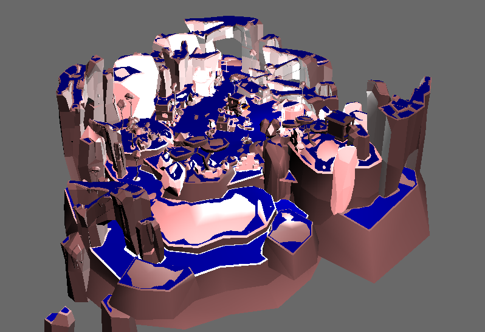

.. _visualize-mesh:

Visualize NavMesh
=================

Update the Code
~~~~~~~~~~~~~~~

After you have built the navigation mesh, you migh also wish to visualize it.
Let's say you used the following line of code to build the navigation mesh.

.. only:: python

   .. code-block:: python

      builder.set_actor_radius(1.0)
      navmesh = builder.build()

.. only:: cpp

   .. code-block:: cpp

      builder.set_actor_radius(1.0);
      PT(NavMesh) navmesh = builder.build();

You do not want you actor to move along the walls, hence the radius has been 
set to a value of 1 unit using set_actor_radius(1.0) function. You should set the 
radius as per your requirements.
Now, in order to visualize the mesh, you can do it in the following way:

.. only:: python

   .. code-block:: python

      node = navmesh.draw_nav_mesh_geom()

.. only:: cpp

   .. code-block:: cpp

      PT(GeomNode) node = navmesh->draw_nav_mesh_geom();

draw_nav_mesh_geom() returns the navigation mesh as a GeomNode object.

Before visualizing navigation mesh, you might also want to visualize the 
the object node over which navigation mesh is built.

You should first set up the lighting of the environment. Here, a combination of
directional and point light is used. 

.. only:: python

   .. code-block:: python

      from panda3d.core import PointLight,DirectionalLight

      plight = PointLight('plight')
      plight.set_color((0.9, 0.9, 0.9, 0.5))
      plnp = render.attach_new_node(plight)
      plnp.set_pos(10, 20, 0)
      render.set_light(plnp)
   
      dlight = DirectionalLight('dlight')
      dlight.set_color((0.8, 0.5, 0.5, 1))
      dlnp = render.attach_new_node(dlight)
      dlnp.set_hpr(0, -60, 0)
      render.set_light(dlnp)

.. only:: cpp

   .. code-block:: cpp

      #include "pointLight.h"
      #include "directionalLight.h"

      PointLight plight = new PointLight('plight');
      plight.setColor((0.9, 0.9, 0.9, 0.5));
      NodePath plnp = render.attach_new_node(plight);
      plnp.set_pos(10, 20, 0);
      render.set_light(plnp);
   
      DirectionalLight dlight = new DirectionalLight('dlight');
      dlight.set_color((0.8, 0.5, 0.5, 1));
      NodePath dlnp = render.attach_new_node(dlight);
      dlnp.set_hpr(0, -60, 0);
      render.set_light(dlnp);

To visualize the object:

.. only:: python

   .. code-block:: python

      scene.reparent_to(render)

.. only:: cpp

   .. code-block:: cpp

      scene.reparent_to(window->get_render());

Now in order to visualize GeomNode, you can attach the GeomNode to render
or some other NodePath already attached to render, like here it has been 
attached to 'scene'.

.. only:: python

   .. code-block:: python

      nodepath = scene.attach_new_node(node)
      nodepath.set_color(0, 0, 1)

.. only:: cpp

   .. code-block:: cpp

      NodePath nodepath = scene.attach_new_node(node);
      nodepath.set_color(0, 0, 1);

Run the Program
~~~~~~~~~~~~~~~

Go ahead and run the program. You should see this:

You should see navigation mesh in blue color over the object surface.
