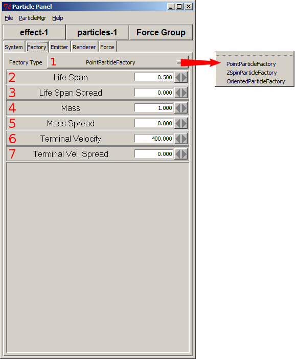
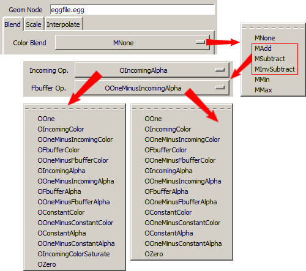

.. _using-the-particle-panel:

Using the Particle Panel
========================

The Particle Panel can be invoked by running the Particle Panel sample program,
which should be located at Panda3D-1.X.X/samples/Particles in Windows. The
Panda3D engine uses text files for storing particle effects. You don't need to
use the Particle Panel to create particle effects, you can just create those
files in your text editor, or set all the parameters in your code, however it
makes everything a lot easier and you can see all your changes immediately in
the 3d view.

|Ppanel1.png|

1. Load Params, Save Params, Print Params or Quit. You can load or save your
   Panda Particle Files (\*.ptf), which are ordinary text files. You can also
   print the content of the ptf file to the console. Quit exits the Particle
   Panel program.

2. Toggle between Active or Passive modes (Active by default).

3. Find out general info about the Particle Panel program or toggle Baloon Help
   (on by default).

4. Select effect to configure or create new effect. Options: Create new Effect,
   Select Particle Effect, Place Particle Effect, Toggle Effect Vis,
   Enable/Disable.

5. Select effect to configure or create new effect.

6. Select particles object to configure or add new particles object to current
   effect.

7. System:

|Ppanel2.png|

1) Max number of simultaneous particles. More amount of particles won't exist at
   the same time.

2) Seconds between particle births. No new particles will be generated during
   this period.

3) Number of particles created at each birth.

4) Variation in litter size, so exactly the same amount of particles won't be
   generated at each birth as set in the "Litter Size".

5) Age in seconds at which the system (vs. Particles) should die. Default is 0,
   which means the particle generator won't die.

6) Whether or not velocities are absolute.

7) System has a lifespan or not. Length set in "Lifespan".

8) Particle system position (0,0,0 by default)

9) Particle system orientation (0,0,0 by default)

Some of this information can also be found in the Particle Effect Basic
Parameters page.

8. Factory:

|Ppanel3.png|

1) Type of the particle factory. The differences between these factories lie in
   the orientation and rotational abilities.

2) Average particle lifespan in seconds. Sets how long each particle should
   exist.

3) Variation in lifespan. Default is 0, which means all particles will have the
   same lifespan.

4) Average particle mass.

5) Variation in particle mass.

6) Average particle terminal velocity.

7) Variation in terminal velocity.

Some of this information can also be found in the Particle Factories page.

9. Emitter:

|Ppanel4.png|

1) There are a large number of particle emitters, each categorized by the volume
   of space they represent.

2) All emitters have three modes: explicit, radiate, and custom. Explicit mode
   emits the particles in parallel in the same direction. Radiate mode emits
   particles away from a specific point. Custom mode emits particles with a
   velocity determined by the particular emitter.

3) Launch velocity multiplier (all emission modes)

4) Spread for launch velocity multiplier (all emission modes)

5) Velocity vector applied to all particles.

6) All particles launch with this velocity in Explicit mode.

7) Particles launch away from this point in Radiate mode.

Some of this information can also be found in the Particle Emitters page.

10. Renderer:

|Ppanel5.png|

1) Renderer Type sets the type of particle renderer. These are
   LineParticleRenderer, GeomParticleRenderer, PointParticleRenderer,
   SparkleParticleRenderer and SpriteParticleRenderer.

2) Alpha setting over particle's lifetime: NO_ALPHA, ALPHA_IN, ALPHA_OUT,
   ALPHA_IN_OUT, ALPHA_USER.

3) Alpha value for ALPHA_USER alpha mode.

1. LineParticleRenderer

LineParticleRenderer is useful for effects such as rain. You can't use the
SpriteParticleRenderer for the same effect, as the lines would always face the
camera. Each Particle Renderer has it's own unique options, so we are going to
explain them separately.

|Ppanel6.png|

1.1 – 1.2) Head color and tail color of the line can be different.

1.3) You can set the lenght of the line here.

2. GeomParticleRender

GeomParticleRender renders particles as full 3D objects. This requires a
geometry node. Just type the path to the egg file you want to use.

|Ppanel7.png|

undocumented

|Ppanel8.png|

2.1) If you enable these, then the values from 3 and 5 and 7 won't be ignored,
     the values between Initial X/Y/Z and Final X/Y/Z will be interpolated over
     particle's life.

2.2, 2.4, 2.6) Initial X/Y/Z scales. You can set the scales of particles here.

2.3, 2.5, 2.7) Final X/Y/Z scales. If the "X Scale","Y Scale" and "Z Scale"
are enabled, then the the values between Initial X/Y/Z and Final X/Y/Z will be
interpolated over particle's life.

|Ppanel9.png|

Segments can be used to change the colour of particles during their lifetime.

3. PointParticleRender

Renders particles as pixel points.

|Ppanel10.png|

3.1) Size of the points (1 pixel by default)

3.2 – 3.3) Starting and ending colors. The colors the points will have during
their birth and death.

3.4) How the particles blend from the start color to the end color.

3.5) Interpolation method between colors.

4. SparkleParticleRender

Renders particles as star or sparkle objects, three equal-length perpendicular
axial lines, much like jacks. Sparkle particles appear to sparkle when viewed
as being smaller than a pixel.

|Ppanel11.png|

4.1 – 4.2) Color of the center and color of the edges.

4.3 – 4.4) Initial sparkle radius and final sparkle radius

4.5) Whether or not sparkle is always of radius birthRadius

5. SpriteParticleRender

Renders particles as an image, using a Panda3D texture object. The image is
always facing the user.

|Ppanel12.png|

5.1.1) On: Multitexture node will be animated, Off: only the first frame of a
node will be rendered. One way to make such a node (textured quad) is
egg-texture-cards program, which will take your image files and generate an
egg file for you. To add such a node, click on (5.4) Add Animation button.

5.1.2) The frame rate of the animation, enable Animation first.

5.1.3) Add a texture.

5.1.4) Add a node intended for animations.

5.1.5 - 5.1.6) Write the name of the texture file. You won't see changes
before you click "Update". You can see the default texture file used by the
program. Use the X button to remove the texture.

|Ppanel13.png|

5.2.1) If you enable these, then the values from 4 and 6 won't be ignored, the
values between Initial X/Y and Final X/Y will be interpolated over particle's
life.

5.2.2) On: particles that are set to spin on the Z axis will spin
appropriately.

5.2.3, 5.2.5) Initial X/Y scales. You can set the scales of particles here.

5.2.4, 5.2.6) Final X/Y scales. If the "X Scale" and "Y Scale" are enabled,
then the the values between Initial X/Y and Final X/Y will be interpolated
over particle's life.

5.2.7) If animAngle is false: counter-clockwise Z rotation of all sprites

|Ppanel14.png|

undocumented

|Ppanel15.png|

Segments can be used to change the colour of particles during their lifetime.
Here's an example of using a Linear Segment:

|Rocket-particles.png|

11. Force

|Ppanel16.png|

You can add different forces to your particle effects here. For example you can
use the Noise Force to add some randomness to the movement of particles such as
for falling particles used in a snow effect.

Note: There isn't an option in the Particle Panel to set what the individual
particles should be relative to. If you want to set that explicitly, use the
``renderParent`` argument in the ``start()`` call in your code. You will find
this useful for particle effects on moving objects, or for example rain and
snow.

Note: resizing the particle Panel GUI window might crash the program.

.. |Ppanel1.png| image:: ppanel1.png
.. |Ppanel2.png| image:: ppanel2.png

.. |Ppanel4.png| image:: ppanel4.png
.. |Ppanel5.png| image:: ppanel5.png
.. |Ppanel6.png| image:: ppanel6.png

.. |Ppanel8.png| image:: ppanel8.png
.. |Ppanel9.png| image:: ppanel9.png
.. |Ppanel10.png| image:: ppanel10.png
.. |Ppanel11.png| image:: ppanel11.png
.. |Ppanel12.png| image:: ppanel12.png
.. |Ppanel13.png| image:: ppanel13.png
.. |Ppanel14.png| image:: ppanel14.png
.. |Ppanel15.png| image:: ppanel15.png
.. |Rocket-particles.png| image:: rocket-particles.png
.. |Ppanel16.png| image:: ppanel16.png
