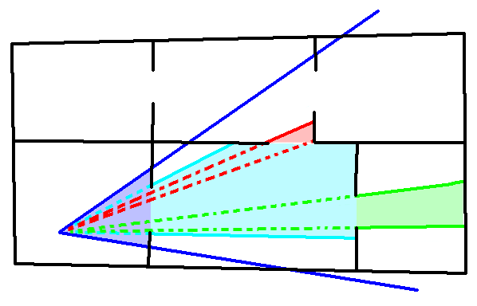

.. _portal-culling:

Portal Culling
==============

What is Portal Culling?
-----------------------

Portal culling is a method by which the 3D scene can be broken into areas called
cells, which are linked together by portals. A portal is a window in 3D space
that allows objects in one cell (the "out" cell) to be seen from another cell
(the "in" cell). Portal culling works best in scenes where there is limited
visibility from one area to another, for example a building or network of caves.
It has very limited use in wide open scenes.

In this diagram the original camera frustum is seen in blue, this is used to
cull the current cell. The shaded areas represent areas visible after culling.
The camera is looking through a portal into the next cell, and so the frustum is
reduced (seen in cyan) so as to render only that which is visible through the
portal. This reduced frustum is then used to check visibility of additional
portals in other cells, and it will be reduced again as it passed through more
portals (seen in red and green). Note that even though more cells are visible to
the original camera frustum, there is no direct line of visibility and so they
are not even considered.

How are Cells and Portals handled in Panda3D?
---------------------------------------------

Cells in Panda3D are just NodePaths parented under the top level of the scene
graph (usually render). Any object that is physically in that cell should be
parented under the cell's NodePath. It is up to you to dynamically re-parent
objects as they move from one cell to another, or not put them in a cell at all.

Portals are one-way and for this reason they are usually created in pairs.
Portals get parented under the cell from which they are intended to be looked
through. For example if this is a portal from cell A looking into cell B, it
would get parented under cell A. Which side of the portal is the front or back
is determined by winding order of the vertices, the same as with render
geometry.

Application-level code is needed to show the cell the camera is currently in and
hide the rest. During the culling stage any portal visible to the camera will be
enabled, and render the objects that can be seen through the portal into its
specified "out" cell. If another portal is visible through the previous one, the
process continues. If multiple cameras are used, for example to do split screen
play, hide the cells using the same mask set on the camera using
camera.setCameraMask(mask).

