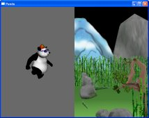
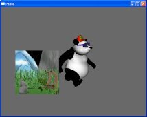

.. _display-regions:

Display Regions
===============

A new window can't render anything until it has at least one
:class:`.DisplayRegion`. A DisplayRegion is necessary to associate a camera with
the window.

A :class:`.DisplayRegion` is a rectangular area of the window that contains the
rendered scene, as viewed by one particular camera. Usually, you create just one
DisplayRegion that covers the entire window, although you can create as many
different smaller regions as you like, each one displaying the output from a
different camera.

.. figure:: displayregion-1.jpg

   A single display region

   Two display regions

   Another arrangement of two regions

You can create a DisplayRegion with the
:meth:`~.GraphicsOutput.make_display_region()` call on a window:

.. only:: python

   .. code-block:: python

      region = win.makeDisplayRegion()
      region = win.makeDisplayRegion(left, right, bottom, top)

.. only:: cpp

   .. code-block:: cpp

      PT(DisplayRegion) region = win.make_display_region();
      PT(DisplayRegion) region = win.make_display_region(left, right, bottom, top);

The first example creates a DisplayRegion that fills the entire window, while
the second example specifies the size and placement of the DisplayRegion within
the window. The ranges of left, right, bottom, top are from 0 to 1, where 0 is
the left and bottom of the window, and 1 is the right and top of the window.
(Note that this is different from the range of the render2d screen coordinates,
which ranges from -1 to 1 instead of 0 to 1.) For instance, the right panel of
the second example above was created with the call ``win.makeDisplayRegion(0.5,
1, 0, 1)``.

A new DisplayRegion won't render anything until it has been associated with a
camera. Each DisplayRegion may have just one camera associated with it (although
a particular camera may be associated with more than one DisplayRegion).

A :class:`.Camera` is a kind of :class:`.PandaNode`, so you can simply create
one and wrap a :class:`.NodePath` around it:

.. only:: python

   .. code-block:: python

      camNode = Camera('cam')
      camNP = NodePath(camNode)
      region.setCamera(camNP)

.. only:: cpp

   .. code-block:: cpp

      PT(Camera) camNode = new Camera("cam");
      NodePath camNP(camNode);
      region->set_camera(camNP);

Once you have a Camera, you need to decide where to attach it to the scene
graph. If you parent it to base.camera, it will inherit the transform of that
node and so it will move with the system trackball controls, if enabled, and
will view the scene that base.camera is attached to (usually render). The
default Camera that Panda creates is attached to base.camera.

.. only:: python

   .. code-block:: python

      # View render, as seen by the default camera
      camNP.reparentTo(base.camera)

.. only:: cpp

   .. code-block:: cpp

      // View render, as seen by the default camera
      camNP.reparent_to(windowFramework->get_camera_group());

If you wish your new Camera to view a completely different scene, you can set up
a new scene graph simply by creating a new NodePath to be the root, and then
reparent your Camera into that new scene graph. Then, your camera will render
whatever models you put into the same scene graph. In this case, since your
camera is not a child of base.camera, it will be up to you to position the
camera and the models correctly relative to each other.

.. only:: python

   .. code-block:: python

      # View some other scene, unrelated to render
      render2 = NodePath('render2')  # the string parameter is important
      camNP.reparentTo(render2)
      env = loader.loadModel('environment.egg')
      env.reparentTo(render2)

.. only:: cpp

   .. code-block:: cpp

      // View some other scene, unrelated to render
      NodePath render2("render2");  // the string parameter is important
      camNP.reparent_to(render2);
      NodePath env = windowFramework->load_model(render2, "environment.egg");
