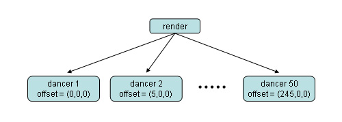

.. _instancing:

Instancing
==========

In the musical "A Chorus Line," the most well-known scene is when about 50
identical-looking young women line up left-to-right across the stage, and they
all kick-left-kick-right in unison. To implement this in Panda3D, you might do
this:

.. code-block:: python

   for i in range(50):
       dancer = Actor.Actor("chorus-line-dancer.egg", {"kick":"kick.egg"})
       dancer.loop("kick")
       dancer.setPos(i*5,0,0)
       dancer.reparentTo(render)

Here is the scene graph that we just created:

This works fine, but it is a little expensive. Animating a model involves a lot
of per-vertex matrix calculations. In this case, we're animating 50 copies of
the exact same model using 50 copies of the exact same animation. That's a lot
of redundant calculations. It would seem that there must be some way to avoid
calculating the exact same values 50 times. There is: the technique is called
instancing.

The idea is this: instead of creating 50 separate dancers, create only one
dancer, so that the engine only has to update her animation once. Cause the
engine to render her 50 times, by inserting her into the scene graph in 50
different places. Here is how it is done:

.. code-block:: python

   dancer = Actor.Actor("chorus-line-dancer.egg", {"kick":"kick.egg"})
   dancer.loop("kick")
   dancer.setPos(0,0,0)
   for i in range(50):
       placeholder = render.attachNewNode("Dancer-Placeholder")
       placeholder.setPos(i*5, 0, 0)
       dancer.instanceTo(placeholder)

Here is a diagram of the scene graph we just created:

.. image:: instancing2.jpg

It's not a tree anymore, it is a directed acyclic graph. But the renderer
still traverses the graph using a recursive tree-traversal algorithm. As a
result, it ends up traversing the dancer node 50 times. Here is a diagram of
the depth-first traversal that the renderer takes through the graph. Note that
this is not a diagram of the scene graph - it's a diagram of the renderer's
path through the scene graph:

.. image:: instancing3.jpg

In other words, the renderer visits the dancer actor 50 times. It doesn't even
notice that it's visiting the same actor 50 times, rather than visiting 50
different actors. It's all the same to the renderer.

There are 50 placeholder nodes, lined up across the stage. These are called
dummy nodes. They don't contain any polygons, they're little tiny objects used
mainly for organization. In this case, I'm using each placeholder as a
platform on which a dancer can stand.

The position of the dancer is (0,0,0). But that's relative to the position of
the parent. When the renderer is traversing placeholder 1's subtree, the
dancer's position is treated as relative to placeholder 1. When the renderer
is traversing placeholder 2's subtree, the dancer's position is treated as
relative to placeholder 2. So although the position of the dancer is fixed at
(0,0,0), it appears in multiple locations in the scene (on top of each
placeholder).

In this way, it is possible to render a model multiple times without storing
and animating it multiple times.

Advanced Instancing
-------------------

Now, let's go a step further:

.. code-block:: python

   dancer = Actor.Actor("chorus-line-dancer.egg", {"kick":"kick.egg"})
   dancer.loop("kick")
   dancer.setPos(0,0,0)
   chorusline = NodePath('chorusline')
   for i in range(50):
       placeholder = chorusline.attachNewNode("Dancer-Placeholder")
       placeholder.setPos(i*5,0,0)
       dancer.instanceTo(placeholder)

This is the exact same code as before, except that instead of putting the 50
placeholders beneath ``render``, I
put them beneath a dummy node called
``chorusline``. So my line of dancers
is not part of the scene graph yet. Now, I can do this:

.. code-block:: python

   for i in range(3):
       placeholder = render.attachNewNode("Line-Placeholder")
       placeholder.setPos(0,i*10,0)
       chorusline.instanceTo(placeholder)

Here is the scene graph I just created:

.. image:: instancing4.jpg

But when the renderer traverses it using a recursive tree-traversal algorithm,
it will see 3 major subtrees (rooted at a line-placeholder), and each subtree
will contain 50 placeholders and 50 dancers, for a grand total of 150 apparent
dancers.

Instancing: an Important Caveat
-------------------------------

Instancing saves panda quite a bit of CPU time when animating the model. But
that doesn't change the fact that the renderer still needs to render the model
150 times. If the dancer is a 1000 polygon model, that's still 150,000
polygons.

Note that each instance has its own bounding box, each is occlusion-culled and
frustum-culled separately.

The NodePath: a Pointer to a Node plus a Unique Instance ID
-----------------------------------------------------------

If I had a pointer to the chorus-line dancer model, and I tried to ask the
question "where is the dancer," there would be no well-defined answer. The
dancer is not in one place, she is in 150 places. Because of this, the data
type pointer to node does not have a method that retrieves the net transform.

This is very inconvenient. Being able to ask "where is this object located" is
fundamental. There are other incredibly useful queries that you cannot perform
because of instancing. For example, you cannot fetch the parent of a node. You
cannot determine its global color, or any other global attribute. All of these
queries are ill-defined, because a single node can have many positions, many
colors, many parents. Yet these queries are essential. It was therefore
necessary for the Panda3D designers to come up with some way to perform these
queries, even though a node can be in multiple locations at the same time.

The solution is based on the following observation: if I had a pointer to the
chorus line-dancer model, and I also had a unique identifier that distinguishes
one of the 150 instances from all the others, then I could meaningfully ask for
the net transform of that particular instance of the node.

Earlier, it was noted that a NodePath contains a pointer to a node, plus some
administrative information. The purpose of that administrative information is
to uniquely identify one of the instances. There is no method
:meth:`.PandaNode.get_net_transform()`, but there is a method
:meth:`.NodePath.get_net_transform()`. Now you know why.

To understand how NodePath got its name, think about what is necessary to
uniquely identify an instance. Each of the 150 dancers in the graph above
corresponds to a single path through the scene graph. For every possible path
from root to dancer, there exists one dancer-instance in the scene. In other
words, to uniquely identify an instance, you need a list of nodes that starts
at the leaf and goes up to the root.

The administrative information in a NodePath is a list of nodes. You can fetch
any node in the list, using the ``NodePath.node(i)`` method. The first one,
``node(0)``, is the node to which the NodePath points.
