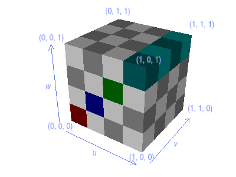
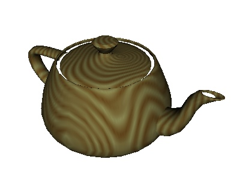

.. _3d-textures:

3-D Textures
============

So far, we have only talked about ordinary 2-D texture maps. Panda3D also
supports the concept of a 3-D texture map. This is a volumetric texture: in
addition to a height and a width, it also has a depth:

|A sample 3-D texture.|

The 3-D texture image is solid all the way through; if we were to cut away part
of the cube we would discover that the checkerboard pattern continues within:

|A sample 3-D texture on a sphere.|

This is true no matter what shape we carve out of the cube:

|A sample 3-D texture on a teapot.|

In addition to the usual u and v texture dimensions, a 3-D texture also has w.
In order to apply a 3-D texture to geometry, you will therefore need to have 3-D
texture coordinates (u, v, w) on your geometry, instead of just the ordinary (u,
v).

There are several ways to get 3-D texture coordinates on a model. One way is to
assign appropriate 3-D texture coordinates to each vertex when you create the
model, the same way you might assign 2-D texture coordinates. This requires that
your modeling package (and its Panda converter) support 3-D texture coordinates;
however, at the time of this writing, none of the existing Panda converters
currently do support 3-D texture coordinates.

More commonly, 3-D texture coordinates are assigned to a model automatically
with one of the :ref:`TexGen modes <automatic-texture-coordinates>`, especially
``MWorldPosition``. For example, to assign 3-D texture coordinates to the
teapot, you might do something like this:

.. code-block:: python

   teapot = loader.loadModel('teapot.egg')
   teapot.setTexGen(TextureStage.getDefault(), TexGenAttrib.MWorldPosition)
   teapot.setTexProjector(TextureStage.getDefault(), render, teapot)
   teapot.setTexPos(TextureStage.getDefault(), 0.44, 0.5, 0.2)
   teapot.setTexScale(TextureStage.getDefault(), 0.2)

The above assigns 3-D texture coordinates to the teapot based on the (x, y, z)
positions of its vertices, which is a common way to assign 3-D texture
coordinates. The ``setTexPos()`` and ``setTexScale()`` calls in the above are
particular to the teapot model; these numbers are chosen to scale the texture so
that its unit cube covers the teapot.

Storing 3-D texture maps on disk is a bit of a problem, since most image formats
only support 2-D images. By convention, then, Panda3D will store a 3-D texture
image by slicing it into horizontal cross-sections and writing each slice as a
separate 2-D image. When you load a 3-D texture, you specify a series of 2-D
images which Panda3D will load and stack up like pancakes to make the full 3-D
image.

The above 3-D texture image, for instance, is stored as four separate image
files:

|The four images that make up the 3-D Texture|

Note that, although the image is stored as four separate images on disk,
internally Panda3D stores it as a single, three-dimensional image, with height,
width, and depth.

The Panda3D convention for naming the slices of a 3-D texture is fairly rigid.
Each slice must be numbered, and all of the filenames must be the same except
for the number; and the first (bottom) slice must be numbered 0. If you have
followed this convention, then you can load a 3-D texture with a call like this:

.. code-block:: python

   tex = loader.load3DTexture("grid_#.png")

The hash sign ("#") in the filename passed to :meth:`loader.load3DTexture()
<direct.showbase.Loader.Loader.load3DTexture>` will be filled in with the
sequence number of each slice, so the above loads files named "grid_0.png",
"grid_1.png", "grid_2.png", and so on. If you prefer to pad the slice number
with zeros to a certain number of digits, repeat the hash sign; for instance,
loading "grid_###.png" would look for files named "grid_000.png",
"grid_001.png", and so on. Note that you don't have to use multiple hash marks
to count higher than 9. You can count as high as you like even with only one
hash mark; it just won't pad the numbers with zeros.

Remember that you must usually
:ref:`choose a power of two <choosing-a-texture-size>` for the size of your
texture images. This extends to the w size, too: for most graphics cards, the
number of slices of your texture should be a power of two. Unlike the ordinary
(u, v) dimensions, Panda3D won't automatically rescale your 3-D texture if it
has a non-power-of-two size in the w dimension, so it is important that you
choose the size correctly yourself.

Applications for 3-D textures
-----------------------------

3-D textures are often used in scientific and medical imagery applications, but
they are used only rarely in 3-D game programs. One reason for this is the
amount of memory they require; since a 3-D texture requires storing (u × v × w)
texels, a large 3-D texture can easily consume a substantial fraction of your
available texture memory.

But probably the bigger reason that 3-D textures are rarely used in games is
that the texture images in games are typically hand-painted, and it is difficult
for an artist to paint a 3-D texture. It is usually much easier just to paint
the surface of an object.

So when 3-D textures are used at all, they are often generated procedurally. One
classic example of a procedural 3-D texture is wood grain; it is fairly easy to
define a convincing woodgrain texture procedurally. For instance,
:ref:`click here <woodgrain-example>` to view a Panda3D program that generates a
woodgrain texture and stores it as a series of files named woodgrain_0.png,
woodgrain_1.png, and so on. The following code applies this woodgrain texture to
the teapot, to make a teapot that looks like it was carved from a single block
of wood:

.. code-block:: python

   teapot = loader.loadModel('teapot.egg')
   teapot.setTexGen(TextureStage.getDefault(), TexGenAttrib.MWorldPosition)
   teapot.setTexProjector(TextureStage.getDefault(), render, teapot)
   teapot.setTexPos(TextureStage.getDefault(), 0.44, 0.5, 0.2)
   teapot.setTexScale(TextureStage.getDefault(), 0.2)

   tex = loader.load3DTexture('woodgrain-#.png')
   teapot.setTexture(tex)

|A wooden teapot.|

However, even procedurally-generated 3-D textures like this are used only
occasionally. If the algorithm to generate your texture is not too complex, it
may make more sense to program a :ref:`pixel shader <shaders>` to generate the
texture implicitly, as your models are rendered.

Still, even if it is used only occasionally, the 3-D texture remains a powerful
rendering technique to keep in your back pocket.

.. |A sample 3-D texture on a sphere.| image:: 3dtexture-sphere.png
.. |A sample 3-D texture on a teapot.| image:: 3dtexture-teapot.png
.. |The four images that make up the 3-D Texture| image:: 3dtexture-levels-0.png

