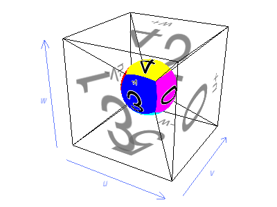

.. _cube-maps:

Cube Maps
=========

There is one more special kind of texture map: the cube map. A cube map is
similar to a :ref:`3-D texture <3d-textures>`, in that it requires 3-D texture
coordinates (u, v, w); also, a cube map is stored on disk as a sequence of
ordinary 2-D images.

But unlike a 3-D texture, which is defined by stacking up an arbitrary number of
2-D images like pancakes to fill up a volume, a cube map is always defined with
exactly six 2-D images, which are folded together to make a cube.

The six images of a cube map are numbered from 0 to 5, and each image
corresponds to one particular face of the cube:

=========== =================================
image 0     The *+u* (or *+x*) face (right)
image 1     The *-u* (or *-x*) face (left)
image 2     The *+v* (or *+y*) face (forward)
image 3     The *-v* (or *-y*) face (back)
image 4     The *+w* (or *+z*) face (up)
image 5     The *-w* (or *-z*) face (down)
=========== =================================

By +x face, we mean the face of the cube farthest along the positive X axis. In
Panda3D's default Z-up coordinate system, this is the right face. Similarly, the
-x face is the face farthest along the negative X axis, or the left face, and so
on for the Y and Z faces. Since the coordinates of a texture map are called (u,
v, w) instead of (x, y, z), it is technically more correct to call these the +u
and -u faces, though it is often easier to think of them as +x and -x.

The faces are laid out according to the following diagram:

.. image:: exploded-cube-map.png
   :alt: The arrangement of the six faces of a cube map

Imagine that you cut out the above diagram and folded it into a cube. You'd end
up with something like this:

.. image:: mapped-cube-map-solid.png
   :alt: A solid-mapped cube

Note that, when you hold the cube so that the axis indications for each face are
in the appropriate direction (as in the picture above), several of the faces are
upside-down or sideways. That's because of the way the graphics card
manufacturers decided to lay out the cube map faces (and also because of
Panda3D's default coordinate system). But in fact, it doesn't matter which way
the faces are oriented, as long as you always generate your cube map images the
same way.

In some sense, a cube map is a kind of surface texture, like an ordinary 2-D
texture. But in another sense, it is also volumetric like a 3-D texture: every
point within the 3-D texture coordinate space is colored according to the face
of the cube it comes closest to. A sphere model with the cube map applied to it
would pick up the same six faces:

Note that, while a 3-D texture assigns a different pixel in the texture to every
point within a volume, a cube map assigns a different pixel in the texture to
every direction from the center.

You can load a cube map from a series of six image files, very similar to the
way you load a 3-D texture:

.. code-block:: python

   tex = loader.loadCubeMap('cubemap_#.png')

As with a 3-D texture, the hash mark ("#") in the filename will be filled in
with the image sequence number, which in the case of a cube map will be a digit
from 0 to 5. The above example, then, will load the six images "cubemap_0.png",
"cubemap_1.png", "cubemap_2.png", "cubemap_3.png", "cubemap_4.png", and
"cubemap_5.png", and assemble them into one cube map.
