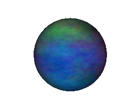

.. _simple-texture-replacement:

Simple Texture Replacement
==========================

Although usually you will load and display models that are already textured, you
can also apply or replace a texture image on a model at runtime. To do this, you
must first get a handle to the texture, for instance by loading it directly:

.. only:: python

   .. code-block:: python

      myTexture = loader.loadTexture("myTexture.png")

   The above
   :py:meth:`loader.loadTexture() <direct.showbase.Loader.Loader.loadTexture>`
   call will search along the current model-path for the named image file (in
   this example, a file named "myTexture.png"). If the texture is not found or
   cannot be read for some reason, None is returned.

.. only:: cpp

   .. code-block:: cpp

      #include "texturePool.h"

      PT(Texture) tex;
      tex = TexturePool::load_texture("myTexture.png");

      NodePath smiley;
      smiley = window->load_model(window->get_render(), "smiley.egg");
      smiley.set_texture(tex, 1);

   The above :cpp:func:`TexturePool::load_texture()` call will search along the
   current model-path for the named image file (in this example, a file named
   "myTexture.png"). If the texture is not found or cannot be read for some
   reason, None is returned.

   Note that the Texture class is :ref:`reference counted <reference-counting>`,
   so it is necessary to use a smart ``PT(Texture)`` pointer to ensure that it
   is not automatically deleted by the garbage collector.

Once you have a texture, you can apply it to a model with the
:meth:`~.NodePath.set_texture()` call. For instance, suppose you used the
:class:`.CardMaker` class to generate a plain white card:

.. only:: python

   .. code-block:: python

      cm = CardMaker('card')
      card = render.attachNewNode(cm.generate())

.. only:: cpp

   .. code-block:: cpp

      CardMaker cm("card");
      NodePath card = render.attach_new_node(cm.generate());

Then you can load up a texture and apply it to the card like this:

.. only:: python

   .. code-block:: python

      tex = loader.loadTexture('maps/noise.rgb')
      card.setTexture(tex)

.. only:: cpp

   .. code-block:: cpp

      PT(Texture) tex = TexturePool::load_texture("maps/noise.rgb");
      card.set_texture(tex);

(Note that it is not necessary to use the override parameter to the
:meth:`~.NodePath.set_texture()` call--that is, you do not need to do
``card.set_texture(tex, 1)``--because in this case, the card does not already
have any other texture applied to it, so your texture will be visible even
without the override.)

In order for this to work, the model you apply it to must already have texture
coordinates defined (see :ref:`simple-texturing`). As it happens, the CardMaker
generates texture coordinates by default when it generates a card, so no problem
there.

.. only:: cpp

   As a special shortcut, you can also directly load the texture as though it
   were a model, which will automatically create a card for it:

   .. code-block:: cpp

      NodePath card;
      card = window->load_model(window->get_render(), "maps/noise.rgb");

   This short piece of code will result in a single polygon in the scene with
   the noise texture applied to it. Of course, if you need it in the 2-D scene,
   you should use :cpp:func:`~WindowFramework::get_aspect2d()` or
   :cpp:func:`~WindowFramework::get_render2d()` instead of
   :cpp:func:`~WindowFramework::get_render()`.

You can also use :meth:`~.NodePath.set_texture()` to replace the texture on an
already-textured model. In this case, you must specify a second parameter to
setTexture, which is the same optional Panda override parameter you can specify
on any kind of Panda state change. Normally, you simply pass 1 as the second
parameter to :meth:`~.NodePath.set_texture()`. Without this override, the
texture that is assigned directly at the Geom level will have precedence over
the state change you make at the model node, and the texture change won't be
made.

For instance, to change the appearance of smiley:

.. only:: python

   .. code-block:: python

      smiley = loader.loadModel('smiley.egg')
      smiley.reparentTo(render)
      tex = loader.loadTexture('maps/noise.rgb')
      smiley.setTexture(tex, 1)

.. only:: cpp

   .. code-block:: cpp

      NodePath smiley;
      PT(Texture) tex;

      smiley = window->load_model(window->get_render(), "smiley.egg");
      tex = TexturePool::load_texture("maps/noise.rgb");
      smiley.set_texture(tex, 1);

Often, you want to replace the texture on just one piece of a model, rather than
setting the texture on every element. To do this, you simply get a
:class:`.NodePath` handle to the piece or pieces of the model that you want to
change, as described in the section :ref:`manipulating-a-piece-of-a-model`, and
make the :meth:`.NodePath.set_texture()` call on those NodePaths.

For instance, this car model has multiple textures available in different
colors:

.. image:: car-red.png

For the most part, this car was painted with one big texture image, which looks
like this:

.. image:: carnsx.png

But we also have a blue version of the same texture image:

.. image:: carnsx-blue.png

Although it is tempting to use :meth:`.NodePath.set_texture()` to assign the
blue texture to the whole car, that would also assign the blue texture to the
car's tires, which need to use a different texture map. So instead, we apply the
blue texture just to the pieces that we want to change:

.. only:: python

   .. code-block:: python

      car = loader.loadModel('bvw-f2004--carnsx/carnsx.egg')
      blue = loader.loadTexture('bvw-f2004--carnsx/carnsx-blue.png')
      car.find('**/body/body').setTexture(blue, 1)
      car.find('**/body/polySurface1').setTexture(blue, 1)
      car.find('**/body/polySurface2').setTexture(blue, 1)

.. only:: cpp

   .. code-block:: python

      NodePath car = window->load_model(window->get_render(), "bvw-f2004--carnsx/carnsx.egg");
      PT(Texture) blue = TexturePool::load_texture("bvw-f2004--carnsx/carnsx-blue.png");
      car.find('**/body/body').set_texture(blue, 1);
      car.find('**/body/polySurface1').set_texture(blue, 1);
      car.find('**/body/polySurface2').set_texture(blue, 1);

And the result is this:

.. image:: car-with-blue.png

As of Panda3D 1.10.4, there is an easier way to do this as well, by allowing you
to tell Panda3D to replace the texture on all parts where a particular existing
texture is applied:

.. only:: python

   .. code-block:: python

      car = loader.loadModel('bvw-f2004--carnsx/carnsx.egg')
      red = loader.loadTexture('bvw-f2004--carnsx/carnsx.png')
      blue = loader.loadTexture('bvw-f2004--carnsx/carnsx-blue.png')
      car.replaceTexture(red, blue)

.. only:: cpp

   .. code-block:: cpp

      NodePath car = window->load_model(window->get_render(), "bvw-f2004--carnsx/carnsx.egg");
      PT(Texture) red = TexturePool::load_texture("bvw-f2004--carnsx/carnsx.png");
      PT(Texture) blue = TexturePool::load_texture("bvw-f2004--carnsx/carnsx-blue.png");
      car.replace_texture(red, blue);

If you are interested in changing the image of a texture during program
execution, say to adjust some of its pixels, see
:ref:`creating-new-textures-from-scratch`.
