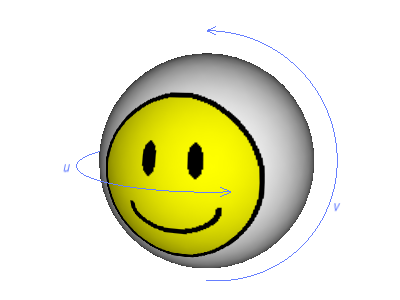

.. _simple-texturing:

Simple Texturing
================

A texture map or texture image is a two-dimensional image file, like a JPEG or
a Windows BMP file, that is used to apply color to a 3-D model. It is called a
"texture" because one of the earliest uses of this technique was to apply an
interesting texture to walls and floors that would otherwise be one flat,
plastic-looking color. Nowadays texturing is so common in 3-D applications
that it is often the only thing used to apply color to models--without texture
maps, many models would simply be white.

There are a vast array of rendering effects that can be achieved with
different variants on texturing. Before you can learn about them, it is
important to understand the basics of texturing first.

In simple texturing--by far the most common form--you can think of the texture
map as a layer of paint that is applied to the model. In order for the
graphics hardware to know in what direction the paint should be applied, the
model must have been created with texture coordinates--a special (u, v)
coordinate pair that is associated with each vertex of your model. Each
vertex's (u, v) texture coordinates place the vertex at a particular point
within the texture map, in the same way that the vertex's (x, y, z)
coordinates place the vertex at a particular point in 3-D space.

These texture coordinates are sometimes called uv's because of the (u, v) name
of the coordinate pair. Almost any modeling package that you might use to
create a model can create texture coordinates at the same time, and many do it
without even asking.

By convention, every texture map is assigned a (u, v) coordinate range such
that the u coordinate ranges from 0 to 1 from left to right, and the v
coordinate ranges from 0 to 1 from bottom to top. This means that the
bottom-left corner of the texture is at coordinate (0, 0), and the top-right
corner is at (1, 1). For instance, take a look at some typical texture maps:

|The assignment of (u, v) values to texture images|

It is the (u, v) texture coordinates that you assign to the vertices that
determine how the texture map will be applied to your model. When each
triangle of your model is drawn, it is drawn with the colors from your texture
map that fall within the same triangle of vertices in (u, v) texture map
space. For instance, the sample smiley.egg model that ships with Panda has its
vertices defined such that the u coordinate increases from 0 to 1 around its
diameter, and the v coordinate increases from 0 at the bottom to 1 at the top.
This causes the texture image to be wrapped horizontally around the sphere:

|The assignment of (u, v) values to vertices|

Note that the (u, v) range for a texture image is always the same, 0 to 1,
regardless of the size of the texture.

.. |The assignment of (u, v) values to texture images| image:: texture-uvs.png

