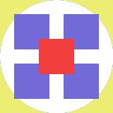
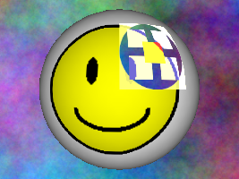

.. _texture-modes:

Texture Modes
=============

There are several kinds of textures: color textures, normal maps, gloss maps,
glow maps, and so forth. To distinguish these, use the
:meth:`.TextureStage.set_mode()` function.

Futhermore, within the general category of color textures, there are several
ways to combine the colors: Modulate, Decal, Blend, and so forth. These, too,
are controlled using the :meth:`~.TextureStage.set_mode()` function.

The Basics
----------

Let's go back to the example of applying a texture to the smiley model. In this
case, we'll create a new TextureStage to apply the following texture image:

|Sample multitexture image|

To this scene:

|Smiley with no multitexture|

Note that the circular white part of the sample image is actually not white at
all, but an alpha cutout (you are seeing through the image to the white page
background). We have rendered smiley.egg against a colored background so you can
see the effects of alpha in the various modes below; in some of them, the alpha
is propagated through to the final color, so smiley is transparent in those
parts of the image, but in other modes, the alpha is used for a different
purpose, and smiley is not transparent there.

Note also that, for the purposes of illustration, we have only applied the
sample texture image to a portion of the smiley model, rather than to the whole
model. (This was done by transforming the texture coordinates of this texture
stage, which is covered in :ref:`a later topic <texture-transforms>`.)

Modulate mode
-------------

This is the default blend mode. In this mode, the top texture color is
multiplied by the bottom texture color to produce the result. This means the
resulting texture color will be darker (or at least, no brighter) than both of
the original texture colors.

.. only:: python

   .. code-block:: python

      ts = TextureStage('ts')
      ts.setMode(TextureStage.MModulate)
      smiley.setTexture(ts, tex)

.. only:: cpp

   .. code-block:: cpp

      PT(TextureStage) ts = new TextureStage("ts");
      ts->set_mode(TextureStage::M_modulate);
      smiley.set_texture(ts, tex);

|Modulate blend mode|

Note that in this mode, an alpha cutout in the top texture produces an alpha
cutout in the resulting image.

Add mode
--------

In this mode, the top texture color is added to the bottom texture color, and
clamped to 1 (white). This means the resulting texture color will be brighter
(or at least, no darker) than both of the original texture colors.

.. only:: python

   .. code-block:: python

      ts = TextureStage('ts')
      ts.setMode(TextureStage.MAdd)
      smiley.setTexture(ts, tex)

.. only:: cpp

   .. code-block:: cpp

      PT(TextureStage) ts = new TextureStage("ts");
      ts->set_mode(TextureStage::M_add);
      smiley.set_texture(ts, tex);

|Add blend mode|

Note that in this mode, as in modulate mode, an alpha cutout in the top texture
produces an alpha cutout in the resulting image. Also note that, unless one or
both of your source textures was rather dark, there is a tendency for the colors
to get washed out at white where everything clamps to 1.

Replace mode
------------

In this mode the top texture completely replaces the bottom texture. This mode
is not often used.

.. only:: python

   .. code-block:: python

      ts = TextureStage('ts')
      ts.setMode(TextureStage.MReplace)
      smiley.setTexture(ts, tex)

.. only:: cpp

   .. code-block:: cpp

      PT(TextureStage) ts = new TextureStage("ts");
      ts->set_mode(TextureStage::M_replace);
      smiley.set_texture(ts, tex);

|Replace blend mode|

Note that the alpha cutout is preserved, but the effects of lighting (which are
considered part of the underlying texture) have been lost.

Decal mode
----------

In this mode the top texture completely replaces the bottom texture, but only
where alpha = 1 in the top texture. When alpha = 0, the bottom texture shows
through, and there is a smooth blending for alpha values between 0 and 1.

.. only:: python

   .. code-block:: python

      ts = TextureStage('ts')
      ts.setMode(TextureStage.MDecal)
      smiley.setTexture(ts, tex)

.. only:: cpp

   .. code-block:: cpp

      PT(TextureStage) ts = new TextureStage("ts");
      ts->set_mode(TextureStage::M_decal);
      smiley.set_texture(ts, tex);

|Decal blend mode|

Note that the alpha cutout is no longer preserved in this mode, because alpha is
used to determine which texture should be visible. Also note that the effects of
lighting are lost for the decalled part of the texture.

Panda3D also provides a built-in decal capability, for rendering a small polygon
coplanar with and embedded within a larger polygon, which is not related to the
decal texture blend mode.

Blend mode
----------

Blend mode is similar to decal mode, except you can specify the color of the
decal as a parameter at runtime. You can vary the color and you don't have to
have a different texture image prepared for each possible color. However, the
decal will always be monochromatic (it will be drawn in different shades of
whatever color you specify).

Blend mode can only be used with a grayscale texture, and it does not use alpha.
Since the sample texture above is not a grayscale texture, we will use a
different texture for this example:

|White_a.png|

This texture does not have an alpha channel; it is simply a grayscale image with
a large white "A" on a field of black. Blend mode will produce the original
color where the image is black, and the color we specify with
``TextureStage.setColor()`` where the image is white. Where the image is shades
of gray, there will be a smooth blending between the colors.

.. only:: python

   .. code-block:: python

      ts = TextureStage('ts')
      ts.setMode(TextureStage.MBlend)
      ts.setColor((1, 0, 0, 1))
      smiley.setTexture(ts, tex)

.. only:: cpp

   .. code-block:: cpp

      PT(TextureStage) ts = new TextureStage("ts");
      ts->set_mode(TextureStage::M_blend);
      ts->set_color(LColor(1, 0, 0, 1));
      smiley.set_texture(ts, tex);

|Blend mode, with a red image|

And we can change the color of the decal at will, simply with:

.. only:: python

   .. code-block:: python

      ts.setColor((0, 0, 1, 1))

.. only:: cpp

   .. code-block:: cpp

      ts->set_color(LColor(0, 0, 1, 1));

|Blend mode, with a blue image|

Note that, as with the decal example above, the lighting information is lost
where the decal is applied.

Normal Map Mode
---------------

Normal maps are maps that cause surfaces to appear to have raised and lowered
areas. They are also called "bump maps." Unlike most maps, normal maps do not
affect the color of the model - they affect the lighting. When light hits a
normal-mapped model, the light creates highlights and shadows throughout those
ridges and bumps. If no lights are applied to the model, then there will be no
shadows or highlights, and the normal map will be invisible. Currently, Panda3D
only allows one normal map per polygon, additional normal maps will be ignored.

.. only:: python

   .. code-block:: python

      ts = TextureStage('ts')
      ts.setMode(TextureStage.MNormal)
      smiley.setTexture(ts, tex)

.. only:: cpp

   .. code-block:: cpp

      PT(TextureStage) ts = new TextureStage("ts");
      ts->set_mode(TextureStage::M_normal);
      smiley.set_texture(ts, tex);

The creation of normal maps is a sufficiently complex process that it is beyond
the scope of this manual. However, there are many good tools out there like
Z-Brush, Crazy Bump, and the like which create normal maps.

See also: :ref:`bump-mapping`

Normal maps only function when :ref:`shader generation <the-shader-generator>`
is enabled.

Height / Parallax Map Mode
--------------------------

As an addition to normal mapping, you can specify a grayscale height map to
enable parallax mapping. This technique offsets the UV coordinates based on the
height value and eye normal vector, so the resulting surface will have more
apparent depth. Currently, Panda only supports one height map per polygon,
additional height maps will be ignored.

.. only:: python

   .. code-block:: python

      ts = TextureStage('ts')
      ts.setMode(TextureStage.MHeight)
      smiley.setTexture(ts, tex)

.. only:: cpp

   .. code-block:: cpp

      PT(TextureStage) ts = new TextureStage("ts");
      ts->set_mode(TextureStage::M_height);
      smiley.set_texture(ts, tex);

Since parallax mapping doesn't look very good without normal mapping, they are
often used both together. As an optimization, most people prefer to store the
height map into the alpha channel of the normal map. If you are using such a
packed normal/height map, you need to use the MNormalHeight mode in Panda:

.. only:: python

   .. code-block:: python

      # The second parameter to loadTexture will be stored in the texture's alpha channel.
      tex = loader.loadTexture("normalmap.png", "heightmap.png")

      ts = TextureStage('ts')
      ts.setMode(TextureStage.MNormalHeight)
      smiley.setTexture(ts, tex)

.. only:: cpp

   .. code-block:: cpp

      # The second parameter to load_texture will be stored in the texture's alpha channel.
      PT(Texture) tex = TexturePool::load_texture("normalmap.png", "heightmap.png");

      PT(TextureStage) ts = new TextureStage("ts");
      ts->set_mode(TextureStage::M_normal_height);
      smiley.set_texture(ts, tex);

By default, the parallax mapping algorithm will use 3 samples, and the effect
will be scaled by 0.1. To change these parameters, use the following Config.prc
lines:

.. code-block:: text

   parallax-mapping-samples 3
   parallax-mapping-scale 0.1

The amount of samples is how accurate the parallax mapping will be. Lower values
are cheaper, but the result will be less accurate. The scale is the magnitude of
the effect - with a lower value the effect decreases, with a higher value the
surface will have more apparent depth (although the artifacts due to lack of
occlusion will be more visible). Use a negative value to invert the effect (this
has the same effect as inverting the heightmap).

Gloss Map Mode
--------------

A gloss map is a black-and-white image indicating where the model is supposed to
be shiny and where it is supposed to be dull. Gloss maps do not affect the color
of the model - they affect the degree to which the model reflects specular
highlights. So if no lights are applied to the model, and thus there are no
specular highlights at all, then the gloss map will be invisible.

More precisely, the gloss map affects the material specular color of the model.
If the model already has a material specular color, then it is multiplied by the
value (0-1) in the gloss map. In this way, the gloss map can effectively turn on
or off the specularity on a per-pixel basis. If the model does not already have
a material specular color specified, then applying a gloss map causes the
material specular color to range from off to bright white.

A gloss map must be an alpha-texture:

.. only:: python

   .. code-block:: python

      ts = TextureStage('ts')
      ts.setMode(TextureStage.MGloss)
      smiley.setTexture(ts, tex)

.. only:: cpp

   .. code-block:: cpp

      PT(TextureStage) ts = new TextureStage("ts");
      ts->set_mode(TextureStage::M_gloss);
      smiley.set_texture(ts, tex);

If you wish, you can pack a modulate-texture and a gloss-map into a single
RGBA texture. In that case, the RGB components are just regular color values
that are modulated onto the model, and the A controls gloss:

.. only:: python

   .. code-block:: python

      ts = TextureStage('ts')
      ts.setMode(TextureStage.MModulateGloss)
      smiley.setTexture(ts, tex)

.. only:: cpp

   .. code-block:: cpp

      PT(TextureStage) ts = new TextureStage("ts");
      ts->set_mode(TextureStage::M_modulate_gloss);
      smiley.set_texture(ts, tex);

Currently, Panda3D only allows one gloss map per polygon, additional gloss maps
will be ignored.

Gloss maps only function when :ref:`shader generation <the-shader-generator>` is
enabled.

Glow Map Mode
-------------

A glow map is a black-and-white texture which indicates that a model should be
glowing in certain areas. More specifically, the contents of the glow map are
added to the material emission. This causes those parts of the model to be lit
even when the lights are otherwise off.

In practice, though, things don't really look like they're glowing unless you
apply a bloom filter to your scene. Panda can be made to copy the contents of
your glow map into the framebuffer alpha, from which it can be read by the bloom
filter. The bloom filter then really creates a dramatic glow effect. All of this
is documented in the chapter on the bloom filter.

A glow map must be an alpha-texture:

.. only:: python

   .. code-block:: python

      ts = TextureStage('ts')
      ts.setMode(TextureStage.MGlow)
      smiley.setTexture(ts, tex)

.. only:: cpp

   .. code-block:: cpp

      PT(TextureStage) ts = new TextureStage("ts");
      ts->set_mode(TextureStage::M_glow);
      smiley.set_texture(ts, tex);

If you wish, you can pack a modulate-texture and a glow-map into a single RGBA
texture. In that case, the RGB components are just regular color values that are
modulated onto the model, and the A controls glow:

.. only:: python

   .. code-block:: python

      ts = TextureStage('ts')
      ts.setMode(TextureStage.MModulateGlow)
      smiley.setTexture(ts, tex)

.. only:: cpp

   .. code-block:: cpp

      PT(TextureStage) ts = new TextureStage("ts");
      ts->set_mode(TextureStage::M_modulate_glow);
      smiley.set_texture(ts, tex);

Currently, Panda3D only allows one glow map per polygon, additional glow maps
will be ignored.

See also: :ref:`glow-filter`

Glow maps only function when :ref:`shader generation <the-shader-generator>` is
enabled.

.. |Smiley with no multitexture| image:: smiley-multitex-none.png
.. |Modulate blend mode| image:: smiley-multitex-modulate.png

.. |Replace blend mode| image:: smiley-multitex-replace.png
.. |Decal blend mode| image:: smiley-multitex-decal-1.png
.. |White_a.png| image:: white-a.png
.. |Blend mode, with a red image| image:: smiley-multitex-blend-red.png
.. |Blend mode, with a blue image| image:: smiley-multitex-blend-blue.png
