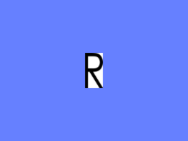

.. _texture-wrap-modes:

Texture Wrap Modes
==================

As described earlier, the *(u, v)* texture coordinates that you assign to your
vertices are what determines how the texture fits on your geometry. Often, you
will use texture coordinates that always fall within the range [0, 1], which is
the complete range of the pixels of your texture image. However, it is also
legal to use texture coordinates that go outside this range; you can have
negative values, for instance, or numbers higher than 1.

So if the texture image is only defined over the range [0, 1], what does the
texture look like outside this range? You can specify this with the **texture
wrap mode**.

.. only:: python

   .. code-block:: python

      texture.setWrapU(wrap_mode)
      texture.setWrapV(wrap_mode)

.. only:: cpp

   .. code-block:: cpp

      texture->set_wrap_u(wrap_mode);
      texture->set_wrap_w(wrap_mode);

The wrap_mode parameter is specified separately for the *u* and *v* directions
(there is also a :meth:`.Texture.set_wrap_w()` for
:ref:`3-D textures <3d-textures>`, but that's an advanced topic).
The wrap mode may be any of the following values:

Texture.WM_repeat
   The texture image repeats to infinity.

Texture.WM_clamp
   The last pixel of the texture image stretches out to infinity.

Texture.WM_border_color
   The color specified by :meth:`.Texture.set_border_color()` is used to fill
   the space.

Texture.WM_mirror
   The texture image flips back-and-forth to infinity.

Texture.WM_mirror_once
   The texture image flips backwards, once, and then the "border color" is used.

The default wrap mode is ``WM_repeat``.

Consider the following simple texture image:

|black_r.png|

We will apply this texture in the center of a large polygon whose texture
coordinates range considerably farther than [0, 1] in both directions.

WM_repeat
---------

.. only:: python

   .. code-block:: python

      texture.setWrapU(Texture.WM_repeat)
      texture.setWrapV(Texture.WM_repeat)

.. only:: cpp

   .. code-block:: cpp

      texture->set_wrap_u(Texture::WM_repeat);
      texture->set_wrap_v(Texture::WM_repeat);

|WM_repeat|

``WM_repeat`` mode is often used to tile a relatively small texture over a large
surface.

WM_clamp
--------

.. only:: python

   .. code-block:: python

      texture.setWrapU(Texture.WM_clamp)
      texture.setWrapV(Texture.WM_clamp)

.. only:: cpp

   .. code-block:: cpp

      texture->set_wrap_u(Texture::WM_clamp);
      texture->set_wrap_v(Texture::WM_clamp);

|WM_clamp|

``WM_clamp`` mode is rarely used on large polygons because, frankly, it looks
terrible when the pixels stretch out to infinity like this; but this mode is
usually the right choice when the texture exactly fills its polygon (see *One
caution about a common wrap error,* below).

WM_border_color
---------------

.. only:: python

   .. code-block:: python

      texture.setWrapU(Texture.WM_border_color)
      texture.setWrapV(Texture.WM_border_color)
      texture.setBorderColor((0.4, 0.5, 1, 1))

.. only:: cpp

   .. code-block:: cpp

      texture->set_wrap_u(Texture::WM_border_color);
      texture->set_wrap_v(Texture::WM_border_color);
      texture->set_border_color(LColor(0.4, 0.5, 1, 1));

|WM_border_color|

The above blue color was chosen for illustration purposes; you can use any color
you like for the border color. (However, some hardware may not efficiently
support a border color other than opaque white, transparent white, opaque black
and transparent black.) Normally, you would use the background color of the
texture as the border color, like this:

.. only:: python

   .. code-block:: python

      texture.setWrapU(Texture.WMBorderColor)
      texture.setWrapV(Texture.WMBorderColor)

.. only:: cpp

   .. code-block:: cpp

      texture->set_wrap_u(Texture::WM_border_color);
      texture->set_wrap_v(Texture::WM_border_color);
      texture->set_border_color(LColor(1, 1, 1, 1));

|WMBorderColor|

Some very old graphics drivers don't support ``WM_border_color``. In this case,
Panda3D will fall back to ``WM_clamp``, which will look similar as long as there
is a sufficient margin of background color around the edge of your texture
(unlike our sample texture, which goes all the way out the edge).

WM_mirror
---------

.. only:: python

   .. code-block:: python

      texture.setWrapU(Texture.WM_mirror)
      texture.setWrapV(Texture.WM_mirror)

.. only:: cpp

   .. code-block:: cpp

      texture->set_wrap_u(Texture::WM_mirror);
      texture->set_wrap_v(Texture::WM_mirror);

|WM_mirror|

Many older graphics drivers do not support ``WM_mirror``. In this case, Panda3D
will fall back to ``WM_repeat``.

WM_mirror_once
--------------

.. only:: python

   .. code-block:: python

      texture.setWrapU(Texture.WM_mirror_once)
      texture.setWrapV(Texture.WM_mirror_once)
      texture.setBorderColor((0.4, 0.5, 1, 1))

.. only:: cpp

   .. code-block:: cpp

      texture->set_wrap_u(Texture::WM_mirror_once);
      texture->set_wrap_v(Texture::WM_mirror_once);
      texture->set_border_color(LColor(0.4, 0.5, 1, 1));

|WM_mirror_once|

Few graphics drivers support ``WM_mirror_once``. In this case, Panda3D will fall
back to ``WM_border_color``.

Setting different wrap modes
----------------------------

It is possible to set different wrap modes in the *u* and *v* directions:

.. only:: python

   .. code-block:: python

      texture.setWrapU(Texture.WM_repeat)
      texture.setWrapV(Texture.WM_clamp)

.. only:: cpp

   .. code-block:: cpp

      texture->set_wrap_u(Texture::WM_repeat);
      texture->set_wrap_v(Texture::WM_clamp);

|WM_clamp and WM_repeat|

One caution about a common wrap mode error
------------------------------------------

When you apply a texture that is intended to exactly fill a polygon--that is,
the texture coordinates range from 0 to 1, but no further--you should usually
set its wrap mode to *clamp*. This is because if you let it keep the default
value of *repeat*, the color may bleed in from the opposite edge, producing a
thin line along the edge of your polygon, like this:

|A common wrap mode error|

This is a particularly common error with a texture that is painted as an alpha
cutout, where there is an image with a fully transparent background: you will
often see a thin, barely-visible edge floating along the top (for instance) of
the polygon. This edge is actually the bottom edge of the texture bleeding onto
the top, because the designer specified ``WM_repeat`` instead of the correct
mode, ``WM_clamp``.

.. |WM_repeat| image:: texture-repeat.png
.. |WM_clamp| image:: texture-clamp.png

.. |WMBorderColor| image:: texture-border-color-white.png
.. |WM_mirror| image:: texture-mirror.png
.. |WM_mirror_once| image:: texture-mirror-once.png

.. |A common wrap mode error| image:: texture-wrap-error.png
